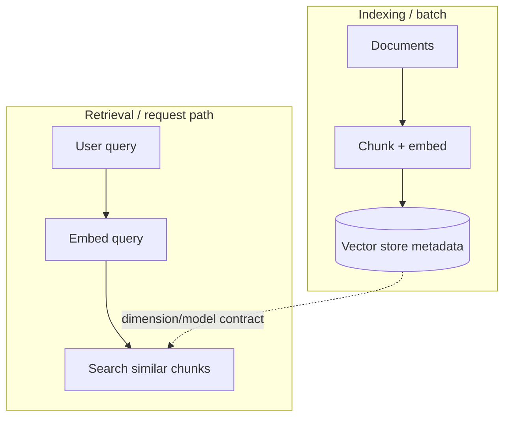

# RAG overview

**Retrieval-Augmented Generation (RAG)** in this service means: **embedding** user or document text, **storing** chunks in a tenant-scoped vector index, and **retrieving** relevant chunks at inference time under **governance** (policies, activation, limits). Implementation spans `src/domain/rag/` (services, ports, repositories) and persistence for `rag_config`, `vector_store`, `rag_document`, and `rag_chunk` (see [Persistence tables](../Glossary/persistence-tables.md)).

## Indexing vs retrieval (conceptual)

**Vector store** rows define **embedding model** and **dimension** so indexing and query paths stay compatible. See [Vector store](../Glossary/terms/vector-store.md) and [RAG config](../Glossary/terms/rag-config.md).

Indexing can start from **linear text** (batch `RagDocumentCreate`) or from **stored media** resolved to text (e.g. PDF extract) before the same chunk-and-embed pipeline; see [Runtime and integration — ingest](runtime-and-integration.md#ingest-and-generic-query).

## Product boundaries

- RAG is optional per flow or task: **activation** logic decides when retrieval runs (see domain `context` and RAG services).
- Caching (`rag_query_cache`, `semantic_answer_cache`) is an optimization layer, not a second source of truth.

## Further reading

- [Chunking strategies](chunking-strategies.md) — **`rag_chunking_rule`** strategies, parameters, ingest contracts (`PER_PAGE` vs content-only); [media ingest vs `PER_PAGE`](chunking-strategies.md#media-ingest-vs-per_page)
- [Embedding orchestration](embedding-orchestration.md) — ports, executor, adapter, vector-store contract
- [Runtime and integration](runtime-and-integration.md) — retrievers, policies, validation script, HTTP API; **ingest:** batch text (`documents:ingest`) vs [media (`documents:ingestFromMedia`)](runtime-and-integration.md#ingest-from-media)
- [Data model reference](data-model-reference.md) — tables, ER diagrams, ORM pointers
- [GLM-OCR (external)](glm-ocr.md) — optional OCR preprocessing for ingest pipelines
- [Glossary index](../Glossary/index.md), [Domain overview](../Models/domain-overview.md)
