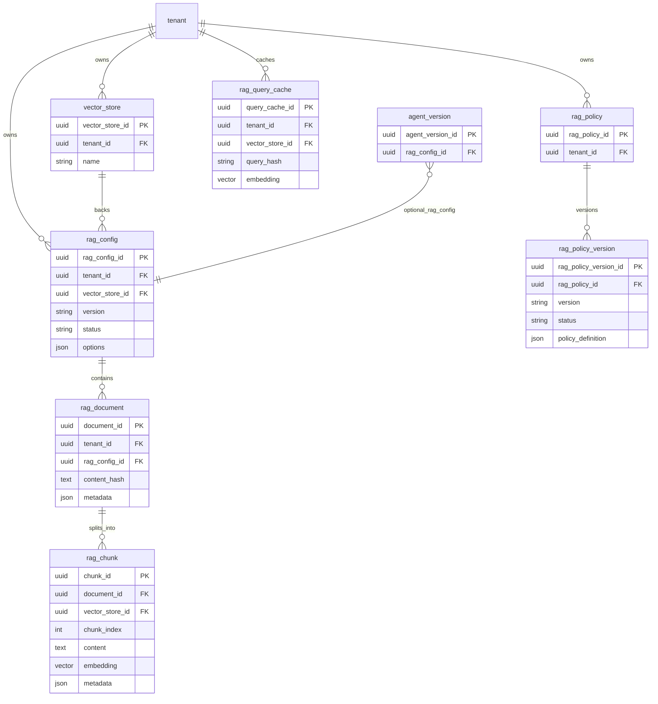
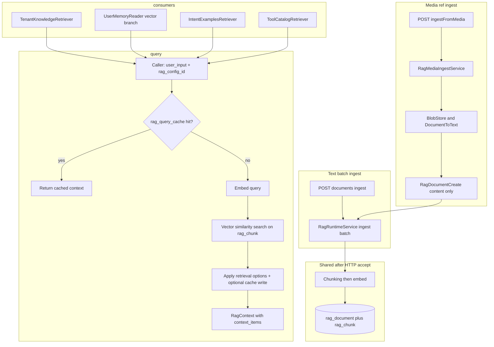
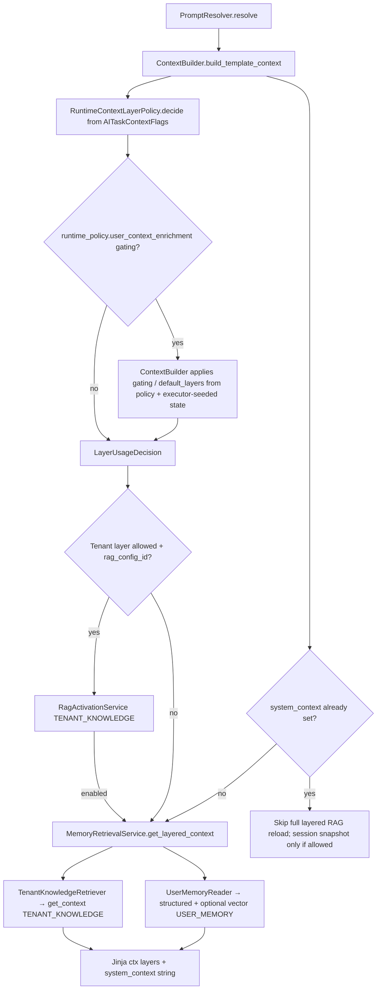

# RAG runtime and integration

This guide describes how retrieval-augmented generation (vector search over ingested chunks) is **implemented, governed, and consumed** at runtime. It includes a **validation-oriented** summary for `resources/scripts/examples/rag/validate_rag_runtime_scenarios.py`.

**Clarification:** The service implements **tenant knowledge retrieval** via `TenantKnowledgeRetriever` → `RagRuntimeService.get_context` with `ContextLayerScope.TENANT_KNOWLEDGE`. That path is orchestrated from `MemoryRetrievalService.get_layered_context` when `ContextBuilder` builds prompt template context. It is separate from **user memory**, which combines structured profile data (`UserMemoryProfile` via `ExecutionRepository`) with optional **user-scoped** vector RAG (`ContextLayerScope.USER_MEMORY`).

## Consolidated reference: validation script

End-to-end checks use **`ApplicationContainer`** (same wiring as the app): `RagRuntimeService`, `RagActivationService`, retrievers, and (for the user-vector path) `MemoryWriteService` + `MemoryPolicyService`. `main()` runs **four** async scenarios in sequence; each scenario is a **named function**.

| Scenario function | What it validates | Main call chain | Filters / metadata (retrieval) |
|-------------------|-------------------|-----------------|----------------------------------|
| `scenario_tenant_knowledge` | Tenant KB policy + retrieval | `RagActivationService.decide` (`TENANT_KNOWLEDGE`, `LLMTaskType.INTENT_SELECTION`) → `TenantKnowledgeRetriever.retrieve` → `get_context` | Scope from `resolve_rag_scope(TENANT_KNOWLEDGE)`: documents with `doc_metadata.scope` **null** or **`TENANT_KNOWLEDGE`** |
| `scenario_user_memory_vector` | Write path + policy + vector read | `MemoryWriteService.write_memory_item` (expects `USER_MEMORY_VECTOR` in `targets_applied`) → `decide` (`USER_MEMORY_VECTOR`) → `UserMemoryReader.get_context` | `USER_MEMORY` + `user_id`; `MemoryPolicyService.resolve` on read can add **`expires_after`** so only documents with future **`expires_at`** match |
| `scenario_intent_examples` | Semantic intent examples | `IntentExamplesRetriever.retrieve_best_match` → `get_context` | **`source=intent_examples`**, **`doc_type=intent_examples`**; chunk metadata **`intent_type`** → `IntentType` in `_pick_best_match` |
| `scenario_tool_catalog` | Semantic tool ranking | `ToolCatalogRetriever` (`tools_repository` required) → `get_context` → batch published configs by `tool_config_id` | **`source=tool_catalog`**, **`doc_type=tool_catalog`**, **`category=TOOL_CATALOG`**; optional **`tool_intent`**; chunk metadata must include **`tool_config_id`** (UUID string); global RAG ranking with a small top-k cap (max 5) |

**Rationale**

1. **`LLMTaskType.INTENT_SELECTION`** in scenarios 1–2 matches a **stable** task type when exercising `RagActivationService` against demo `rag_policy` (production nodes use task types appropriate to each step).
2. **Probe documents:** Each scenario calls `ingest_document` with text aligned to the query and a **`run_ref`** (unique per run) so **`content_hash`** differs and embeddings match the query well enough to pass **`options.retrieval.similarity_threshold`** (commonly **0.5**).
3. **User memory vector:** Stored content is **JSON** (e.g. `MemoryWriteService` / `USER_MEMORY_ITEM`). Retrieval **`user_input`** should be **close** to the embedded natural-language field.
4. **Demo IDs:** `TENANT_DEMO_ID`, `RAG_CONFIG_DEMO_ID`, `TOOL_CONFIG_DEMO_ID`, `TOOL_DEMO_ID` from `resources/scripts/seeds/demo/ids.py`. **`tool_config_id`** on `UserMemoryReader.get_context` / `RagActivationService.decide` must match policy when the demo tenant enforces tool-scoped rules.

### Corpus conventions (ingest must match retriever filters)

| Corpus | `RagDocumentCreate.source` | `doc_type` | Metadata notes |
|--------|----------------------------|------------|------------------|
| Tenant knowledge | Convention-specific (e.g. seed `assistente-bolso`) | Any | `scope` omitted or `TENANT_KNOWLEDGE` for tenant-layer filter |
| Intent examples | `intent_examples` | `intent_examples` | `intent_type` per row; see `IntentExamplesRetriever._normalize_intent_type` |
| Tool catalog | `tool_catalog` | `tool_catalog` | `category=TOOL_CATALOG`, `tool_config_id`, `tool_id`, `operation_id`, `method`, `path`; optional `tool_intent` |

Reference seeds: `resources/scripts/seeds/demo/seed_21_rag.py`, `seed_22_tool_catalog_rag.py`.

## Embedding generation and chunking

| Responsibility | Component | Notes |
|----------------|-----------|--------|
| Production path | `RagRuntimeService` | Calls the embedding adapter path for single-query and batch embeddings during ingest and `get_context`. |
| Adapter wiring | `OpenAIEmbeddingAdapter` | Model and dimensions driven by resolved config and `vector_store`. |
| Chunking before embed | `_resolve_rag_ingest_bundle` + `_chunks_for_ingest` | Loads **`rag_chunking_rule`** from `rag_config.chunking_rule_id`, parses **`params`** with **`parse_rag_chunking_rule_params`**, then dispatches on **`RagChunkingStrategy`**. **Canonical doc:** [Chunking strategies](chunking-strategies.md) (parameter defaults, `SEMANTIC` vs `TOKEN_WINDOW`, **`PER_PAGE`** + `RagDocumentCreate.pages`). |

When **`embedding_job_queue`** is set, workers still finalize vectors through the same domain paths (`embed_document_by_id` / finalize).

## Configuration and governance

### RAG config (`rag_config`)

- **Table**: `rag_config` (linked to `vector_store`, tenant-scoped, versioned by semver + `status`).
- **`corpus_kind`**: Column on `rag_config` used for ingest quota / usage accounting (`finalize_document_embedding_with_usage`), not as the sole retrieval filter (retrieval filters merge `options.retrieval.filters` + caller `filters_override`).
- **Chunking rule**: `chunking_rule_id` FK → **`rag_chunking_rule`**; runtime ingest resolves strategy and params from that row. Strategy reference: [Chunking strategies](chunking-strategies.md).
- **Runtime options**: JSON `options` → `RagConfigOptions`: `embedding`, `retrieval`, `generation_contract` (inline chunking in options may still exist for older configs).

### RAG policy (tenant rules)

- **Tables**: `rag_policy`, `rag_policy_version`.
- **Services**: `RagPolicyService` resolves rules per `LLMTaskType` and `RagActivationScope`. `RagActivationService.decide` applies structural gates (`AITaskContextFlags`), published `rag_config`, min input length, tool allowlists, etc.

### Agent binding (single RAG config for runtime)

- **`agent_version.rag_config_id`**: Optional FK to a published `rag_config`. Used for layered prompt context, intent examples (**`IntentClassifier`**), and semantic tool ranking (**`ToolResolver`**).
- **Validation** (`ExecutionService`): If `agent_version.rag_config_id` is set and the current graph node has `allow_rag_tenant == False`, startup fails with `RagNotAllowedException` (`rag_not_allowed_for_task`).

### Document metadata and filters

- Ingest stores `metadata` on `rag_document`. `RagRuntimeService.get_context` merges `options.retrieval.filters` with **`filters_override`**.
- **Scope base:** `resolve_rag_scope` sets **`scope`** to `TENANT_KNOWLEDGE` or `USER_MEMORY` (+ `user_id` for user path). Allowed merge keys from overrides include `tags`, `namespace`, `doc_type`, `expires_after`.
- **Repository:** `RagRepository.search_similar_chunks` applies `source`, `doc_type`, `scope`, `user_id`, `category`, `tool_intent`, `created_after`, `expires_after` when present. For **`scope=TENANT_KNOWLEDGE`**, documents with **missing** `scope` in metadata still match.

### Query cache

- **Table**: `rag_query_cache`. `RagRuntimeService.get_context` caches the **query embedding vector**
  (not the retrieved chunks) under `(tenant_id, vector_store_id, vector_store_version, contract_hash,
  query_hash)`, where `query_hash` is a hash of `user_input` and `contract_hash` identifies the
  embedding contract (provider, model, dimension, metric, version).
- **Hit**: reuses the stored vector and updates usage counters (`update_query_cache_usage`); the
  similarity search still runs, so filters, `top_k`, and thresholds continue to apply.
- **Invalidation**: `invalidate_query_cache_contract` on contract change (called before every lookup)
  and `invalidate_query_cache_vector_store` when the store is re-indexed, so cached vectors never
  outlive the embedding model that produced them.
- Cross-layer view: [Context and cache strategy](../Architecture/context-and-cache-strategy.md).

## Retrieval paths: tenant knowledge vs user memory

| Layer | Component | Vector search? | Scope / filters |
|-------|-----------|----------------|-----------------|
| **Tenant knowledge** | `TenantKnowledgeRetriever.retrieve` | Yes | `scope=TENANT_KNOWLEDGE`; `search_user_id=None` for embedding query path. |
| **User memory structured** | `UserMemoryReader.get_preferences` / `get_profile` | No | Relational reads only. |
| **User memory vector** | `UserMemoryReader.get_context` (when `allow_user_memory_vector` and `rag_config_id`) | Yes | `scope=USER_MEMORY` + `user_id`; `RagActivationService` with `USER_MEMORY_VECTOR`; optional `expires_after` from `MemoryPolicyService`. |

**Orchestration:** `MemoryRetrievalService.get_layered_context` loads session snapshot (if allowed), then tenant knowledge (if allowed and IDs present), then user memory (structured always when allowed; vector branch gated by `allow_user_memory_vector`). Optional **temporal re-ranking** on user-memory vector results uses `MemoryRetrievalConfig` from `execution_context.metadata.runtime_policy.memory_retrieval` (`temporal_scoring`).

## Data model (Mermaid)

## Runtime flows

### Ingest and generic query

### Prompt template context (tenant + user layers)

**Note:** The graph node type **`UserContextEnrichmentNode`** is **deprecated** (`FlowGraphValidator` rejects it). Enrichment behaviour is carried by **`execution_context.metadata.runtime_policy.user_context_enrichment`** and **`ContextBuilder._apply_user_context_enrichment_gating`**.

## Where RAG is used in flow execution

| Stage | Mechanism | Purpose |
|-------|-----------|---------|
| **Intent detection** | `IntentClassifier` + `IntentExamplesRetriever` | Examples from `agent_version.rag_config_id` via `RagRuntimeService.get_context`. |
| **Tool selection (semantic)** | `ToolResolver` + `ToolCatalogRetriever` | Same `rag_config_id`; metadata filters isolate tool-catalog chunks. |
| **User context enrichment (gating)** | `ContextBuilder` + `runtime_policy.user_context_enrichment` | Layer flags can be tightened per run. |
| **Prompt rendering (LLM nodes)** | `PromptResolver` → `ContextBuilder` | Loads persona and `rag_config_id` from `agent_version`; runs `MemoryRetrievalService` unless `execution_context.system_context` is already populated. |

## RAG dependency on execution (today)

| Mechanism | What it controls |
|-----------|------------------|
| **`agent_version.rag_config_id`** | Which vector corpus backs layered memory, intent examples, and tool catalog retrieval for that agent version. |
| **Graph node columns** | `allow_rag_tenant`, **`allow_user_memory_structured`**, **`allow_user_memory_vector`**, `allow_session_context`, `allow_memory_write` (validated against agent RAG attachment). |
| **`AITaskContextFlags`** | Mapped in `RuntimeContextLayerPolicy` to `LayerUsageDecision`. |
| **`execution_context.metadata.runtime_policy`** | `memory_retrieval` (temporal scoring), `user_context_enrichment` (enabled, gating, default layers). |
| **`RagActivationService` + `rag_policy_version`** | Per-tenant, per-`LLMTaskType`, per-scope allow/deny and overrides. |
| **`system_context` memoization** | After first successful layered load, later LLM nodes in the same run may skip re-querying RAG for the full stack. |

**Product note:** There is **no** `rag_config_id` on individual graph nodes today. Different corpora per step require a product/schema change and executor support.

## Choosing tenant knowledge vs user context (operator guide)

| Goal | Primary control | Secondary |
|------|-----------------|-----------|
| **Enable tenant KB in prompts** | Node: `allow_rag_tenant = true` | `rag_policy` scope `TENANT_KNOWLEDGE`; published `rag_config`; `agent_version.rag_config_id` set. |
| **Disable tenant KB for a task** | Node: `allow_rag_tenant = false` | If agent still has `rag_config_id`, flow start may fail unless RAG is cleared from agent version. |
| **Enable user memory (structured)** | Node / flags: `allow_user_memory_structured = true` | Reads **`UserMemoryProfile`** via `ExecutionRepository`. |
| **Enable user memory (vector)** | Node / flags: `allow_user_memory_vector = true` | Same **`rag_config_id`** as the agent for vector chunks scoped by metadata (`scope=USER_MEMORY`, `user_id`). |
| **Refine layers (gating)** | Flow runtime policy `user_context_enrichment` + `ContextBuilder` | Do **not** add `UserContextEnrichmentNode` (deprecated). |
| **Intent / tools only** | Independent of prompt layers | Intent and tool nodes resolve `rag_config_id` from `agent_version` when retrievers are configured. |

## HTTP API (as implemented)

**How it works in this repository:** `RagController` (`src/domain/rag/controllers/rag_controller.py`) mounts under **`/core/v1`**. **`RagService`** owns CRUD for configs, vector stores, and chunking rules (authoring-style operations). **`RagRuntimeService`** backs ingest, listing documents/chunks, and **`get_context`** for **`POST /rag-retrieval:preview`**.

**Source of truth for request/response shapes:** FastAPI OpenAPI from Pydantic models in `src/domain/rag/schemas/rag.py` and handler signatures. For a running deployment, use **`GET /openapi.json`**. If this table drifts, OpenAPI wins.

**Auth:** Routes use `Depends(get_auth_context)`; `tenant_id` comes from auth context. Additional scopes are enforced where noted.

| Method | Path | Scope (if any) | Notes |
|--------|------|----------------|-------|
| `GET` | `/core/v1/rag-configs` | — | `status_filter`, `limit` |
| `POST` | `/core/v1/rag-configs` | — | Creates `RagConfig` |
| `POST` | `/core/v1/rag-configs/{rag_config_id}:validate` | `rag_configs:validate` | |
| `POST` | `/core/v1/rag-configs/{rag_config_id}:publish` | — | `ChangeRequest` body |
| `POST` | `/core/v1/rag-configs/{rag_config_id}:deprecate` | — | `ChangeRequest` body |
| `POST` | `/core/v1/rag-configs/{rag_config_id}:disable` | — | `ChangeRequest` body |
| `GET` | `/core/v1/vector-stores` | `vector_stores:list` (`Scope.VectorStoresList`) | |
| `POST` | `/core/v1/vector-stores` | `vector_stores:create` (`Scope.VectorStoresCreate`) | |
| `POST` | `/core/v1/rag-configs/{rag_config_id}/documents:ingest` | — | Batch `RagDocumentCreate`; `202` + async background ingest |
| `POST` | `/core/v1/rag-configs/{rag_config_id}/documents:ingestFromMedia` | `rag_configs:create` | `RagIngestFromMediaRequest`: resolves `media_ref` via blob store + document-to-text (Docling when enabled), then same ingest path as text; `202` |
| `GET` | `/core/v1/rag-documents` | — | Optional `rag_config_id` filter |
| `GET` | `/core/v1/rag-documents/{document_id}/chunks` | — | |
| `GET` | `/core/v1/rag-chunking-rules` | `rag_configs:list` | |
| `POST` | `/core/v1/rag-chunking-rules` | `rag_configs:create` | |
| `PATCH` | `/core/v1/rag-chunking-rules/{rag_chunking_rule_id}` | `rag_configs:create` | Body wraps rule update + `ChangeRequest` |
| `POST` | `/core/v1/rag-retrieval:preview` | `rag_configs:list` | Calls `RagRuntimeService.get_context` with `RagRetrievalPreviewRequest` |

**`RagConfigCreate`:** includes `vector_store_id` (required); `options` may appear as a generic object at the OpenAPI boundary while domain services parse **`RagConfigOptions`** where applicable.

### Batch text ingest

`POST .../documents:ingest` accepts a JSON array of **`RagDocumentCreate`**. The handler returns **`202 Accepted`** immediately and runs **`RagRuntimeService.ingest_documents_batch`** in a **background task** (`asyncio.create_task`). A **`202` response does not guarantee** that embedding finished successfully; poll **`GET /rag-documents`** (and document/chunk state) or rely on logs/metrics to confirm completion. Failures during the async batch are **not** returned in the HTTP response body.

### Ingest from media

`POST .../documents:ingestFromMedia` accepts `source`, `doc_type`, `metadata`, `media_ref`, and `mime_type`. The service loads bytes from the configured **`BlobStorePort`**, runs **`DocumentToTextPort`** (PDF via Docling when `DOCLING_ENABLED=true` and the `docling` extra is installed), builds a **`RagDocumentCreate`** with **`content` only** (no `pages`; see [Chunking strategies — Media ingest vs PER_PAGE](chunking-strategies.md#media-ingest-vs-per_page)), and enqueues the same background ingest path as batch text. **Auth scope:** `rag_configs:create` (see HTTP table above). **Blob storage must be wired** in your deployment; see [User input and media](../Conversation/user-input-and-media.md) and the repository **`DEVELOPMENT.md`** (multimodal / blob).

| Topic | Behaviour |
|-------|-----------|
| **`rag_media_ingest_unconfigured`** | Domain error when `RagController` has no `RagMediaIngestService` injected (`_media_ingest_service is None`). Fix **DI** wiring in `src/containers.py`. |
| **HTTP `202` and background** | Same pattern as batch text: **`202 Accepted`** is returned before chunk/embed completes; **success HTTP does not prove** ingest finished. Verify via **`rag_document`** listing, chunk APIs, or observability. |
| **Async failures** | Work runs after `create_task`; failures **after** `202` are **not** included in the initial response. Use logs/traces/metrics for operations. |

## Related

- [RAG overview](index.md)
- [Embedding orchestration](embedding-orchestration.md)
- [Data model reference](data-model-reference.md)
