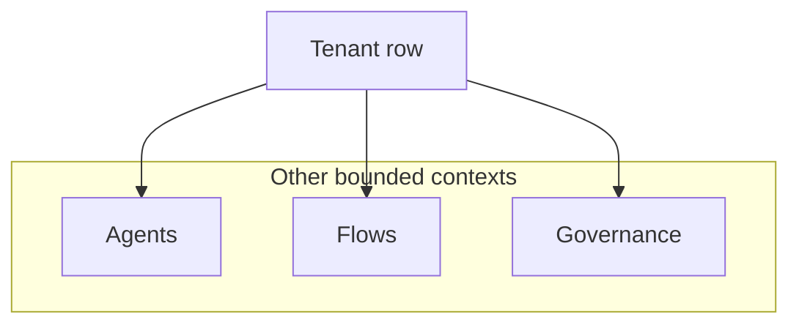

# Tenants — integration and runtime

**Tenants** is a **foundation** bounded context: most other domains scope data by **tenant id** obtained from auth / request context.

## Placement

- [Auth](../Auth/index.md) issues tokens scoped to a tenant; [Governance](../Governance/index.md) attaches policies per tenant.

## Related

- [Auth](../Auth/index.md)
