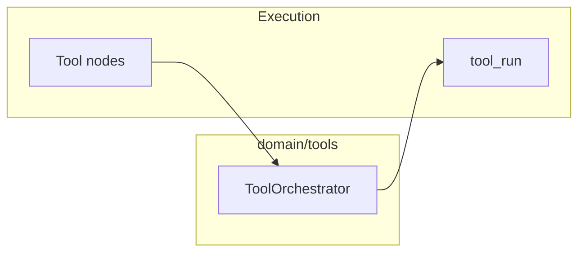

# Tools — integration and runtime

**Tools** covers **registry/authoring** and **runtime orchestration** (`ToolOrchestrator`) invoked from execution.

## Runtime path

- [Runtime execution](runtime-execution.md) for orchestrator details.
- [MCP](../MCP/index.md) may expose the same tool configs to external MCP clients.

## Related

- [Agents](../Agents/index.md)
- [Execution](../Execution/index.md)
