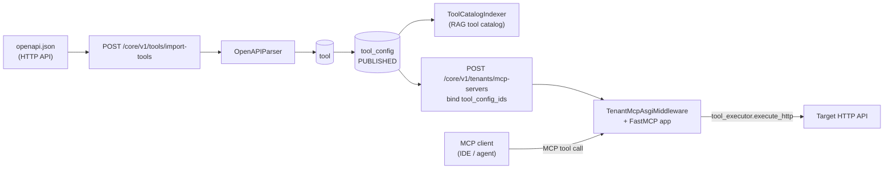
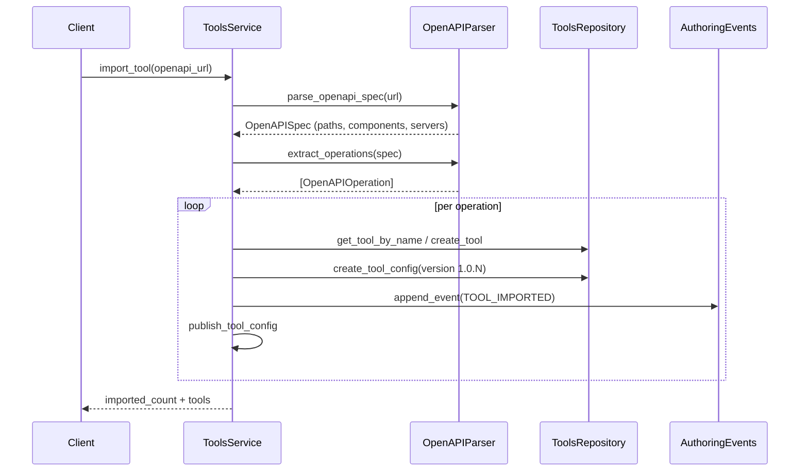
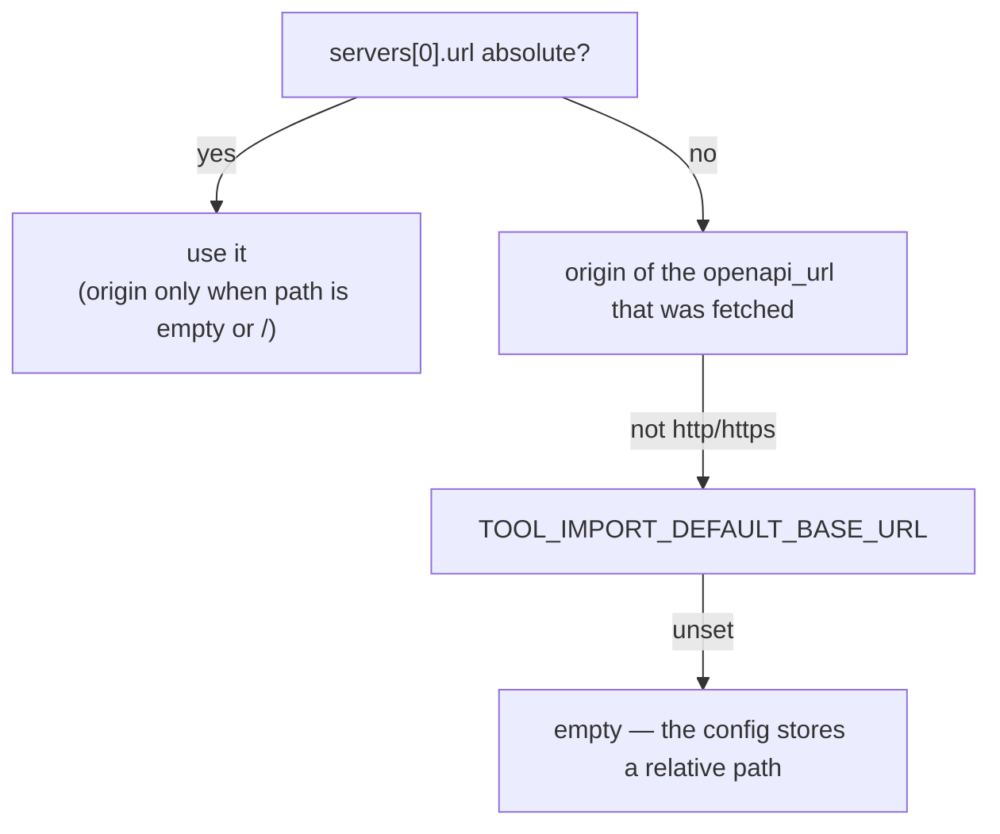

# From OpenAPI to MCP — the HTTP tool converter

This page documents the pipeline that turns a plain **HTTP API described by an `openapi.json`** into

1. tenant-scoped, versioned **tool configs** usable by graph nodes, and
2. **MCP tools** served to external MCP clients over Streamable HTTP.

No code generation and no per-integration adapters are involved: the OpenAPI document is parsed once,
each operation becomes a persisted contract, and both the graph runtime and the MCP gateway execute
that contract through the same `ToolExecutorPort`.

## End-to-end pipeline



The same `tool_config` row is the single contract behind two consumers:

| Consumer | Entry point | Execution |
|----------|-------------|-----------|
| Graph runtime | `ToolResolver` / tool nodes → `ToolOrchestrator` | `tool_executor.execute_http` |
| MCP client | `/core/v1/mcp-servers/{id}/mcp` → `_McpHttpProxyTool` | `tool_executor.execute_http` |

## Stage 1 — import

`POST /core/v1/tools/import-tools` with `{"openapi_url": "..."}` →
`ToolsService.import_tool` (`src/domain/tools/services/tools_service.py`).



### Parsing rules

`OpenAPIParser` (`src/domain/tools/services/openapi_parser.py`):

| Aspect | Behaviour |
|--------|-----------|
| Document format | JSON or YAML; must contain `openapi` or `swagger` plus a `paths` object, otherwise `invalid_openapi_spec` |
| Fetch | `httpx` GET, 30 s timeout, redirects followed; network failure → `failed_to_fetch_openapi_spec` |
| Methods | `get`, `post`, `put`, `patch`, `delete` |
| Tool name | `operationId`; when absent, `"{method}_{path}"` |
| Request schema | Single flat JSON Schema object merging the `application/json` request body with **path** then **query** parameters, `additionalProperties: false`, `required` accumulated from both sources, `$ref` deep-resolved against `components.schemas` |
| Response schema | Success `application/json` response schema, `$ref`-resolved, kept only when it is an object |
| Examples | `requestBody.content.application/json.examples[*].value`, serialized to strings |

Merging body and parameters into **one** object schema is what makes the operation callable as a single
MCP tool argument payload, and what lets the LLM slot-filling path emit strict `params`
(see [Structured output and budget](../LLM/structured-output-and-budget.md)).

### Base URL resolution

`resolve_tool_import_base_url` (`src/domain/tools/services/tool_import_http_base.py`) picks the first
usable value:



The resulting `tool_config.config` stores `base_url`, `path`, and a precomputed absolute `url`.
Runtime resolution prefers `base_url + path` via `effective_tool_http_url`, falling back to the legacy
absolute `url`.

### Authentication defaults

Imported configs receive `DEFAULT_IMPORT_TOOL_HEADERS`:

```json
{ "Authorization": { "interaction_metadata_key": "end_user_authorization" } }
```

That is a **late-bound** header: the value is not stored, it is resolved per call from the caller's
interaction metadata. Header entries in a `tool_config` may take three shapes:

| Shape | Meaning |
|-------|---------|
| `"Header": "literal"` | Static value |
| `"Header": {"secret_ref": "..."}` | Resolved through `SecretResolverPort` |
| `"Header": {"interaction_metadata_key": "..."}` | Resolved from the current interaction (end-user token propagation) |

In the MCP path the middleware records the inbound `Authorization` header as
`end_user_authorization` when it differs from the MCP API key, so the tenant's end-user credential
is forwarded to the target API instead of the MCP credential.

### Versioning and side effects per operation

Each imported operation produces:

- a `tool` row (reused when a tool with the same name already exists),
- a new `tool_config` at `1.0.{max_patch + 1}` for the tenant,
- an `AuthoringEvent` of type `TOOL_IMPORTED` with justification `import tool from openapi`,
- an immediate `publish_tool_config` so the config is usable by runtime and MCP,
- a tool-catalog RAG document (`source=tool_catalog`, `doc_type=tool_catalog`,
  `category=TOOL_CATALOG`, metadata `tool_config_id`, `operation_id`, `method`, `path`) enabling
  semantic tool ranking by `ToolCatalogRetriever`.

Re-importing the same document is therefore additive and versioned; it never mutates a published config.

## Stage 2 — expose as MCP

Bind the published `tool_config_ids` to an MCP server:

```bash
curl -X POST "$BASE/core/v1/tenants/mcp-servers" \
  -H "Authorization: Bearer $JWT" \
  -H "Content-Type: application/json" \
  -d '{"name":"crm","tool_config_ids":["<uuid>"],"vector_store_ids":[],"user_prompt_ids":[]}'
```

The response returns the `endpoint` (`{base}/core/v1/mcp-servers/{id}/mcp`) and a **one-time** `api_key`.
`McpRegistryRepository.fetch_mcp_server_build_spec` then projects each binding into an
`McpServerToolBinding`:

| MCP surface | Source |
|-------------|--------|
| Tool name (`mcp_name`) | Tool name, suffixed with the first 8 hex chars of the `tool_config_id` when duplicated |
| Tool `parameters` | `config.request_schema`, normalized; fallback `{"additionalProperties": true}` |
| Tool `output_schema` | `config.response_schema` when it is an object |

At call time `_McpHttpProxyTool.run` validates arguments with `jsonschema`, reloads the tool config under
the tenant guard, resolves URL, method, timeout and headers, executes the HTTP request and optionally
validates the response body against `response_schema`. Failure modes are returned as structured errors
(`arguments_validation_failed`, `tool_config_not_found`, `tool_response_validation_failed`, …) rather
than protocol exceptions — see [Gateway and runtime](../MCP/gateway-and-runtime.md).

## Minimal walkthrough

```bash
# 1. import every operation of an OpenAPI document as published tool configs
curl -X POST "$BASE/core/v1/tools/import-tools" \
  -H "Authorization: Bearer $JWT" -H "Content-Type: application/json" \
  -d '{"openapi_url":"https://api.example.com/openapi.json"}'

# 2. list the resulting configs
curl "$BASE/core/v1/tool-configs" -H "Authorization: Bearer $JWT"

# 3. publish an MCP server bound to a subset of them, then point an MCP client at
#    the returned endpoint using X-Api-Key: <api_key>
```

## Operational notes

- Import is **tenant-scoped**: `tenant_id` comes from the JWT, never from the payload.
- A document with zero usable operations fails with `openapi_spec_without_operations`.
- The converter covers JSON request/response bodies; multipart, form-encoded, and streaming operations
  are imported as contracts but should be reviewed before being exposed over MCP.
- Vector stores bound to the same MCP server add the `search_knowledge` tool, and bound user prompts
  become MCP prompts — the same server can therefore expose actions, knowledge, and prompt templates.

## Related

- [Tools overview](index.md) · [HTTP API](http-api.md) · [Runtime execution](runtime-execution.md)
- [MCP registry and API](../MCP/registry-and-api.md) · [MCP gateway and runtime](../MCP/gateway-and-runtime.md)
- [Structured output and budget](../LLM/structured-output-and-budget.md) — request schemas drive slot filling
