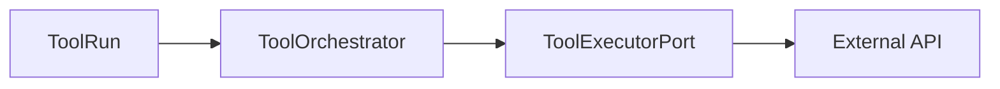

# Tools — runtime execution

## `ToolOrchestrator`

`src/domain/tools/services/tool_orchestrator.py`

Coordinates **tool runs** with:

- **`ExecutionRepository`** — persistence for runs and state transitions
- **`ToolExecutorPort`** — actual HTTP (or adapter) execution
- **`SecretResolverPort`** — resolves `secret_ref` entries in tool config headers
- Optional **`ToolsRepository`** — tool metadata when needed

Shared URL resolution: **`effective_tool_http_url(config)`** prefers `base_url` + `path`, else legacy absolute `url` (same idea as [MCP gateway](../MCP/gateway-and-runtime.md)).

## Relationship to graph runtime

Graph nodes such as **`ToolExecutor`** invoke tooling through the execution stack; see [Non-LLM nodes](../Execution/graph-runtime/nodes/non-llm-nodes.md) and [Execution service](../Execution/execution-service.md).

## Related

- [Tools overview](index.md)
