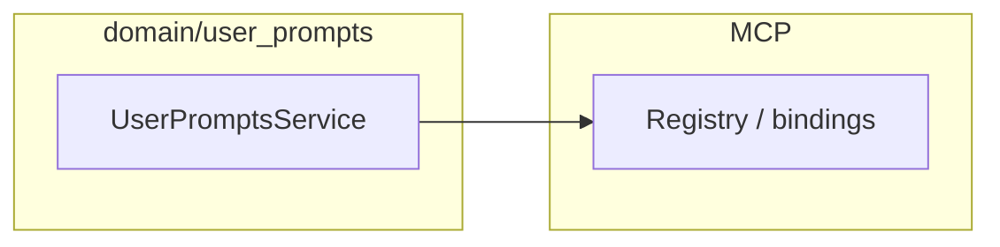

# User prompts — integration and runtime

**User prompts** are **tenant-authored** library entries, distinct from [Prompts](../Prompts/index.md) (**node_type** templates).

## Placement

- HTTP API manages CRUD; MCP surfaces selected prompts to clients when configured.

## Related

- [MCP — registry and API](../MCP/registry-and-api.md)
- [HTTP API](http-api.md)
