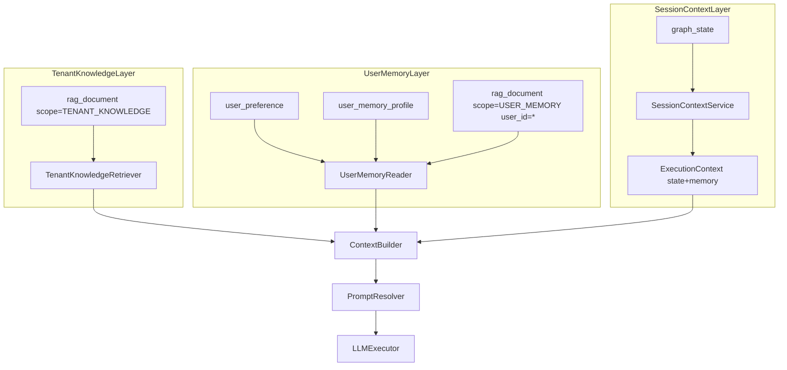
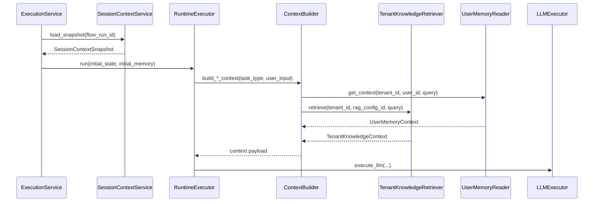

# Context Layer Architecture

## Scope

This document defines the formal separation between:

- Tenant Knowledge
- User Memory
- Session Context

It also defines contracts, runtime responsibilities, usage criteria by task type, and security/observability constraints.

## Layer model

### Tenant Knowledge

- Purpose: tenant-curated, shared domain knowledge.
- Scope key: `tenant_id`.
- Source: RAG documents with `metadata.scope = TENANT_KNOWLEDGE`.
- Constraints:
  - no `user_id`
  - no user PII

### User Memory

- Purpose: long-term user personalization memory.
- Scope key: `(tenant_id, user_id)`.
- Sources:
  - structured: `UserPreference`, `UserMemoryProfile`
  - vector: RAG documents with `metadata.scope = USER_MEMORY` and `metadata.user_id`
- Constraints:
  - never shared across users
  - scoped retrieval is mandatory

### Session Context

- Purpose: execution continuity and temporary working context.
- Scope key: `(tenant_id, session_id, flow_run_id)`.
- Source: `graph_state` snapshots and runtime `ExecutionContext`.
- Constraints:
  - ephemeral
  - not long-term truth

## Invariants

- Tenant Knowledge must not contain user-scoped payloads.
- User Memory must always be retrieved by `(tenant_id, user_id)`.
- Session Context cannot be promoted to long-term memory without explicit policy.
- ExecutionPlan remains structural and does not model context-layer operations.
- Context activation is controlled structurally by AITask flags:
  - `allow_rag_tenant`
  - `allow_user_memory`
  - `allow_session_context`
  - `allow_memory_write`
- RAG activation must pass objective precedence:
  - structural gate (`AITask`)
  - active `RagPolicyVersion`
  - explicit `ToolConfig.config.rag_activation` when present
  - valid/published `RagConfig`
  - user scope requires `user_id`
  - lightweight input heuristic (`empty`, `short`, `structured`)
- Inferred memory persistence requires an active `MemoryPolicyVersion` for the tenant.

## Runtime architecture

## Read path sequence

## Formal contracts

Implemented contracts:

- `ContextLayerScope`
- `TenantKnowledgeQuery`
- `TenantKnowledgeContext`
- `UserMemoryQuery`
- `UserMemoryStructured`
- `UserMemoryContext`
- `SessionContextSnapshot`
- `LayerUsageDecision`

Location:

- `src/domain/context/schemas/context_layers.py`

## Formal ports

Implemented ports:

- `TenantKnowledgeRetrieverPort`
- `UserMemoryReaderPort`
- `MemoryWriteServicePort`
- `MemoryRetrievalServicePort`
- `SessionContextPort`

Location:

- `src/domain/context/ports/service.py`

## Runtime responsibilities

### ExecutionService

- Wires `TenantKnowledgeRetriever`, `UserMemoryReader`, and `RuntimeContextLayerPolicy` into `ContextBuilder`.

### ContextBuilder

- Applies layer usage policy by task type.
- Delegates retrieval orchestration to `MemoryRetrievalService`.

### MemoryRetrievalService

- Centralizes layered retrieval orchestration with explicit scope boundaries:
  - Tenant knowledge (`TENANT_KNOWLEDGE`)
  - User memory (`USER_MEMORY`) structured + vector
  - Session context snapshot (`SESSION_CONTEXT`)
- Enforces strict user memory scoping with `(tenant_id, user_id)` for vector retrieval.
- Applies TTL enforcement for user memory vector retrieval using `doc_metadata.expires_at > now`.
- Supports optional temporal reranking with multiplicative decay:
  - `final_score = similarity_score * exp(-age_seconds / half_life_seconds)`
- Emits:
  - `domain.context.memory_retrieval.started`
  - `domain.context.memory_retrieval.completed`
  with ids/counts/flags only (no raw chunk content).

### PromptResolver

- Appends tenant knowledge contract to prompt when available.
- Appends user memory structured/retrieved payload when available.

### RuntimeExecutor

- Maintains node-level session continuity.
- Persists session context snapshots in `graph_state`.
- Applies write boundary for memory persistence using `AITask.allow_memory_write`.
- Seeds `state.user_context_enrichment` when `runtime_policy.user_context_enrichment.enabled=true`.
- Emits `domain.context.user_context_enrichment.seeded` with mode/flags only.

### UserContextEnrichmentNode (hybrid explicit layer)

- Acts as an explicit runtime node to publish context-layer eligibility for downstream LLM tasks.
- Does not load or persist memory content in `graph_state`; it only updates a small handle:
  - `enabled`
  - `published`
  - `layers` (`allow_tenant_knowledge`, `allow_user_memory_structured`, `allow_user_memory_vector`)
  - `published_by_node_id`
  - `published_at`
  - `mode` (`GATED` or `LEGACY`)
- Emits `domain.context.user_context_enrichment.published` with booleans/flags only.

### ContextBuilder (hybrid gating behavior)

- Reads `runtime_policy.user_context_enrichment`.
- If `gating=true` and the handle is not published, it blocks tenant/user memory retrieval by forcing:
  - `allow_tenant_knowledge=false`
  - `allow_user_memory_structured=false`
  - `allow_user_memory_vector=false`
- If the handle is published and contains explicit layer overrides, it applies those overrides before retrieval.
- Emits `domain.context.user_context_enrichment.gated_block` when gating blocks retrieval.

### MemoryPolicyService

- Resolves active memory policy version per tenant.
- Enforces allowed source, allowed schema, consent, and TTL constraints for user memory writes.

### MemoryWriteService

- Enforces `MemoryPolicyService.enforce_write(...)` before any persistence side effect.
- Routes memory writes by `AllowedSchema.write_targets`:
  - `USER_PREFERENCE` -> `user_preference`
  - `USER_MEMORY_PROFILE` -> `user_memory_profile`
  - `USER_MEMORY_VECTOR` -> RAG ingestion
- Applies deterministic preference update policy for `USER_PREFERENCE`:
  - key derivation: `fixed_key` wins, otherwise payload key must be in `allowed_keys`
  - overwrite: incoming source priority must be >= stored source priority
  - ignore: missing/unauthorized key, missing value, unchanged value, lower-priority source
- Emits canonical memory write events:
  - `event.MemoryUpdated` and `event.MemoryEmbedded` (tracing)
  - `ExecutionEventType.MemoryUpdated` and `ExecutionEventType.MemoryEmbedded` (persisted execution events when flow context is available)

### MemoryExtractionNode (post-execution)

- Runs after `FlowCompleted` using `ExecutionEventHook.on_flow_complete(...)` wrapper semantics.
- Executes LLM-assisted extraction/classification from final flow output into:
  - preference candidates
  - profile patch candidate
  - vector memory candidates
- Converts extracted output into `UserMemoryItem` payloads and persists exclusively through `MemoryWriteService.write_memory_item(...)`.
- Uses `MemoryPolicySource.INFERRED_LLM` by default and requires `rag_config_id` from runtime policy config.
- Emits `domain.context.memory_extraction.started` and `domain.context.memory_extraction.completed` with keys/counts only, never raw flow output.

### Async embedding pipeline (USER_MEMORY_VECTOR)

- Vector writes remain policy-gated in `MemoryWriteService` and call `MemoryPolicyService.enforce_write(...)` before queue side effects.
- `MemoryWriteService` now prepares document ingestion with `RagRuntimeService.prepare_document_for_embedding(...)` and enqueues a job through `EmbeddingJobQueuePort`.
- Worker execution runs `RagRuntimeService.embed_document_by_id(...)` asynchronously using Redis + Arq.
- Delivery semantics are at-least-once and rely on idempotency via:
  - document dedupe by `(tenant_id, content_hash)`
  - chunk upsert/do-nothing conflict handling on `(document_id, chunk_index)`
- Document lifecycle is tracked by `embedding_status` (`PENDING`, `PROCESSING`, `COMPLETED`, `FAILED`) and `embedding_attempts`.
- Canonical embedding events:
  - `MemoryEmbeddingQueued`
  - `MemoryEmbeddingStarted`
  - `MemoryEmbeddingCompleted`
  - `MemoryEmbeddingFailed`
- Existing `MemoryEmbedded` remains the completion marker for successful vector persistence.

### RagPolicyService

- Resolves active RAG policy version per tenant.
- Provides task/scope defaults and optional retrieval cap (`top_k_cap`).

### RagActivationService

- Computes dynamic allow/deny for vector retrieval per scope (`TENANT_KNOWLEDGE`, `USER_MEMORY_VECTOR`).
- Merges structural gate, policy, tool metadata overrides, rag config validity, user scope `user_id` guard, and input heuristic.
- Supports safe filter overrides via intent metadata/tool config, always enforcing mandatory scope boundaries.
- Emits canonical activation event `domain.rag.activation.decision` with reason code and derived input metadata (`input_len`, `input_kind`), never raw user input.

### SessionContextService

- Defines explicit load/persist contracts for session snapshots.

## Usage criteria by task type

| Task Type | allow_session_context | allow_user_memory | allow_rag_tenant | allow_memory_write |
| --- | --- | --- | --- | --- |
| IntentDetection | true | true | false | false |
| SlotFilling | true | true | false | false |
| ResponseFormatting | true | true | true | false |
| Clarification | true | false | false | false |
| ContentModeration | false | false | false | false |
| FlowDecision | false | false | false | false |
| ExecutionControl | false | false | false | false |

Policy implementation:

- `src/domain/context/services/runtime_policy.py`
- `src/domain/ai_policy/schemas/ai.py`

## Security and observability constraints

- Tenant Knowledge ingestion and retrieval:
  - must not include user PII or `user_id`.
- User Memory retrieval:
  - must include `(tenant_id, user_id)` scoping.
  - vector retrieval must apply `scope=USER_MEMORY`.
  - vector retrieval must apply TTL by `expires_at` and exclude missing/expired entries.
- Logging/tracing:
  - include identifiers (`tenant_id`, `user_id`, `session_id`, `flow_run_id`, `interaction_id`) when needed.
  - avoid raw memory payload logging if sensitive.
- PromptResolver emits the effective context flag decision per node/task before context rendering.
- If a flag forbids a layer:
  - layer retrieval is skipped
  - prompt payload for that layer is not appended
  - no fallback escalation to forbidden layer occurs
- If `runtime_policy.user_context_enrichment.gating=true`, tenant/user memory layers are also blocked until `UserContextEnrichmentNode` publishes the handle.

## Guardrails

- Retrieval before routing is blocked by default unless the bound AITask enables `allow_rag_tenant`.
- User memory exposure is blocked by default unless the bound AITask enables `allow_user_memory`.
- Shared RAG infrastructure must use separate `rag_config_id` and explicit `scope` metadata boundaries.
- User Memory vector retrieval must apply TTL by `expires_at` derived from active MemoryPolicy.
- Tenant/User vector retrieval must be skipped when dynamic RAG decision is deny.

## Manual verification checklist

- Verify context models include all three layers and remain optional where expected.
- Verify `ContextBuilder` only retrieves layers allowed by runtime policy.
- Verify `GET /core/v1/ai-tasks` returns the four flags and matches persisted values.
- Verify User Memory retrieval always receives `(tenant_id, user_id)`.
- Verify Tenant Knowledge retrieval enforces `scope=TENANT_KNOWLEDGE`.
- Verify User Memory vector retrieval enforces `scope=USER_MEMORY` and `user_id`.
- Verify User Memory vector retrieval applies `expires_at > now` filtering and excludes missing/expired entries.
- Verify optional temporal reranking uses multiplicative decay and does not expose raw content in telemetry.
- Verify vector retrieval follows precedence: structural -> policy -> tool metadata -> rag config -> user_id -> heuristic.
- Verify `domain.rag.activation.decision` is emitted with `scope`, `enabled`, `reason`, `input_len`, and `input_kind`.
- Verify dynamic deny reasons include `USER_ID_MISSING`, `INPUT_EMPTY`, `INPUT_TOO_SHORT`, and `INPUT_STRUCTURED`.
- Verify inferred memory write is denied when no active memory policy exists.
- Verify persisted memory metadata includes `policy_version_id` and `expires_at`.
- Verify `AllowedSchema.write_targets` controls which memory side effects are executed.
- Verify `MemoryUpdated`/`MemoryEmbedded` event payloads exclude raw sensitive memory values.
- Verify deterministic preference policy behavior (`fixed_key` vs `allowed_keys`, source-priority overwrite, ignore on unchanged).
- Verify Session Context remains persisted via `graph_state` snapshots.
- Verify PromptResolver includes tenant and user memory payloads only when present.
