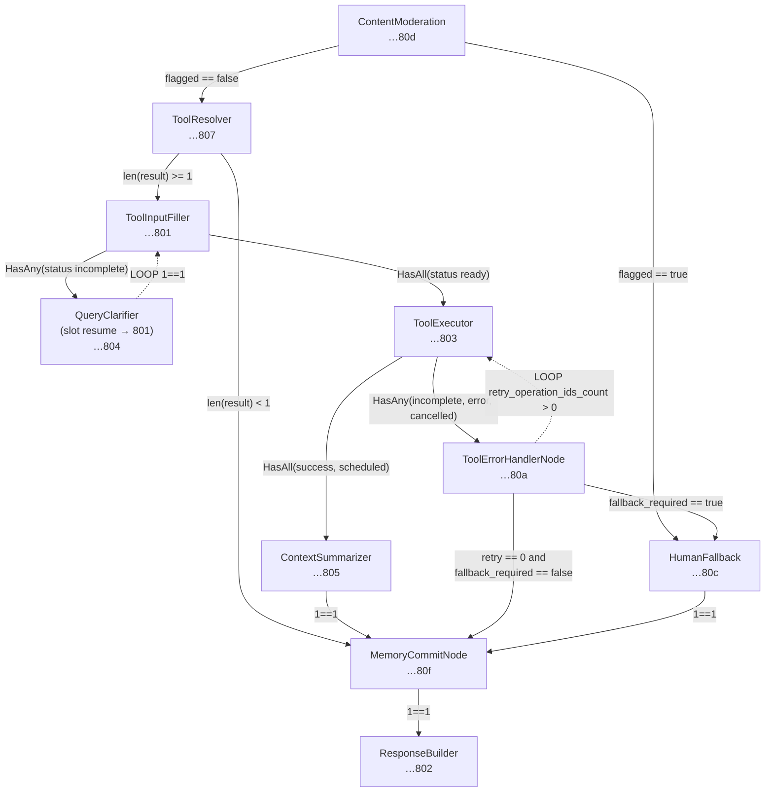

## Demo seed graph: conditional edges (`seed_11_graph.py`)

The demo flow graph is defined in `resources/scripts/seeds/demo/seed_11_graph.py`. Below, **node labels** use short IDs (UUID suffix) for traceability; **edge labels** summarize conditions (full strings are in the seed). There is **no** `UserContextEnrichmentNode`; read gating for USER_MEMORY layers is applied from **runtime policy** in the executor.

**Entry path:** after `ContentModeration`, the graph runs **`ToolResolver` first** (semantic catalog retrieval + optional LLM fallback). If at least one tool is selected (`len(result) >= 1`), execution continues to **`ToolInputFiller`**. If none (`len(result) < 1`), execution goes to **`MemoryCommitNode`** and then **`ResponseBuilder`** (no `IntentClassifier` in this graph for now).

The demo **`ToolResolver`** node sets **`confidence_threshold`** `0.78` (below the runtime default `0.9`) and **`top_k`** `10` to favor recall; tune per tenant.

**Notes**

- **Moderation → ToolResolver:** first pass runs without prior intent from this graph; `ToolResolver` uses the full tool catalog when no `IntentClassifier` output is present in state (`_resolve_detected_intent`).
- **ToolResolver → MemoryCommit:** when no tool is selected, the run still completes via commit + response (conversational or ambiguous input).
- **Tool success path:** `ToolExecutor` → optional **`ContextSummarizer`** (runs only when staged payload exceeds `min_payload_bytes_to_run`) → **`MemoryCommitNode`**. The summarize step **does not** persist; only `MemoryCommitNode` updates session memory via `NodeResult.memory` for USER_MEMORY on this graph.
- **`data_merge` on `MemoryCommitNode`:** merges slot `nickname` / `financial_goal` and optional `prepared_memory_data` from the summarize node into the commit payload (paths validated in `FlowGraphValidator`).
- **Terminal completion** for post-flow extraction is **`ResponseBuilder` / `HumanFallback`** types; `QueryClarifier` pauses do not invoke `on_flow_complete` extraction.
