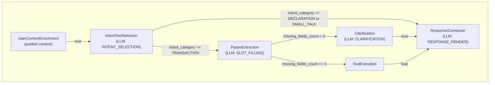

# Demo Flow – Technical Documentation

This document describes the **demo tenant** created by the seeds under `resources/scripts/seeds/demo/`: identity, persona, graph structure, LLM usage, context enrichment, and all seed configurations.

---

## 1. Demo tenant

| Field | Value |
|-------|--------|
| **Tenant ID** | `00000000-0000-0000-0000-000000000100` |
| **Name** | Assistente de Bolso |
| **Description** | Agente financeiro conversacional via WhatsApp: controle financeiro pessoal com integração bancária (Open Finance), categorização de gastos, relatórios, metas financeiras e compromissos. |
| **Timezone** | America/Sao_Paulo |
| **Currency** | BRL |
| **Language** | pt-BR |
| **Active** | true |

**Seed:** `seed_01_tenant.py`

---

## 2. Persona (agent)

The agent **Assistente de Bolso** is a “copiloto financeiro pessoal” with the following persona (from `seed_06_agent.py`):

| Attribute | Value |
|-----------|--------|
| **Language** | pt_BR |
| **Tone** | professional |
| **Style** | concise |
| **Max response length** | 500 characters |
| **Rules** | Never invent financial data; work only with system data; state explicitly when information is missing; confirm data when relevant ambiguity exists; do not assume uninformed financial context; do not promise non-existent features. |

The agent version is linked to an AI Execution Policy (v1), a RAG config (tenant knowledge), and is activated as the active agent version.

**Seed:** `seed_06_agent.py`

---

## 3. Flow and graph

- **Flow ID:** `00000000-0000-0000-0000-000000000700`
- **Flow name:** fluxo-assistente-bolso
- **Description:** Fluxo conversacional do Assistente de Bolso: intent, extração de parâmetros, execução de ferramentas (registro de despesas/receitas, consultas, metas, lembretes) e resposta ao usuário.
- **Start node:** UserContextEnrichment
- **Version:** 1.0.0 (published); active flow version is set after graph seed.

**Seed:** `seed_07_flow.py`, `seed_11_graph.py`

### 3.1 Graph diagram (Mermaid)

### 3.2 Nodes

| Node type | Node ID (suffix) | Role |
|-----------|-------------------|------|
| **UserContextEnrichmentNode** | ...0805 | First node; publishes user context layers (tenant knowledge, user memory structured/vector). No LLM. |
| **IntentToolSelectionNode** | ...0800 | Selects one tool and classifies intent (TRANSACTION / DECLARATION / SMALL_TALK). LLM. |
| **ParamExtractionNode** | ...0801 | Slot filling: extracts parameters and reports missing fields. LLM. |
| **ClarificationNode** | ...0804 | Asks user for missing required info. LLM. `resume_to_node_id` = Slot. |
| **ToolExecutionNode** | ...0803 | Executes the chosen tool (e.g. createExpense). No LLM. |
| **ResponseComposer** | ...0802 | Formats tool output or answers declarative/small-talk. LLM; only node with conversation history. |

### 3.3 Edges (routing)

| From | To | Condition |
|------|-----|-----------|
| UserContextEnrichment | Intent | `true` |
| Intent | Slot | `intent_category == "TRANSACTION"` |
| Intent | Response | `(intent_category == "DECLARATION" or intent_category == "SMALL_TALK")` |
| Slot | ToolExecution | `missing_fields_count == 0` |
| Slot | Clarification | `missing_fields_count > 0` |
| Clarification | Response | `true` |
| ToolExecution | Response | `true` |

---

## 4. LLMs and when they run

All LLM nodes use **OpenAI** with model alias **gpt-4o-mini** (provider model `gpt-4o-mini`). Runtime policy defaults: `temperature` 0, `max_tokens` 1024; Response node overrides `temperature` to 0.2.

| Moment | Node | LLM task type | Model | History |
|--------|------|----------------|-------|---------|
| After enrichment | IntentToolSelection | INTENT_SELECTION | gpt-4o-mini | No (stateless) |
| When TRANSACTION | ParamExtraction | SLOT_FILLING | gpt-4o-mini | No (stateless) |
| When missing fields | Clarification | CLARIFICATION | gpt-4o-mini | No (stateless) |
| Before final reply | ResponseComposer | RESPONSE_RENDER | gpt-4o-mini (temp 0.2) | Yes (`previous_response_id`) |

Conversation history is enabled only for **RESPONSE_RENDER** (`history_enabled_tasks: ["RESPONSE_RENDER"]` in runtime policy). Intent, Slot, and Clarification do not read or update the session’s “last response” pointer.

---

## 5. User enrichment and tenant knowledge / memory

- **When enrichment runs:** At the **start** of every run, in **UserContextEnrichmentNode**. It publishes context layers according to config: `allow_tenant_knowledge`, `allow_user_memory_structured`, `allow_user_memory_vector` (all true in the graph config).
- **When enriched context is used in prompts:** Only for the **ResponseFormatting** AI task. The AITask flags are:
  - **IntentDetection, SlotFilling, Clarification:** `allow_rag_tenant` / `allow_user_memory` / `allow_session_context` / `allow_memory_write` = **false** → no RAG, no user memory, no session context in the prompt.
  - **ResponseFormatting:** all **true** → tenant knowledge (RAG), user memory, and session context can be injected into the Response node’s prompt.

So: enrichment happens once at the beginning; the **consumption** of that enriched data (tenant knowledge + user memory + session) in the LLM prompt occurs only at the **Response** node.

RAG policy and memory policy (seeds 22, 23) define which sources and schemas are allowed for retrieval and writing; the runtime uses them together with the AITask flags above.

---

## 6. Seed files and configurations

Execution order is defined in `run.py`. Below is what each seed does and the main configuration it introduces.

### 6.1 `seed_01_tenant.py`

- Creates tenant **Assistente de Bolso** (id `...0100`): name, description, timezone America/Sao_Paulo, currency BRL, language pt-BR, active.

### 6.2 `seed_02_ai_tasks.py`

- **IntentDetection:** allow_rag_tenant=False, allow_user_memory=False, allow_session_context=False, allow_memory_write=False.
- **SlotFilling:** same (all false).
- **Clarification:** same (all false).
- **ResponseFormatting:** allow_rag_tenant=True, allow_user_memory=True, allow_session_context=True, allow_memory_write=True.

### 6.3 `seed_03_model.py`

- Model **gpt-4o-mini** (id `...0300`).

### 6.4 `seed_04_policy.py`

- AI Execution Policy (id `...0400`) for tenant demo; policy version v1 (id `...0401`) linked to model `...0300`, status PUBLISHED.

### 6.5 `seed_05_tool.py`

- Tool **createExpense** (id `...0500`); ToolConfig (id `...0501`) for tenant, version 1.0.0, from OpenAPI `openapi/demo_api.json` when present (else basic createExpense schema). Request schema includes amount, currency, bank_name, account_alias, description, category, payment_method, date, etc. `rag_activation`: tenant_knowledge and user_memory_vector enabled.

### 6.6 `seed_06_agent.py`

- Agent **Assistente de Bolso** (id `...0600`); AgentVersion v1 (id `...0601`) with persona_config (language, tone, style, rules, max_response_length), ai_execution_policy_version_id, rag_config_id; ActiveAgentVersion set.

### 6.7 `seed_07_flow.py`

- Flow **fluxo-assistente-bolso** (id `...0700`); FlowVersion v1 (id `...0701`), status DRAFT then published by graph seed.

### 6.8 `seed_08_nodes.py`

- Registers nodes for the flow version: UserContextEnrichment (no AITask), Intent→IntentDetection, Slot→SlotFilling, ToolExecution (no AITask), Response→ResponseFormatting, Clarification→Clarification.

### 6.9 `seed_09_prompts.py`

- Node prompts for Intent, Slot, Clarification, Response: template text and output_schema per node. Intent output schema requires intent, tool_config_id, clarification, intent_category (enum TRANSACTION/DECLARATION/SMALL_TALK). Slot: payload, missing_fields, missing_fields_count, execution_ready. Clarification/Response: system_output.

### 6.10 `seed_10_bindings.py`

- NodeAgentBinding: Intent, Slot, Response, Clarification nodes bound to AgentVersion v1. AgentVersionToolBinding: agent version bound to ToolConfig createExpense.

### 6.11 `seed_11_graph.py`

- FlowGraphDefinition: start_node = UserContextEnrichment; nodes (with llm configs: task_type, provider OPENAI, model_alias gpt-4o-mini, output_schema); edges and conditions as in section 3. Compiles to FlowGraphSnapshot, sets flow version to PUBLISHED, creates ActiveFlowVersion for the flow.

### 6.12 `seed_12_runtime_policy.py`

- Runtime policy (id `...0b00`) for tenant: limits (max_nodes, max_depth, timeouts, etc.), execution flags, tools (retries, circuit_breaker), **llm** (max_retries, timeout_ms, **history_enabled_tasks: ["RESPONSE_RENDER"]**, model_alias gpt-4o-mini, temperature 0, max_tokens 1024), user_context_enrichment (enabled, gating, default_layers), memory_extraction (enabled, rag_config_id, schemas, llm for extraction), memory_retrieval (temporal_scoring).

### 6.13 `seed_13_llm_provider_config.py`

- LLMProviderConfig OPENAI (id `...0c00`) for tenant: provider OPENAI, credential_secret_ref `env:openai_api_key`, base_url None.

### 6.14 `seed_14_llm_model_mapping.py`

- Two LLMModelMapping rows: alias **gpt-4o-mini** and alias **gpt-4o-mini** (fake-model id) both map to provider model `gpt-4o-mini` for the tenant.

### 6.15 `seed_15_node_ai_execution_policy_binding.py`

- NodeAIExecutionPolicyBinding: Intent, Slot, Response, Clarification nodes each bound to POLICY_VERSION_V1_ID (same AI execution policy version).

### 6.16 `seed_16_router.py`

- Router (id `...0f00`) on Intent node; ConditionExpression `ctx.get("intent") == "payment"`; RoutingRule from Intent to Slot when condition holds. (Demo-only; graph edges in seed_11 define the actual routing by intent_category.)

### 6.17 `seed_17_llm_pricing.py`

- LLMPricing for provider OPENAI, provider_model gpt-4o-mini: input/output cost per 1k tokens (USD), currency USD, status ACTIVE.

### 6.18 `seed_18_access_policy.py`

- AccessPolicy for tenant; AccessPolicyVersion v1 with rules allowing all scopes (from `Scope` enum).

### 6.19 `seed_19_rate_limit_policy.py`

- RateLimitPolicy for tenant; RateLimitPolicyVersion v1: action ExecutionFlowRunCreate, principal_type human, limit 100 per 60 seconds.

### 6.20 `seed_20_billing_policy.py`

- BillingPolicy for tenant; BillingPolicyVersion v1 (no extra config in seed).

### 6.21 `seed_21_rag.py`

- VectorStore “Assistente de Bolso - Conhecimento” (id `...1400`); RagConfig (id `...1401`) for tenant, linked to vector store, status PUBLISHED. Ingests documents: identity/propose, scope, FAQ (conexão bancária, registro, consultas, relatórios, metas, compromissos, uso geral), comportamento_limites. Embedding: text-embedding-3-small, 1536 dimensions.

### 6.22 `seed_22_memory_policy.py`

- MemoryPolicy for tenant; MemoryPolicyVersion v1: retention_ttl_seconds, consent_definition, allowed_sources (explicit_user, inferred_llm, tool_output, admin_seed), allowed_schemas (user.preference.v1, user.profile_signal.v1). ActiveMemoryPolicyVersion set for tenant.

### 6.23 `seed_23_rag_policy.py`

- RagPolicy for tenant; RagPolicyVersion v1: defaults per task type (INTENT_SELECTION, SLOT_FILLING, RESPONSE_RENDER, CLARIFICATION) with tenant_knowledge and user_memory_vector enabled; require_published_rag_config, top_k_cap 5, min_query_chars_by_scope, allow_structured_input false. ActiveRagPolicyVersion set for tenant.

### 6.24 `run.py`

- Ensures DATABASE_URL; waits for DB; runs seeds in the order listed in section 6 (Tenant → AI Tasks → Model → Policy → Tool → RAG → Agent → Flow → Nodes → Prompts → Bindings → Graph → Runtime Policy → LLM Provider Config → LLM Model Mapping → Node AI Execution Policy Binding → Router → LLM Pricing → Access → Rate Limit → Billing → Memory Policy → RAG Policy).

---

## 7. IDs reference (`ids.py`)

| Entity | UUID suffix |
|--------|-------------|
| Tenant | ...0100 |
| AI Tasks (Intent, Slot, Response, Clarification) | ...0200–...0203 |
| Model | ...0300 |
| Policy / Policy version | ...0400, ...0401 |
| Tool / ToolConfig | ...0500, ...0501 |
| Agent / Agent version | ...0600, ...0601 |
| Flow / Flow version | ...0700, ...0701 |
| Nodes (UserContext, Intent, Slot, Response, Tool, Clarification) | ...0805, ...0800, ...0801, ...0802, ...0803, ...0804 |
| Prompts (Intent, Slot, Response, Clarification) | ...0900–...0903 |
| Flow graph draft / snapshot | ...0a00, ...0a01 |
| Runtime policy | ...0b00 |
| LLM provider config | ...0c00 |
| LLM model mappings | ...0d00, ...0d01 |
| Node AI execution policy bindings | ...0e00–...0e03 |
| Router / Routing rule / Condition | ...0f00–...0f02 |
| LLM pricing | ...1000 |
| Access policy / version | ...1100, ...1101 |
| Rate limit policy / version | ...1200, ...1201 |
| Billing policy / version | ...1300, ...1301 |
| Memory policy / version | ...1350, ...1351 |
| RAG policy / version | ...1360, ...1361 |
| Vector store / RAG config | ...1400, ...1401 |

---

## 8. Summary

- **Tenant:** Assistente de Bolso (financeiro, WhatsApp, pt-BR).
- **Persona:** Profissional, conciso, regras de não inventar dados e confirmar ambiguidades.
- **Graph:** UserContextEnrichment → Intent → (TRANSACTION→Slot→Tool ou Clarification; DECLARATION/SMALL_TALK→Response) → Response; Tool/Clarification also feed Response.
- **LLMs:** gpt-4o-mini em Intent, Slot, Clarification e Response; história de conversa só em Response.
- **Enriquecimento:** Feito no nó inicial (UserContextEnrichment); uso de contexto (tenant + memória + sessão) no prompt só no nó Response (ResponseFormatting).

All of the above is created and wired by the seeds under `resources/scripts/seeds/demo/` as described in section 6.
