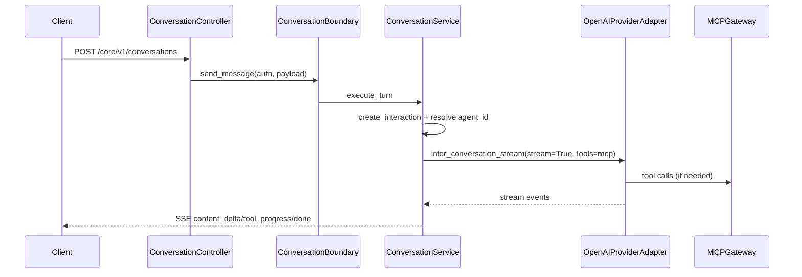

# Percurso atual do `POST /core/v1/conversations` no modo de baixa fricção

Este documento descreve o caminho atual do endpoint de conversação após a transição para execução direta no provider LLM (sem `create_flow_run`).

---

## 1. Entrada HTTP e autenticação

- Rota: `POST /core/v1/conversations` em `src/domain/conversation/controllers/conversation_controller.py`.
- Dependência global: `get_auth_context_or_api_key` em `src/utils/auth.py`.
- Headers principais:
  - `X-Inbound-Service-Key` ou `Authorization: Bearer ...`.
  - `Idempotency-Key` obrigatório.
  - `Last-Event-ID` opcional.
  - `X-Trace-Id` opcional.

O controller carrega a configuração MCP do tenant (`McpConfigLoader`) e coloca no `ContextVar` por request.

---

## 2. Boundary e políticas

`ConversationBoundary.send_message` aplica:

1. `RateLimitService.enforce` com `Scope.ExecutionFlowRunCreate`.
2. `AccessPolicyService.authorize` com a mesma ação.
3. Delega para `ConversationService.execute_turn`.

---

## 3. Serviço de conversa direto

`ConversationService.execute_turn`:

1. Cria `asyncio.Queue` e `SSEWriter`.
2. Inicia task de `_run_direct`.
3. Faz stream SSE token a token.

`_run_direct`:

- Cria interação de auditoria via `ExecutionRepository.create_interaction`.
- Resolve `agent_id` para versão ativa em `AgentsRepository`.
- Combina prompt da versão do agente com `user_prompt` opcional.
- Monta ferramentas MCP a partir do `ContextVar`.
- Chama `OpenAIProviderAdapter.infer_conversation_stream`.
- Mapeia eventos OpenAI para SSE interno:
  - `response.output_text.delta` -> `content_delta`.
  - `response.tool_call.started|completed` -> `tool_progress`.
  - fim -> `done`.
  - erro -> `error`.
- Atualiza auditoria da interação com `update_interaction_result`.

---

## 4. OpenAI provider

`src/domain/llm/adapters/openai_provider.py` expõe:

- `infer` para caminho legado de execução por grafo.
- `infer_conversation_stream` para conversa direta:
  - usa `responses.create(stream=True)`,
  - suporta MCP tools no payload,
  - faz retry em erro 424/Failed Dependency,
  - persiste `previous_response_id` quando existe `conversation_key`.

---

## 5. Diagrama resumido

---

## 6. Diferença principal para o fluxo antigo

O endpoint de conversação não depende mais de `ExecutionService.create_flow_run` para responder; ele usa caminho direto para OpenAI com mapeamento SSE interno e auditoria mínima em `interaction`.
