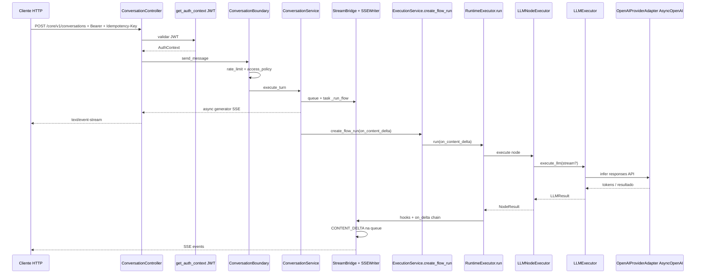

# **Percurso ida e volta** do `POST /core/v1/conversations` até à chamada ao **OpenAI**, com os pontos de validação que encontrei no código.

---

## 1. Entrada HTTP → SSE


| Passo       | Componente                                                                                  | O que faz                                                           |
| ----------- | ------------------------------------------------------------------------------------------- | ------------------------------------------------------------------- |
| Rota        | `ConversationController` (`src/domain/conversation/controllers/conversation_controller.py`) | `POST /core/v1/conversations`, `response_class=EventSourceResponse` |
| Auth global | `Depends(get_auth_context)` no router                                                       | Resolve `**Authorization: Bearer <JWT>`** via `src/utils/auth.py`   |


**Validações no controller (antes do boundary):**

- `**Idempotency-Key`** obrigatório — ausência → `RouterValidationException` (`missing_idempotency_key`).
- `**Last-Event-ID**` opcional — se vier, tem de ser inteiro ≥ 0 (`invalid_last_event_id`).
- `**X-Trace-Id**` opcional — UUID ou hex 32 chars; senão gera UUID novo.

**Auth JWT (`get_auth_context`):**

- Bearer obrigatório; `JWT_SECRET`, `JWT_ISSUER`, `JWT_AUDIENCE` configurados.
- Validação do token: `iss`, `aud`, `exp` (+ leeway), `**scopes**` não vazio, `**tenant_id**` (exceto scope `tenants:create`), `**principal_type**` (`human`  `machine`), `**principal_id**` / `sub`.

Nota: este endpoint usa `**get_auth_context**` (só JWT). O fluxo com `**X-Inbound-Service-Key**` está em `**get_tenant_token_m2m_auth**`, usado outro sítio (ex.: troca de token M2M), **não** no handler direto de `/conversations`.

---

## 2. Boundary de conversação

| Passo | `ConversationBoundary.send_message` (`src/services/conversation_boundary.py`) |

- `**RateLimitService.enforce**` — `Scope.ExecutionFlowRunCreate` (tenant + principal).
- `**AccessPolicyService.authorize**` — mesma ação + `auth.scopes`.

Se falhar aqui, o pedido nem chega ao serviço de execução.

---

## 3. Serviço de conversação + fila SSE

`ConversationService.execute_turn` (`src/domain/conversation/services/conversation_service.py`):

1. Cria uma `**asyncio.Queue**` e um `**SSEWriter**` (numera eventos SSE; suporta `Last-Event-ID`).
2. Arranca `**_run_flow**` em **task** em background.
3. O gerador devolvido faz `**async for chunk in writer.stream()**` → cada item vira `**ServerSentEvent**` (`event`, `data`, `id`, `retry=5000`).

`**_run_flow`:**

- Opcionalmente junta **user prompt** do repositório ao texto (`user_prompt_id`).
- Monta `**FlowRunCreate**` (`flow_id`, `flow_version_id`, `session_id`, `user_id`, `correlation_id`, `input`, `input_parts`, `metadata`).
- Envolve os hooks de execução num `**CompositeHook**`: hook original do `ExecutionService` + `**StreamBridge**` (empurra eventos para a fila: `FLOW_STARTED`, `NODE_*`, `CONTENT_DELTA`, `DONE`, erros, etc.).
- Chama `**ExecutionService.create_flow_run(..., on_content_delta=_on_content_delta)**` — o delta de texto do LLM pode ir para `**StreamBridge.push_content_delta**` → evento SSE `**content_delta**`.

---

## 4. Execução do fluxo (`ExecutionService.create_flow_run`)

Trecho principal: `src/domain/execution/services/execution_service.py` (~475–904).

**Validações / regras relevantes (lista não exaustiva mas representativa):**

- `**flow_id` ou `flow_version_id**` obrigatório.
- Versão do fluxo existe, `**PUBLISHED**`, alinhada com a versão **ativa** do flow (`flow_version_not_active`, etc.).
- `**user_id**` não vazio.
- **Flow** existe e `**tenant_id**` coincide com o do token.
- **Idempotência**: chave `(tenant, endpoint, idempotency_key)` — se já existir resposta em cache, devolve-a; se estiver “em progresso”, pode levantar `**IdempotencyInProgressException**`.
- `**trace_id**` parseável como UUID.
- **Sessão**: criar sessão ou validar `**tenant_id` + user_id`** (`session_user_mismatch`).
- `**_normalize_flow_run_input`**: se houver `**input_parts**`, normaliza para `**user_input**` (multimédia/texto); senão normalizer, erro (`user_input_normalizer_required`).
- Carrega **snapshot do grafo**, **runtime policy**, **deployment**; pode falhar se faltar snapshot (`flow_snapshot_required`, `flow_graph_snapshot_missing`, etc.).
- `**create_flow_run`** na BD, `**create_interaction**`, `**link_interaction_to_flow_run**`, event batching.
- Compila ou lê do **cache** o `**ExecutionPlan`**.

**O `create_flow_run` usado pela conversa** (linhas ~833–850) chama:

```text
await self.runtime.run(..., on_content_delta=on_content_delta)
```

Ou seja, o **delta para SSE** entra pelo `**RuntimeExecutor`** e desce até aos nós LLM como `**context.on_content_delta**`.

*(Neste método não aparece `limits.assert_can_create_agent_run`; esse tipo de limite está ligado a outros caminhos, p.ex. `create_agent_run`.)*

---

## 5. Runtime do grafo → nó LLM

- `**RuntimeExecutor.run*`* (`graph_runtime/executor.py`) percorre o plano, executa nós (tool, LLM, etc.), dispara hooks (`on_flow_start`, `on_node_start`, …) que o `**StreamBridge**` traduz em tipos SSE.
- Nós **LLM** usam `**LLMNodeExecutor`** em `graph_runtime/nodes/_llm_base.py`:
  - Resolve **prompt** (`PromptResolver`), **model_alias** (obrigatório, senão `llm_model_alias_required`).
  - Constrói `**LLMRequest`** (temperatura, max tokens, schema, `stream` conforme **runtime policy** `stream_enabled` + `on_content_delta` presente + `stream_eligible_tasks`).
  - Chama `**llm_executor.execute_llm(..., on_delta=...)`** quando streaming está ativo.

---

## 6. `LLMExecutor` → fornecedor (OpenAI)

- `**LLMExecutor**` (`src/domain/llm/services/llm_executor.py`): guardrails, circuit breaker, custo, schema validation, **selector de provider**.
- O provider concreto para OpenAI é `**OpenAIProviderAdapter`** (`src/domain/llm/adapters/openai_provider.py`): cliente `**AsyncOpenAI**`, uso da API `**responses**` (e `**conversations.create**` para chave de conversa em Redis — TTL 24h), montagem do payload com modelo (`model_alias`), mensagens, JSON schema quando aplicável.

Ou seja: a **comunicação com a OpenAI** passa por `**LLMExecutor` → `LLMProviderPort.infer` → `OpenAIProviderAdapter`** (`openai_client.responses.create` / fluxos relacionados no mesmo adapter).

---

## 7. Volta: OpenAI → cliente SSE

1. **Streaming textual**: deltas do provider → `**on_delta`** → `**LLMNodeExecutor**` → `**context.on_content_delta**` (definido pelo runtime a partir de `**on_content_delta**` passado ao `create_flow_run`) → `**StreamBridge.push_content_delta**` → fila → `**SSEWriter**` → `**ServerSentEvent**` com `event=content_delta` (valor em `SSEEventType`).
2. **Eventos de ciclo de vida**: hooks `**on_flow_complete` / `on_flow_failed`** → `**StreamBridge**` → `DONE` ou erro → sentinel `**None**` na fila → `**SSEWriter**` termina o loop.
3. No fim, `**create_response_artifact_for_flow_run**` persiste artefacto da resposta do flow run (quando `_run_flow` conclui sem exceção).

Se `**create_flow_run**` lançar exceção no `_run_flow`, a conversa empurra `**ERROR**` na fila e fecha.

---

## 8. Diagrama ida e volta (resumo)




---

**Em uma frase:** o endpoint **não** chama OpenAI diretamente no controller; sempre passa por **JWT + rate limit + policy**, `**ConversationService`** (fila SSE), `**ExecutionService.create_flow_run**` (dezenas de validações de fluxo/sessão/idempotência/snapshot), **runtime do grafo**, **nó LLM**, `**LLMExecutor`** e só então `**OpenAIProviderAdapter**` (`AsyncOpenAI` / Responses API). O caminho de volta é **delta + hooks → `StreamBridge` → `SSEWriter` → `ServerSentEvent`**.