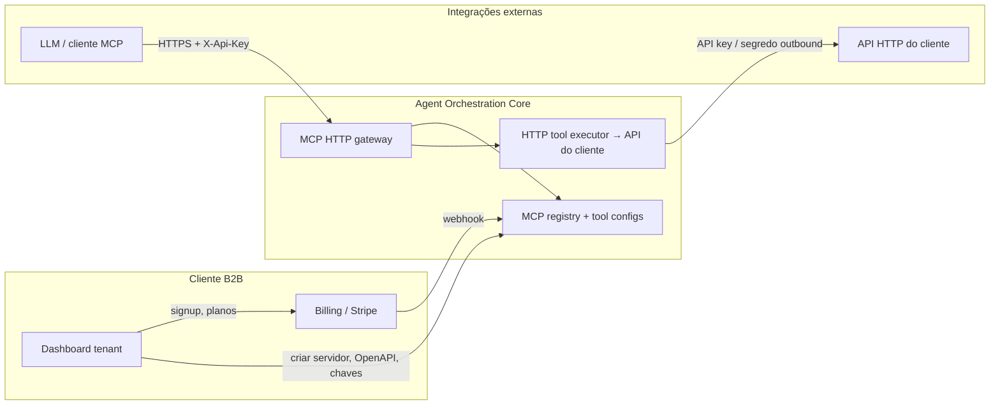
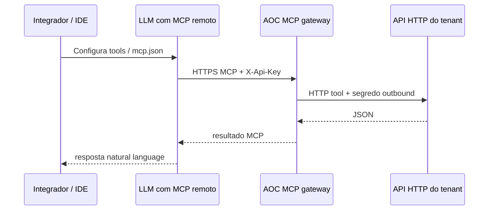

# Evolução: experiência B2B SaaS no Agent Orchestration Core

Este documento descreve como evoluir o **agent-orchestration-core (AOC)** para uma experiência próxima de **SaaS B2B**: conta, pagamento, dashboard do tenant e configuração simples de APIs expostas como **MCP**, com credenciais **estáveis** (sem refresh obrigatório para o integrador).

Referência ao estado atual: [Registry and API](../MCP/registry-and-api.md), [Gateway and runtime](../MCP/gateway-and-runtime.md).

---

## 1. Visão alvo

**Cliente B2B** (empresa integradora ou produto white-label):

1. Cria conta e organização (**tenant**).
2. Escolhe plano e paga (ou trial).
3. Acede a um **dashboard** onde:
   - vê o URL público do MCP e gere **chaves de API de longa duração** (inbound);
   - regista **origens HTTP** (OpenAPI ou endpoints individuais) que o AOC converte em **ferramentas MCP**;
   - opcionalmente define **segredos outbound** (chamadas do AOC à API do cliente) sem expor JWT de utilizador final ao integrador.

**Objetivo de simplicidade:** o integrador embute **uma chave** (`X-Api-Key`) e o endpoint MCP nas ferramentas do modelo (OpenAI, Cursor, etc.). **Não** deve precisar de fluxo OAuth ou refresh para **configurar** o servidor MCP em nome da própria empresa.

Nota: chamadas que representam **utilizadores finais** da app do cliente podem continuar a precisar de token curto (JWT/OAuth). Isso é um **eixo separado** da “chave do tenant no dashboard”.

---

## 2. Estado atual (resumo) vs lacunas

| Área | Hoje (AOC + ecossistema) | Lacuna para “SaaS B2B simples” |
|------|---------------------------|----------------------------------|
| Tenant | Existe modelo multi-tenant; API registry em `/core/v1/tenants` com scopes | Sem self-service “signup + billing” no produto; muitas operações parecem **operator-led** |
| MCP inbound | `X-Api-Key` ou Bearer como **credencial de servidor** (hash SHA-256, mostrada uma vez) | Já é “estável”; falta **UX** (rodar/regenerar no dashboard, nomes, auditoria) |
| Ferramentas HTTP → MCP | `tool_config` + bindings ao `mcp_server`; proxy HTTP no gateway | Cadastro de API costuma passar por **app-platform-api** / pipelines internos; não há wizard “cole a URL OpenAPI” só no AOC |
| Auth outbound | `outbound_authorization_secret_ref` com prefixo `env:` | Adequado a ops; B2B quer **secret por tenant** guardado em cofre + UI “testar ligação” |
| End-user JWT no MCP | `Authorization` separado da api-key inbound para dados do utilizador | Correto para produto consumer; para **integração B2B pura**, muitos casos só precisam **server-to-server** com segredo fixo |

---

## 3. Oportunidades de melhoria

### 3.1 Produto e go-to-market

- **Onboarding guiado:** fluxo “criar servidor MCP → gerar chave → copiar URL” num único ecrã reduz suporte.
- **Planos por métricas:** chamadas MCP, número de tools expostas, largura de banda outbound — alinha receita com custo de proxy HTTP e LLM.
- **Ambientes:** `dev` / `staging` / `prod` com chaves distintas sem multiplicar tenants (opcional: **projects** dentro do tenant).

### 3.2 Experiência do integrador

- **Uma chave inbound visível e revogável** no dashboard (o modelo atual já não devolve a chave após criação — ver registry); evolução: **“regenerar chave”** com overlap opcional (duas chaves válidas durante migração).
- **Documentação gerada:** OpenAPI do próprio AOC só para “tenant admin” + página “Connect to ChatGPT / Cursor” com snippets.

### 3.3 Modelo de configuração HTTP → MCP

- **Import OpenAPI:** gerar `tool_config` a partir de especificação (paths, métodos, schemas) com pré-visualização e renomeação de `mcp_name`.
- **Validação “dry-run”:** chamada de teste ao upstream com segredo outbound antes de publicar o servidor MCP.
- **Versionamento:** publicar nova revisão do conjunto de tools sem downtime (blue/green no `mcp_server` ou flags).

### 3.4 Segurança e compliance

- **Separação clara:** chave **inbound** (quem chama o MCP) vs segredos **outbound** (quem o AOC chama). Evitar reutilizar JWT de utilizador como único segredo de integração.
- **Audit log:** quem criou/regenerou chaves, alterações em bindings, IPs opcionais (allowlist) para enterprise.

### 3.5 Arquitetura técnica

- **Dashboard como app à parte** (SPA) falando com **API pública do AOC** ou com **BFF** que delega em AOC + serviço de billing — evita misturar UI no mesmo deploy dos workers sensíveis.
- **Billing:** Stripe (ou equivalente) com `customer_id` / `subscription_id` no tenant; webhooks atualizam `plan` e limites (feature flags no middleware MCP).

---

## 4. Princípio: “chave sem refresh” — onde é realista

| Cenário | Credencial recomendada | Refresh? |
|---------|-------------------------|----------|
| Integrador chama o **endpoint MCP** do AOC | `X-Api-Key` (servidor) | Não, até revogação explícita |
| AOC chama a **API do cliente** (server-to-server) | API key estática, HMAC, ou mTLS no outbound | Opcional rotação por política do cliente |
| Dados **por utilizador final** da app do cliente | JWT/OAuth no header por pedido MCP | Sim, no produto do cliente |

Ou seja: **simplificar para B2B** significa fixar **dois canais** — inbound estável para o MCP e outbound estável para a API do cliente — e tratar identidade de utilizador final como **camada opcional** quando o caso de uso exigir.

---

## 5. Como realizar a evolução (fases sugeridas)

### Fase A — Fundações SaaS (mínimo viável)

1. **Projeto “Tenant portal”** (nova app ou módulo): login, lista de `mcp_servers`, criar/editar, mostrar endpoint, regenerar chave (novos endpoints se o registry ainda não expuser rotação).
2. **Stripe (ou similar):** checkout + webhook → atualiza `tenant.plan`, limites (`max_mcp_servers`, `max_tool_configs`).
3. **Governança:** middleware que recusa criação MCP se plano excedido.

Entregável: um tenant pode **pagar** e **gerar chave + URL** sem pedir a equipa interna.

### Fase B — Configuração HTTP → MCP sem depender do app-platform

1. **API no AOC:** `POST /tool-configs/from-openapi` (multipart ou URL) → gera rascunhos de `tool_config` associados ao tenant.
2. **UI:** wizard + validação de schema + teste `dry-run`.
3. **Ligação ao fluxo existente:** reusar `McpRegistryService.create_server` com os novos `tool_config_ids`.

Entregável: “cole OpenAPI → aparecem tools no MCP”.

### Fase C — Enterprise

1. Allowlist IP, SSO para o dashboard (SAML/OIDC), SLA logs.
2. **Replicação regional** do endpoint MCP (DNS + mesmo tenant id).

---

## 6. Riscos e decisões explícitas

- **Não confundir** “sem refresh” com “sem autenticação forte”: chaves longas + rotação + revogação são obrigatórias em produção.
- **Superfície de tools grande** (muitas operações OpenAPI) pode degradar LLMs e custos; o dashboard deve permitir **filtrar** tools exportadas (já existe conceito de `allowed_tools` no lado OpenAI — documentar para clientes).
- **Compliance:** se o tenant indexar dados de terceiros, contratos DPA e retenção passam a ser **self-service** (checkboxes no signup).

---

## 7. Diagrama alvo (visão lógica)



---

## 8. Demonstrativo de integrações (exemplos simplificados)

Valores que o **dashboard do tenant** passaria a expor após criar um servidor MCP (ilustrativos):

| Campo | Exemplo |
|-------|---------|
| Base pública HTTPS | `https://mcp.acme-aoc.example.com` |
| `mcp_server_id` | `a1b2c3d4-e5f6-7890-abcd-ef1234567890` |
| Chave inbound (servidor) | `aoc_live_sk_xxxxxxxxxxxxxxxx` (mostrada uma vez; guardar em cofre) |

**URL MCP canónico** (path já usado pelo gateway):

`https://mcp.acme-aoc.example.com/core/v1/mcp-servers/a1b2c3d4-e5f6-7890-abcd-ef1234567890/mcp`

Integradores substituem host, UUID e chave pelos próprios.  
Se o caso **não** precisar de dados por utilizador final, basta `X-Api-Key`.  
Se precisar, acrescenta-se `Authorization: Bearer <jwt>` **além** da chave (contrato atual no [gateway](../MCP/gateway-and-runtime.md)).

### 8.1 OpenAI — Responses API (Python, MCP remoto)

O modelo de produto expõe o mesmo endpoint como **ferramenta MCP remota**; a OpenAI lista e invoca tools conforme a documentação de [MCP Tools](https://platform.openai.com/docs/guides/tools-remote-mcp).

```python
import os
from openai import OpenAI

client = OpenAI(api_key=os.environ["OPENAI_API_KEY"])

inbound_key = os.environ["ACME_MCP_INBOUND_KEY"]

tools = [
    {
        "type": "mcp",
        "server_label": "acme-mcp",
        "server_url": "https://mcp.acme-aoc.example.com/core/v1/mcp-servers/a1b2c3d4-e5f6-7890-abcd-ef1234567890/mcp",
        "require_approval": "never",
        "headers": {
            "x-api-key": inbound_key,
        },
    }
]

response = client.responses.create(
    model="gpt-4.1",
    instructions="Use as ferramentas MCP para dados da Acme.",
    input="Qual foi o total de pedidos ontem?",
    tools=tools,
    store=False,
)

print(response.output_text)
```

**Streaming** (`responses.stream`): mesmo contrato que no POC interno (`agent-orchestration-core/poc_mcp.py`) — `store=False` reduz falhas ao listar muitas ferramentas MCP; `temperature` baixo (ex. `0.2`) estabiliza respostas baseadas em dados das tools. Opcionalmente acrescentar `"Authorization": "Bearer …"` em `headers` quando o upstream precisar de identidade de utilizador final (além da chave inbound).

```python
import os
from openai import OpenAI

client = OpenAI(api_key=os.environ["OPENAI_API_KEY"])

tools = [
    {
        "type": "mcp",
        "server_label": "acme-mcp",
        "server_url": "https://mcp.acme-aoc.example.com/core/v1/mcp-servers/a1b2c3d4-e5f6-7890-abcd-ef1234567890/mcp",
        "require_approval": "never",
        "headers": {
            "x-api-key": os.environ["ACME_MCP_INBOUND_KEY"],
        },
    }
]

with client.responses.stream(
    model="gpt-4.1",
    instructions="Use as ferramentas MCP para dados da Acme.",
    input="Qual foi o total de pedidos ontem?",
    tools=tools,
    store=False,
    temperature=0.2,
) as stream:
    for event in stream:
        if event.type == "response.output_text.delta":
            print(event.delta, end="", flush=True)
        elif event.type == "response.tool_call.started":
            print("\n\n[MCP CALL STARTED]\n", flush=True)
        elif event.type == "response.tool_call.completed":
            print("\n\n[MCP CALL COMPLETED]\n", flush=True)
        elif event.type == "response.error":
            print(f"\nERRO: {event.error}", flush=True)
    final_response = stream.get_final_response()

print("\n\n=== FINAL ===")
if final_response is not None and final_response.output_text:
    print(final_response.output_text)
```

Se a API devolver erro intermitente ao listar tools em modo stream (ex. HTTP 424 no cliente OpenAI), o POC retenta o stream ou faz fallback para `responses.create` com os mesmos argumentos — reproduzir só em automação se necessário.

### 8.2 Cursor — `~/.cursor/mcp.json`

Cursor lê servidores MCP HTTP com URL e cabeçalhos. O tenant copia do dashboard **Connect → Cursor**.

```json
{
  "mcpServers": {
    "acme": {
      "url": "https://mcp.acme-aoc.example.com/core/v1/mcp-servers/a1b2c3d4-e5f6-7890-abcd-ef1234567890/mcp",
      "headers": {
        "x-api-key": "aoc_live_sk_xxxxxxxxxxxxxxxx"
      }
    }
  }
}
```

Reiniciar o Cursor ou recarregar MCP após alterações. Em projetos que usem **SDK Cursor** (`@cursor/sdk`), o mesmo par `url` + `headers` aparece como `mcpServers.uora` (nome arbitrário).

### 8.3 Claude Code / Claude Desktop (Anthropic)

Formatos variam por produto e versão; o padrão desejável para B2B é **HTTP(S) + headers**, quando suportado.

**Claude Code** (ficheiro de configuração MCP do projeto ou utilizador, conforme versão):

```json
{
  "mcpServers": {
    "acme": {
      "type": "http",
      "url": "https://mcp.acme-aoc.example.com/core/v1/mcp-servers/a1b2c3d4-e5f6-7890-abcd-ef1234567890/mcp",
      "headers": {
        "X-Api-Key": "aoc_live_sk_xxxxxxxxxxxxxxxx"
      }
    }
  }
}
```

**Claude Desktop** historicamente privilegia **stdio** (subprocess). Para um endpoint só HTTP, as opções são: cliente que faz proxy stdio→HTTP, ou usar o canal oficial da Anthropic para MCP remoto quando disponível na vossa versão. O dashboard pode oferecer dois blocos de cópia: **“HTTP direto”** e **“stdio wrapper”** (script fornecido pela Acme), mantendo a mesma chave inbound.

### 8.4 Outros clientes (IDEs e agentes)

| Cliente | Ideia |
|---------|--------|
| **Windsurf / Continue / Zed** | Igual ao Cursor: URL MCP + header `X-Api-Key` na configuração nativa de MCP HTTP. |
| **ChatGPT** (conectores / MCP remoto) | Colar URL HTTPS da Acme + headers no fluxo de “connector” quando a UI permitir MCP custom; mesmos valores. |
| **cURL / Postman** | Testar `POST` JSON-RPC MCP (`initialize`, `tools/list`) com `X-Api-Key` para validar que o servidor responde antes de ligar ao LLM. |

### 8.5 Diagrama resumido (integrador → AOC → API do cliente)



---

## 9. Conclusão

O AOC já possui **núcleo técnico** para MCP multi-tenant, **chave inbound estável** e **proxy HTTP para tools**. A evolução “tipo SaaS B2B” é sobretudo **camada de produto**: billing, dashboard, import OpenAPI e políticas de chave — mais **clareza de modelo de auth** (inbound fixo vs identidade de utilizador final). Implementar em **fases** reduz risco e permite validar receita e UX antes de automatizar todo o desenho OpenAPI.
