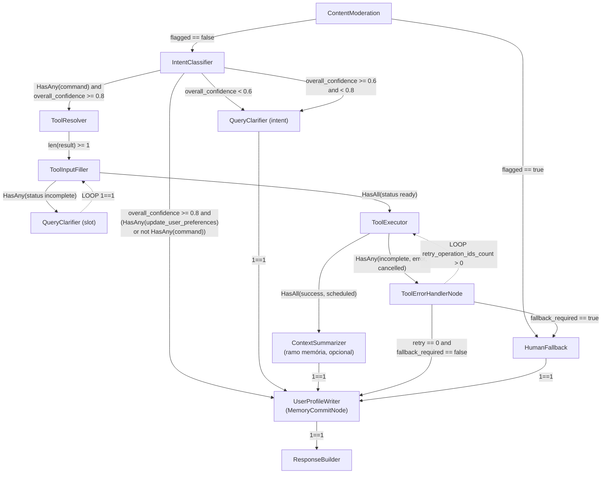

# Catálogo de Nodes – Agent Orchestration Core

> Todos os nodes podem ser copiados e adaptados conforme necessidade.

## Estrutura de Contexto

O contexto é construído dinamicamente a partir dos prompts disponíveis. Nem todos os prompts precisam estar presentes para cada execução. Exemplo de construção de contexto:

```json
[
  {"role": "system", "content": "system_prompt"},
  {"role": "system", "content": "node_prompt"},
  {"role": "system", "content": "tool_input_context.prompt"},
  {"role": "system", "content": "tool_output_context.prompt"},
  {"role": "system", "content": "tenant_profile.prompt"},
  {"role": "system", "content": "user_profile.prompt"},
  {"role": "user", "content": "user.input_message"}
]
```

### Descrição dos Prompts

* **system_prompt:** Prompt de personificação, regras e guardrails do agente.
* **node_prompt:** Prompt da tarefa específica do node (SLM/LLM).
* **tool_input_context.prompt:** Contexto referente ao input da ferramenta (ex.: OpenAPI).
* **tool_output_context.prompt:** Contexto referente ao output da ferramenta.
* **tenant_profile.prompt:** Conhecimento adquirido via RAG baseado no tenant (ex.: FAC).
* **user_profile.prompt:** Conhecimento adquirido via RAG baseado no usuário, sumarizado ou gerado por nodes.
* **user.input_message:** Mensagem enviada pelo usuário.

---

# Pacote de Nodes – Definição e Contexto

## TenantProfile (LLM‑less)

Node responsável por coletar e enriquecer informações do tenant.

---

## UserProfileReader (LLM‑less)

Node responsável apenas por **obter informações do usuário**.

**Observações:**

* Lê dados do usuário **somente do RAG**.
* Se o contexto retornado do RAG for muito grande, aciona **ContextSummarizer** antes de repassar para outros nodes.

**Contexto necessário:**

```json
[
  {"role": "system", "content": "node_prompt"},
  {"role": "user", "content": "user.input_message"}
]
```

---

## UserProfileWriter (LLM)

Node responsável por **criar ou atualizar memória do usuário**.

**Observações:**

* Grava ou atualiza dados no RAG do usuário.
* Se o número de documentos do usuário ultrapassar o limite (ex.: 500), aciona **LLM** para **summarization** e reduzir o volume antes de persistir.

**Mapeamento no código (receita):** o writer explícito no grafo é o vértice `MemoryCommitNode` (único por fluxo, PM-01). Opcionalmente, posicione `MemoryPayloadSummarizeNode` **antes** do commit no ramo de memória para comprimir o payload (sem persistência); o commit usa `data_merge` para compor o payload a partir de saídas de `IntentDetectionNode`, `ParamExtractionNode` e, se existir, do summarize. Não existe vértice `UserContextEnrichmentNode` no grafo; o gating de leitura USER_MEMORY vem do executor + `runtime_policy.user_context_enrichment` (ver `.cursor/analysis/memory-extraction-and-retrieval.md` §E).

**Contexto necessário:**

```json
[
  {"role": "system", "content": "node_prompt"},
  {"role": "system", "content": "user_profile.prompt"},
  {"role": "user", "content": "user.input_message"}
]
```

---

## ContentModeration (SLM → LLM)

Node responsável por moderar conteúdo e sinalizar violações.

**Contexto necessário:**

```json
[
  {"role": "system", "content": "node_prompt"},
  {"role": "user", "content": "user.input_message"}
]
```

---

## HumanFallback (Hybrid)

Node responsável por abrir SLA humano baseado em políticas e fallback de nodes.

**Contexto necessário:**

```json
[
  {"role": "system", "content": "node_prompt"},
  {"role": "system", "content": "tenant_profile.prompt"},
  {"role": "user", "content": "user.input_message"}
]
```

---

## IntentClassifier (Hybrid)

Node responsável por identificar a intenção do usuário, como: conversation, small_talk, execution, query.

**Contexto necessário:**

```json
[
  {"role": "system", "content": "node_prompt"},
  {"role": "user", "content": "user.input_message"}
]
```

---

## ToolResolver (RAG Only)

Node responsável por identificar as ferramentas disponíveis de forma inteligente, sem recuperar indiscriminadamente todo o contexto.

**Contexto necessário:**

```json
[
  {"role": "system", "content": "node_prompt"},
  {"role": "system", "content": "tenant_profile.prompt"},
  {"role": "user", "content": "user.input_message"}
]
```

---

## DataCategorizer (Hybrid)

Node responsável por categorizar dados com base em padrões existentes no banco.
Ex.: categorizar transações financeiras com base no input do usuário.

**Contexto necessário:**

```json
[
  {"role": "system", "content": "node_prompt"},
  {"role": "system", "content": "tenant_profile.prompt"},
  {"role": "user", "content": "user.input_message"}
]
```

---

## ToolExecutor (LLM‑less)

Node responsável por recuperar a especificação da API ou ferramenta selecionada e validada para execução.

---

## ToolInputFiller (LLM)

Node que verifica, com base na SPEC da API (input_schema/output_schema), se todos os campos necessários foram fornecidos pelo usuário e estrutura o input_schema quando necessário.

**Contexto necessário:**

```json
[
  {"role": "system", "content": "node_prompt"},
  {"role": "system", "content": "tool_schema_context.prompt"},
  {"role": "user", "content": "user.input_message"}
]
```

---

## QueryClarifier (LLM)

Node acionado quando falta intenção ou informação necessária para uma ferramenta, solicitando dados adicionais ao usuário.

**Contexto necessário (máximo):**

```json
[
  {"role": "system", "content": "system_prompt"},
  {"role": "system", "content": "node_prompt"},
  {"role": "system", "content": "tenant_profile.prompt"},
  {"role": "user", "content": "user.input_message"}
]
```

**Contexto necessário (mínimo):**

```json
[
  {"role": "system", "content": "system_prompt"},
  {"role": "system", "content": "node_prompt"},
  {"role": "user", "content": "user.input_message"}
]
```

---

## ResponseBuilder (LLM)

Node responsável por gerar a resposta final ao usuário, incorporando persona, contexto e informações relevantes.

**Contexto necessário (máximo):**

```json
[
  {"role": "system", "content": "system_prompt"},
  {"role": "system", "content": "node_prompt"},
  {"role": "system", "content": "tenant_profile.prompt"},
  {"role": "system", "content": "user_profile.prompt"},
  {"role": "user", "content": "user.input_message"}
]
```

**Contexto necessário (médio):**

```json
[
  {"role": "system", "content": "system_prompt"},
  {"role": "system", "content": "node_prompt"},
  {"role": "system", "content": "user_profile.prompt"},
  {"role": "user", "content": "user.input_message"}
]
```

**Contexto necessário (mínimo):**

```json
[
  {"role": "system", "content": "system_prompt"},
  {"role": "system", "content": "node_prompt"},
  {"role": "user", "content": "user.input_message"}
]
```

---

## ContextSummarizer (LLM)

Node responsável por resumir o contexto quando este é muito amplo.

**Contexto necessário (mínimo):**

```json
[
  {"role": "system", "content": "node_prompt"},
  {"role": "user", "content": "user.input_message"}
]
```
---

### Fluxo proposto para DEMO


