Segue versão consolidada, com padronização de nomenclatura, hierarquia clara e menos redundância.

---

# 1. Nodes Padrão do Sistema

## 1.1 Enums Globais

### OperationStatus

Lifecycle da operação (nível de execução).

```json
[
  "ready",
  "incomplete",
  "success",
  "error",
  "scheduled",
  "cancelled"
]
```

### TurnStatus

Estado final do turno conversacional (nível de negócio).

```json
[
  "completed",
  "partial_success",
  "clarification_required",
  "escalated",
  "failed"
]
```

### Canonical node names

Nomes canônicos alinhados ao enum `NodeType` (fonte única de verdade para doc e código):

| Doc / fluxo | NodeType (código) |
|-------------|-------------------|
| IntentDetectionNode | IntentDetectionNode |
| ToolSelectionNode | ToolSelectionNode |
| ParamExtractionNode (slot filling) | ParamExtractionNode |
| ClarificationNode | ClarificationNode |
| ToolExecutionNode (LLM-less) | ToolExecutionNode |
| ResponseComposer | ResponseComposer |
| FallbackNode | FallbackNodeSLA |

---

# 2. Envelope Padrão de NodeResult

Todos os nodes devem retornar a mesma estrutura base.

```json
{
  "node": "NodeName",
  "status": "SUCCESS | ERROR | NEEDS_INPUT",
  "data": {},
  "error": null,
  "metrics": null,
  "next_state": null,
  "memory_append": null
}
```

Regras:

* `status` reflete execução técnica do node.
* `data` contém exclusivamente dados de negócio.
* Campos de controle nunca devem ser misturados em `data`.
* Estrutura deve ser imutável e append-only ao longo do fluxo.

### 2.1 State shape (canonical)

O state do fluxo é um dicionário cujas **chaves** são o valor string do `NodeType` (ex.: `"IntentDetectionNode"`, `"ToolExecutionNode"`) e o **valor** é o output do node, igual ao campo `data` do `NodeResult` desse node. Não existem chaves literais alternativas; a única fonte de entrada para o ToolExecutionNode é o state escrito pelo ParamExtractionNode (e ToolSelectionNode para `tool_id`).

| Chave state (NodeType) | Conteúdo (shape do valor) |
|------------------------|---------------------------|
| UserContextEnrichmentNode | enabled, layers (allow_tenant_knowledge, allow_user_memory_structured, allow_user_memory_vector), mode, published, published_at, published_by_node_id |
| IntentDetectionNode | result (lista: intent_type, confidence, priority), overall_confidence |
| ToolSelectionNode | result (lista: selected_tool.name, selected_tool.tool_id, selected_tool.tool_config_id, confidence, intent_type), overall_confidence |
| ParamExtractionNode | result (lista: operation_id, tool_name, status, params, missing_fields, depends_on?, blocking?) |
| ToolExecutionNode | results (lista: operation_id, tool_name, execution_mode, status, data ou schedule_id/run_at) |

Exemplo de state canônico (ver também `poc3.py`): chaves = `NodeType`, valor = output do node (ex.: `state["ParamExtractionNode"] = { "result": [ { "operation_id": "op_1", "tool_name": "createExpense", "status": "ready", "params": {...}, "missing_fields": [] } ] }`).

---

# 3. IntentDetectionNode

Natureza: classificação estruturada.

Requisitos:

* Alta consistência
* Baixa variância
* JSON estrito

Modelo: `gpt-4o-mini`
Temperatura: 0.0 – 0.1
Top_p: 0.1

Não há espaço para criatividade aqui. Classificação precisa ser determinística.

## Output Schema

```json
{
  "node": "IntentDetectionNode",
  "status": "SUCCESS",
  "data": {
    "result": [
      {
        "intent_type": "execution",
        "confidence": 0.92,
        "priority": 1
      }
    ],
    "overall_confidence": 0.92
  }
}
```

Observações:

* Sempre retornar lista.
* `priority` define ordenação de execução.
* `overall_confidence` deve refletir a intenção dominante.

---

# 4. ToolSelectionNode

Natureza: matching semântico entre intenção e catálogo.

Requisitos:

* Raciocínio leve
* Sensível à descrição da tool
* Suporte a múltiplas intenções

Modelo: `gpt-4o-mini`
Temperatura: 0.0 – 0.1
Top_p: 0.1 – 0.2

## Output Schema

```json
{
  "node": "ToolSelectionNode",
  "status": "SUCCESS",
  "data": {
    "result": [
      {
        "intent_type": "execution",
        "selected_tool": {
          "name": "createExpense",
          "tool_id": "00000000-0000-0000-0000-000000000500",
          "tool_config_id": "00000000-0000-0000-0000-000000000501"
        },
        "confidence": 0.94
      }
    ]
  }
}
```

---

# 5. ParamExtractionNode (slot filling)

Natureza: extração estruturada + inferência contextual.

Requisitos:

* Compreensão de linguagem natural
* Mapeamento para schema
* Precisão na detecção de `missing_fields`

Modelo: `gpt-4.1-mini`
Temperatura: 0.0 – 0.2
Top_p: 0.2

## Output Schema (Ready)

```json
{
  "node": "ParamExtractionNode",
  "status": "SUCCESS",
  "data": {
    "result": [
      {
        "operation_id": "op_1",
        "tool_name": "createExpense",
        "status": "ready",
        "params": {
          "amount": 20,
          "category": "compras_casa",
          "date": "2026-01-01"
        },
        "missing_fields": [],
        "depends_on": []
      }
    ]
  }
}
```

## Output Schema (Incomplete)

```json
{
  "node": "ParamExtractionNode",
  "status": "SUCCESS",
  "data": {
    "result": [
      {
        "operation_id": "op_1",
        "tool_name": "createExpense",
        "status": "incomplete",
        "params": {
          "amount": 20
        },
        "missing_fields": [
          {
            "field": "date",
            "reason": "required"
          }
        ],
        "blocking": true
      }
    ]
  }
}
```

Observação:
`ready` e `incomplete` pertencem a OperationStatus, não a TurnStatus.

---

# 6. ClarificationNode

Natureza: geração controlada de pergunta.

Requisitos:

* Clareza
* Objetividade
* Foco exclusivo nos campos faltantes

Modelo: `gpt-4.1-mini`
Temperatura: 0.3 – 0.5
Top_p: 0.3

## Output Schema

```json
{
  "node": "ClarificationNode",
  "status": "NEEDS_INPUT",
  "data": {
    "system_output": "Qual é a data da despesa?",
    "result": [
      {
        "operation_id": "op_1",
        "tool_name": "createExpense",
        "missing_fields": [
          {
            "field": "date",
            "reason": "required"
          }
        ]
      }
    ]
  }
}
```

---

# 7. ToolExecutionNode (LLM-less)

Natureza: execução determinística.

## Output Schema

```json
{
  "node": "ToolExecutionNode",
  "status": "SUCCESS",
  "data": {
    "results": [
      {
        "operation_id": "op_1",
        "tool_name": "createExpense",
        "execution_mode": "immediate",
        "status": "success",
        "data": {
          "expense_id": "exp_123"
        }
      },
      {
        "operation_id": "op_2",
        "tool_name": "createExpense",
        "execution_mode": "scheduled",
        "status": "scheduled",
        "schedule_id": "sch_456",
        "run_at": "2026-03-01T09:00:00Z"
      }
    ]
  }
}
```

Observação:
`success`, `scheduled` e `error` são OperationStatus.

---

# 8. ResponseComposer

Natureza: consolidação e definição do estado final do turno.

Requisitos:

* Coerência
* Consolidação multi-operação
* Definição única de `turn_status`

Modelo: `gpt-4o`
Temperatura: 0.2 – 0.5
Top_p: 0.3 – 0.5

## Output Schema

```json
{
  "node": "ResponseComposer",
  "status": "SUCCESS",
  "data": {
    "system_output": "Registrei a despesa de R$20 e agendei outra para o próximo mês.",
    "operations_summary": [
      {
        "operation_id": "op_1",
        "status": "success"
      },
      {
        "operation_id": "op_2",
        "status": "scheduled"
      }
    ],
    "turn_status": "completed"
  }
}
```

Regra crítica:

* Apenas o ResponseComposer define `turn_status`.

---

# 9. FallbackNode (LLM-less)

Natureza: contingência sistêmica.

## Output Schema

```json
{
  "node": "FallbackNode",
  "status": "ERROR",
  "data": {
    "system_output": "Não consegui concluir sua solicitação agora. Já acionamos nosso time para analisar.",
    "severity": "critical",
    "fallback": {
      "reason": "tool_timeout",
      "origin_node": "ToolExecutionNode",
      "operation_ids": ["op_1"],
      "sla_triggered": true,
      "ticket_id": "ticket_123"
    }
  }
}
```

Pode sobrescrever o estado final do fluxo.

---

# 10. Princípios Estruturais

## Separação de Camadas

Node Status (técnico):

* SUCCESS
* ERROR
* NEEDS_INPUT

Turn Status (negócio):

* completed
* partial_success
* clarification_required
* escalated
* failed

Nunca misturar.

---

## Multi-intenção

Sempre trabalhar com coleções:

Errado:

```json
"operation": {}
```

Correto:

```json
"operations": []
```

O sistema nunca deve assumir singularidade.

---

## Governança do Fluxo

Sequência estratégica:

IntentDetection → ToolSelection → ParamExtraction → ToolExecution → ResponseComposer
Fallback pode interceptar qualquer etapa.

O envelope é:

* Imutável
* Append-only
* Persistido a cada node
* Versionável

---

## Métricas Críticas

* Tool mis-selection rate
* Slot correction rate
* Clarification loop rate
* Silent wrong execution rate

Se houver silent wrong execution, o problema é modelo fraco ou temperatura mal calibrada.

---

## Anti-padrões

1. Misturar dados de negócio com controle técnico
2. Não persistir metadata de modelo
3. Não separar NodeStatus de TurnStatus
4. Assumir operação única
5. Não versionar o envelope

---

# Exemplo do Grafo

```mermaid
flowchart TB
    A["IntentDetectionNode"] -- execution/query --> B["ToolSelectionNode"]
    A -- conversation --> G["ResponseComposer"]
    B --> C["ParamExtractionNode"]
    C -- ready operations --> D["ToolExecutionNode"]
    C -- incomplete --> E["ClarificationNode"]
    D -- results --> G
    A -. error .-> F["FallbackNode"]
    B -. error .-> F
    C -. error .-> F
    D -. critical failure .-> F
    G -. render failure .-> F
```


