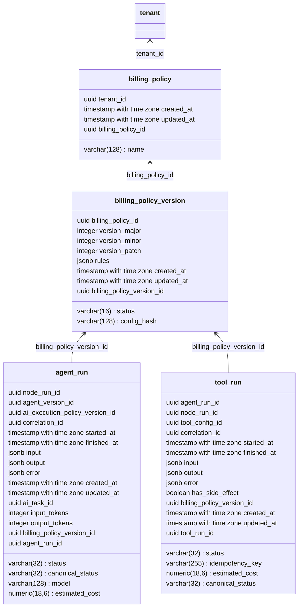

## Planning (16) — Billing, Custo Real e Políticas de SLA

**Objetivo:** tornar a cobrança por tenant confiável, auditável e governada por policy, integrando execução de flows e agent_runs ao sistema de billing.

---

### Tese central

Toda execução **gera custo real**.
Billing é **policy-driven** e **auditável**, não derivado por pós-processamento manual.

Custo = dado de primeira classe, correlacionado a evento e execução.

---

### Unidade de custo

**AgentRun**:

* já possui `estimated_cost` e `input_tokens`/`output_tokens`
* precisa referenciar explicitamente a policy de cobrança aplicada (`billing_policy_version_id`)
* deve ser possível agregar por tenant sem duplicação (`correlation_id` ou `agent_run_id` distinto)

**ToolRun**:

* se tiver efeito financeiro, registrar `estimated_cost` ou `side_effect_cost`
* referenciar mesma policy de billing ou extensão

---

### Tabela de Billing Policy

**billing_policy**:

* `billing_policy_id` (PK)
* `tenant_id`
* `name`
* `created_at` / `updated_at`

**billing_policy_version**:

* `billing_policy_version_id` (PK)
* `billing_policy_id` (FK)
* `status` (DRAFT / VALIDATED / PUBLISHED / ACTIVE)
* `version_major/minor/patch`
* `config_hash`
* `rules` (jsonb) — ex.: SLA, custo máximo por execução, custo por token, descontos, limites)
* `created_at` / `updated_at`

---

### Integração no runtime

1. Ao iniciar **FlowRun / AgentRun**:

* Resolver **billing_policy_version ativa** por tenant
* Registrar `billing_policy_version_id` no `agent_run` (ou `tool_run` se aplicável)
* Validar limites de custo / SLA antes da execução

2. Durante execução:

* Registrar custo estimado (`estimated_cost`) por AgentRun
* Registrar eventos (`ExecutionEvent`) correlacionados
* Garantir que replay não duplique custo

3. Ao finalizar execução:

* Agregar custo real por tenant para dashboards ou exportação
* Permitir comparação com limites de SLA configurados

---

### Queries e agregação

* View ou query que soma `estimated_cost` por tenant, por período, excluindo duplicados por `agent_run_id` ou `correlation_id`
* Possibilidade de filtrar por policy aplicada (`billing_policy_version_id`)
* Ferramentas de observabilidade podem consumir view para alertas ou relatórios

---

### Alertas e limites de SLA

* SLA violado = gerar evento `BillingPolicyViolated`

* Podem existir triggers:

  * custo total do tenant ultrapassa limite
  * execução individual excede limite por node/agent/tool
  * uso de token ultrapassa orçamento

* Eventos alimentam dashboard e sistema de escalonamento (humano / fallback / dead-letter)

---

### Auditoria

* Cada custo é **auditável por execução**

* Cada AgentRun/ToolRun referencia explicitamente:

  * tenant_id
  * flow_run_id
  * agent_run_id
  * billing_policy_version_id
  * estimated_cost

* Toda agregação é **reproduzível** via replay dos eventos (`ExecutionEvent`)

---

### Anti-patterns proibidos

* Calcular billing offline ou apenas por agregação de logs
* Ignorar replay e duplicação de execução
* Hard-code de SLA/custos
* Não referenciar a policy aplicada por execução

---

### Resultado esperado

* Cada tenant possui custo real agregado, confiável, auditável
* Billing policy versionada e aplicável por execução
* Alertas e SLA respeitados em tempo real
* Integridade total com event sourcing, FlowRun e AgentRun

---
Segue a proposta de diagrama atualizado de banco de dados para **Planning 16**, integrando `billing_policy` e `billing_policy_version` com `agent_run` e `tool_run`, mantendo consistência com o modelo existente:

### Detalhes de integração:

1. **agent_run.billing_policy_version_id**: refere a versão ativa de política de billing aplicada a essa execução.
2. **tool_run.billing_policy_version_id**: opcional, se a execução da ferramenta impacta custo diretamente.
3. **billing_policy_version.rules**: JSON que contém limites de custo, SLA por tenant, regras de desconto ou limites máximos por execução.
4. **Agregação**: queries podem somar `estimated_cost` por tenant usando `agent_run_id` e `correlation_id` para evitar duplicação.
5. **Auditoria**: cada registro mantém correlação com tenant, execução, flow_run, agente e policy aplicada.
