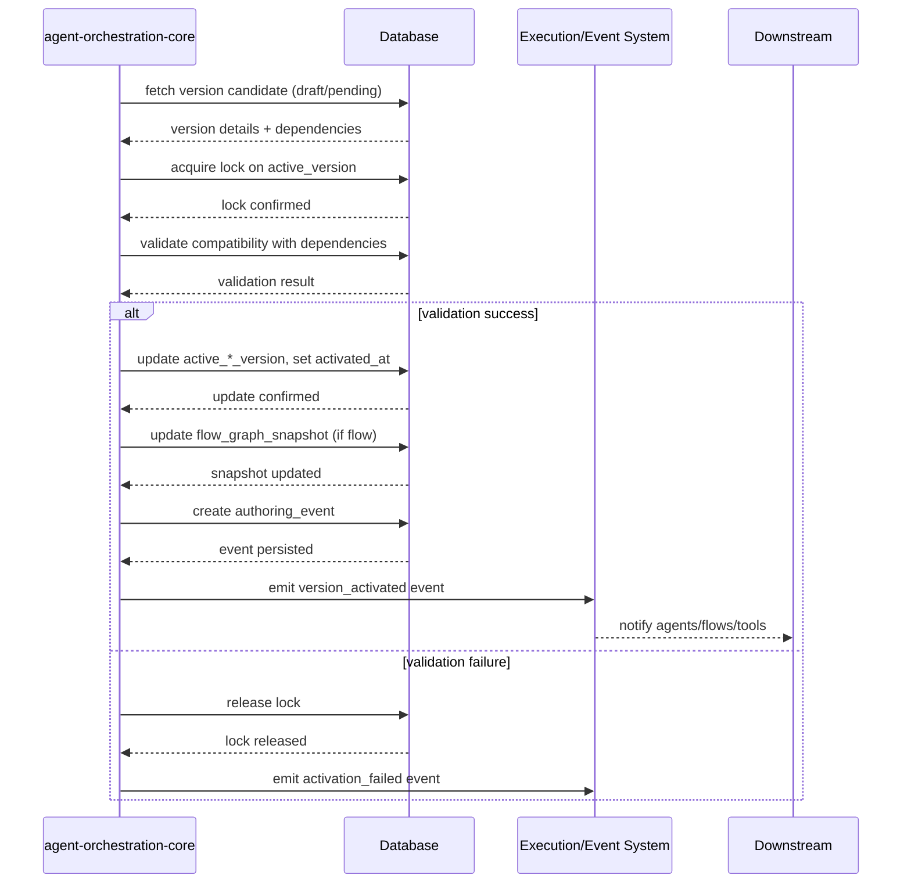

Perfeito. Então vamos direto para a **versão estendida técnica do P29**, detalhando passo a passo a ativação de versões pelo **agent-orchestration-core**, com diagramas de sequência, locks, validações e propagação de status.

---

**P29 – Fundamentos de Versão e Ativação (Versão Estendida Técnica)**

**Contexto:**
O agent-orchestration-core gerencia a ativação de versões de entidades críticas (`agent_version`, `flow_version`, `billing_policy_version`, `execution_limit_policy_version`, `rag_config`) garantindo consistência, rastreabilidade e compatibilidade.

---

### 1. Fluxo de Ativação – Passo a Passo

**1.1 Detecção da versão candidata**

* Input: UUID da versão a ser ativada.
* Query: Buscar versão com status `draft` ou `pending_activation`.
* Validar hash de configuração (`config_hash`) e se todas dependências obrigatórias existem:

  * `agent_version` ligado a ferramentas (`agent_version_tool_binding`) válidas.
  * `flow_version` respeita `min_agent_version_*`.
  * Políticas (`billing_policy_version`, `execution_limit_policy_version`) ativas e compatíveis.

**1.2 Locking**

* Criar lock exclusivo por entidade (`active_*_version`) para evitar concorrência.
* Lock persistido em DB (`locked_at`, `owner`, `correlation_id`).

**1.3 Validação de compatibilidade**

* Para flows:

  * Checar se `flow_version` é compatível com `agent_version` ativa.
  * Validar bindings de nodes: `node_agent_binding`, `node_ai_execution_policy_binding`.
* Para agents:

  * Verificar `rag_config`, `ai_execution_policy_version`, e ferramentas suportadas (`supported_tool_schema_version`).

**1.4 Atualização de registros ativos**

* Atualizar tabela `active_*_version`:

  * Substituir versão ativa anterior.
  * Registrar `activated_at`, `activated_by_principal_id`, `justification`.
* Se flow, atualizar `flow_graph_snapshot` com hash do grafo compilado (`graph_hash`).

**1.5 Auditoria e eventos**

* Criar `authoring_event`:

  * `event_type = activation`
  * `resource_type` = entity ativada
  * `version_id` = versão ativada
* Gerar `execution_event` ou trigger para downstream agents ou flows.

**1.6 Rollback automático**

* Se qualquer validação falhar:

  * Abort lock.
  * Registrar log detalhado.
  * Status da versão permanece inalterado (`draft` ou `pending_activation`).

---

### 2. Diagrama de Sequência (Mermaid)

---

### 3. Considerações Técnicas Detalhadas

* **Idempotência:** Ativação repetida da mesma versão não altera estado nem gera duplicidade de eventos.
* **Concurrency-safe:** Locks garantem que duas ativações não concorram no mesmo tenant/entity.
* **Traceabilidade:** Todos eventos e autorizações ficam registrados, permitindo auditoria completa.
* **Propagação de dependências:** Flows só ativam se `agent_version` compatível estiver ativa.
* **Rollback seguro:** Qualquer falha mantém estado consistente, evitando corromper execução de flows ou agentes.

---
