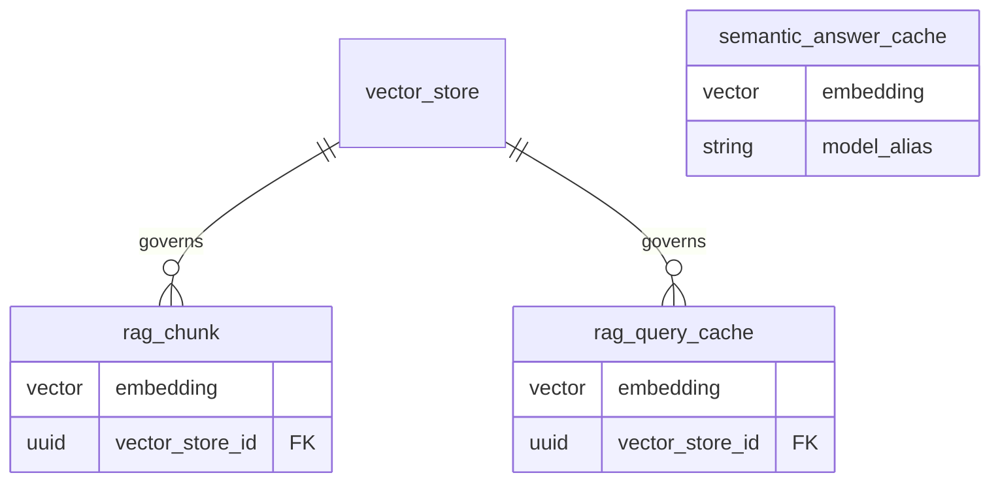

# Análise RAG — estado histórico e encerramento (governança de embedding)

Documentos relacionados: [rag-model-todo.md](./rag-model-todo.md), [rag-orchestration-layer.md](./rag-orchestration-layer.md).

## Implementação (referência de código)

| Área | Caminho |
|------|---------|
| VectorStore ORM | `src/infra/database/models/rag/vector_store.py` |
| RagChunk ORM | `src/infra/database/models/rag/rag_chunk.py` |
| RagQueryCache ORM | `src/infra/database/models/rag/rag_query_cache.py` |
| SemanticAnswerCache ORM | `src/infra/database/models/llm/semantic_answer_cache.py` |
| Model registry | `src/infra/database/models/ai_policy/model.py` |
| Runtime RAG | `src/domain/rag/services/rag_runtime_service.py` |
| Repositório RAG | `src/domain/rag/repositories/rag_repository.py` |
| Port de embedding | `src/domain/rag/ports/embedding.py` |
| Adapter OpenAI | `src/domain/rag/adapters/openai_embedding_adapter.py` |
| Re-export wiring | `src/adapters/rag/embedding_adapter.py` |

## ER alvo (pós-refactor)



---

## 1. RagChunk — era o ponto crítico (resolvido)

Antes havia colunas redundantes e risco de índice inconsistente:

```text
embedding + embedding_512 + embedding_model + embedding_dimension
```

Agora: um único `embedding`, `vector_store_id` obrigatório; modelo e dimensão vêm do `VectorStore` validados em `RagRuntimeService` / ingest.

---

## 2. VectorStore — contrato do índice (implementado)

Campos adicionados: `embedding_model` (string), `embedding_dimension`, `metric`, `version`, `active`. O nome do modelo é string operacional; o catálogo `model` (`provider`, `type`, `is_active`) complementa resolução quando `options.embedding.model_id` é usado.

---

## 3. OpenAIEmbeddingAdapter e hexagonal

O adapter deixou `domain/llm` e passou a `domain/rag/adapters`, implementando `EmbeddingPort`. Consumidores usam `adapters.rag.embedding_adapter` (compat: `adapters.llm.embedding_adapter` pode re-exportar).

---

## 3. RagConfig — governança consistente

Pontos fortes:

```text
- versionamento semântico
- vínculo com chunking_rule e vector_store
- multi-tenant bem definido
```

Ajustes:

```text
- corpus_kind → enum real
- options → evitar uso genérico excessivo
```

---

## 4. RagChunkingRule — flexível e correto

Modelo:

```text
strategy + params (JSONB)
```

Ponto de atenção:

```text
config_hash → tornar NOT NULL se usado para deduplicação
```

---

## 5. RagDocument — orientado ao pipeline

Pontos fortes:

```text
embedding_status
embedding_attempts
erro
timestamps
```

Gap:

```text
relação indireta com VectorStore (via RagConfig)
```

Trade-off:

```text
funciona, mas aumenta acoplamento indireto
```

---

## 6. RagQueryCache — alinhado ao VectorStore

`vector_store_id` + `embedding` único; unicidade `(tenant_id, vector_store_id, query_hash)`. Sem colunas de modelo/dimensão na linha de cache.

---

## 6b. SemanticAnswerCache (domínio LLM)

Removido `embedding_512`; permanece um `embedding` e `model_alias`. Sem `vector_store_id` — não faz parte do pipeline de retrieval RAG.

---

## 7. RagUsageCounter — consistente

Pontos positivos:

```text
- constraints corretos
- suporte a multi-scope
```

Atenção:

```text
- crescimento de cardinalidade
```

---

## 8. Gap estrutural — ausência de “chunk index” explícito

Hoje implícito em:

```text
RagChunk + VectorStore
```

Problema:

```text
falta de enforcement de contrato
```

---

## 9–11. Encerramento

Governança centralizada no `VectorStore`; chunks e query cache carregam `vector_store_id` e uma coluna vetorial; runtime valida modelo e dimensão contra o store antes de embedar e buscar.

---

---

## Problemas em rag_repository.py

---

### Caching — inconsistente

Aplicado:

```text
get_rag_config
```

Não aplicado:

```text
get_vector_store
get_chunking_rule
```

Direção:

```text
- cachear configs (baixo churn)
- evitar cache em dados operacionais
```

---

### Search — bem implementado

Pontos fortes:

```text
- filtros ricos
- multi-tenant
- suporte a user memory
- score derivado de distância
```

Ajustes:

```text
1. similarity_threshold pós-query
→ mover para o banco

2. order_by distance
→ validar impacto com índice

3. JSONB intensivo
→ exigir índice GIN
```

---

## Sugestões objetivas

```text
1. Centralizar embedding no VectorStore
2. Remover dual embedding
3. Padronizar cache para configs
4. Reduzir lógica de dimensão no repository
5. Indexar JSONB crítico
```
