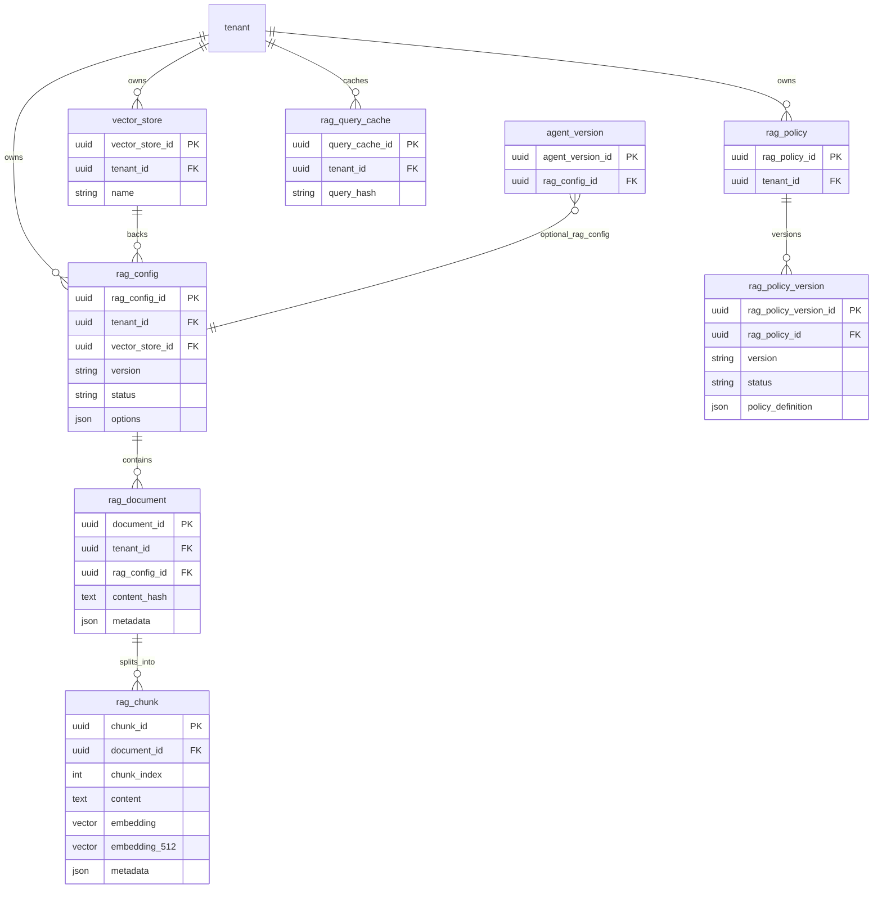
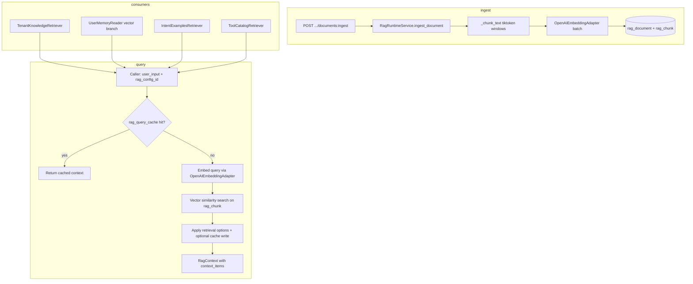
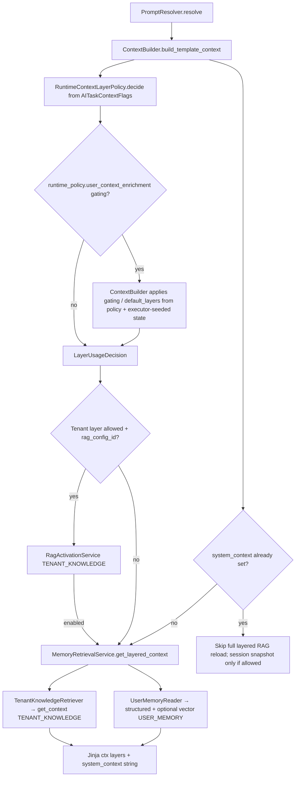
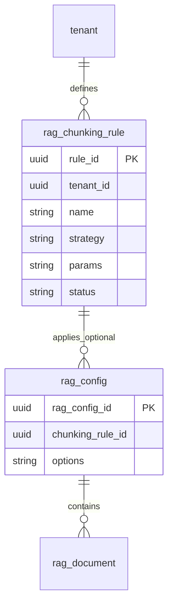
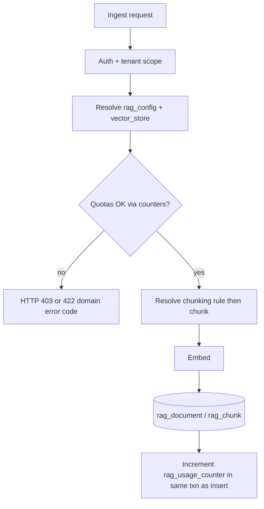
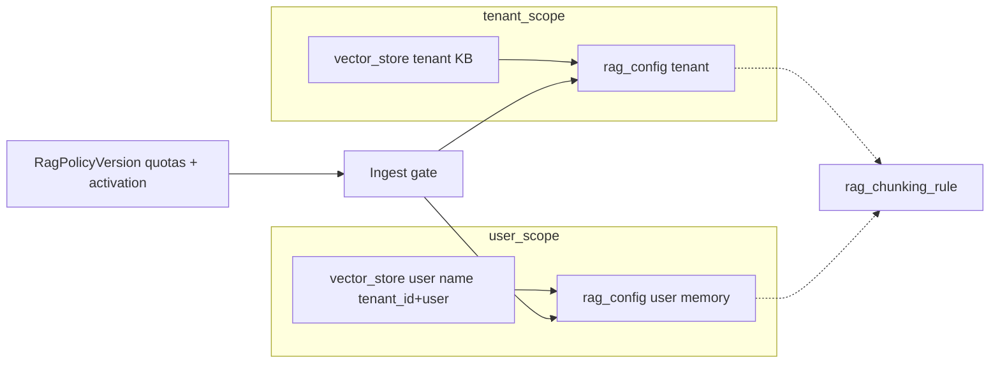

# RAG usage in agent-orchestration-core

Consolidated map of how retrieval-augmented generation (vector search over ingested chunks) is **implemented, governed, and consumed** at runtime, plus a **validation-oriented summary** tied to `resources/scripts/examples/validate_rag_runtime_scenarios.py`. Proposal backlog and phased delivery remain in **§0** and **§10–17**. Aligned with `context://rules/engineering-guide`, `context://rules/security-compliance`, and `context://rules/langfuse-observability` (retriever/generation observation types).

**Clarification:** The codebase **does** implement **tenant knowledge retrieval**. It runs through `TenantKnowledgeRetriever` → `RagRuntimeService.get_context` with `ContextLayerScope.TENANT_KNOWLEDGE` (no per-user vector filter). That path is orchestrated from `MemoryRetrievalService.get_layered_context` when `ContextBuilder` builds prompt template context. It is separate from **user memory**, which combines structured profile data (`UserMemoryProfile` via `ExecutionRepository`) with optional **user-scoped** vector RAG (`ContextLayerScope.USER_MEMORY`).

## Consolidated reference: what exists today + validation script

This subsection is the **single entry point** for “what is wired in code” and how to smoke-test it. Deeper proposal inventory remains in **§0**; HTTP details in **§9**; long-range roadmap in **§10–17**.

### `resources/scripts/examples/validate_rag_runtime_scenarios.py`

End-to-end checks using **`ApplicationContainer`** (same wiring as the app): `RagRuntimeService`, `RagActivationService`, retrievers, and (for user-vector path) `MemoryWriteService` + `MemoryPolicyService`. `main()` runs **four** async scenarios in sequence; each scenario is a **named function** so the stack is easy to read.

| Scenario function | What it validates | Main call chain | Filters / metadata (retrieval) |
|-------------------|-------------------|-----------------|----------------------------------|
| `scenario_tenant_knowledge` | Tenant KB policy + retrieval | `RagActivationService.decide` (`TENANT_KNOWLEDGE`, `LLMTaskType.INTENT_SELECTION`) → `TenantKnowledgeRetriever.retrieve` → `get_context` | Scope from `resolve_rag_scope(TENANT_KNOWLEDGE)`: documents with `doc_metadata.scope` **null** or **`TENANT_KNOWLEDGE`** |
| `scenario_user_memory_vector` | Write path + policy + vector read | `MemoryWriteService.write_memory_item` (expects `USER_MEMORY_VECTOR` in `targets_applied`) → `decide` (`USER_MEMORY_VECTOR`) → `UserMemoryReader.get_context` | `USER_MEMORY` + `user_id`; `MemoryPolicyService.resolve` on read can add **`expires_after`** so only documents with future **`expires_at`** match |
| `scenario_intent_examples` | Semantic intent examples | `IntentExamplesRetriever.retrieve_best_match` → `get_context` | **`source=intent_examples`**, **`doc_type=intent_examples`**; chunk metadata **`intent_type`** → `IntentType` in `_pick_best_match` |
| `scenario_tool_catalog` | Semantic tool ranking | `ToolCatalogRetriever` (`tools_repository` required) → `get_context` → batch published configs by `tool_config_id` | **`source=tool_catalog`**, **`doc_type=tool_catalog`**, **`category=TOOL_CATALOG`**; optional **`tool_intent`**; chunk metadata must include **`tool_config_id`** (UUID string); no allowlist—global RAG ranking with a small top-k cap (max 5) |

**Embasamento (why the script looks like this):**

1. **`LLMTaskType.INTENT_SELECTION`** in scenarios 1–2 matches a **stable** task type used when exercising `RagActivationService` against demo `rag_policy` (production nodes use task types appropriate to each step—e.g. tool selection uses its own type; the script does not run a full graph).
2. **Probe documents:** Each scenario calls `ingest_document` with text aligned to the query and a **`run_ref`** (unique per run) so **`content_hash`** differs and embeddings match the query well enough to pass **`options.retrieval.similarity_threshold`** (commonly **0.5**). Without probes, an empty or misaligned corpus often yields **no context items** even when the code path is correct.
3. **User memory vector:** Stored content is **JSON** (e.g. `MemoryWriteService` / `USER_MEMORY_ITEM`). Retrieval **`user_input`** should be **close to the embedded natural-language field**; a generic paraphrase can score below threshold.
4. **Demo IDs:** `TENANT_DEMO_ID`, `RAG_CONFIG_DEMO_ID`, `TOOL_CONFIG_DEMO_ID`, `TOOL_DEMO_ID` from `resources/scripts/seeds/demo/ids.py`. **`tool_config_id`** on `UserMemoryReader.get_context` / `RagActivationService.decide` must match policy when the demo tenant enforces tool-scoped rules.

### Corpus conventions (ingest must match retriever filters)

| Corpus | `RagDocumentCreate.source` | `doc_type` | Metadata notes |
|--------|----------------------------|------------|------------------|
| Tenant knowledge | Convention-specific (e.g. seed `assistente-bolso`) | Any | `scope` omitted or `TENANT_KNOWLEDGE` for tenant-layer filter |
| Intent examples | `intent_examples` | `intent_examples` | `intent_type` per row; see `IntentExamplesRetriever._normalize_intent_type` |
| Tool catalog | `tool_catalog` | `tool_catalog` | `category=TOOL_CATALOG`, `tool_config_id`, `tool_id`, `operation_id`, `method`, `path`; optional `tool_intent` |

Reference seeds: `resources/scripts/seeds/demo/seed_21_rag.py`, `seed_22_tool_catalog_rag.py`.

## 0. Improvement proposal register (agent-governance)

This section is the **single inventory** of everything that is **not** merely descriptive of today’s code: gaps, target capabilities, schema concepts, API work, and phased delivery. Sections **1–9** describe **as-is** behavior. Sections **10–17** elaborate the proposal; **§16** sequences delivery. **§10** is a short index; **§0** is the authoritative checklist.

**Governance:** Any schema or cross-cutting runtime change requires an **ADR**, `context://rules/database-migrations`, `context://rules/security-compliance` (PII in vectors, DSR, error bodies), and `context://rules/engineering-guide` (hexagonal boundaries—quota/chunking logic in domain services, not DB triggers beyond trivial `CHECK`s).

### 0.1 Chunking and ingest

| ID | Proposal item | Detail (see section) |
|----|----------------|----------------------|
| CH-01 | **Multiple chunking strategies** in runtime | Recursive-by-character, token-window (explicit), semantic, per-page; branch in ingest (`§11`). |
| CH-02 | **Pydantic discriminated** `RagChunkingOptions` | Validated per strategy; HTTP 422 on invalid combos (`§11`, `§13.2`). |
| CH-03 | **Ingest contract** for page-aware sources | Page boundaries in payload or PDF pipeline (`§11`). |
| CH-04 | **Re-ingest / migration** playbook | Changing strategy does not rewrite chunks automatically (`§10`, `§11`). |
| CH-05 | **`rag_chunking_rule` table** | Named templates; `UNIQUE (tenant_id, name)`; `tenant_id NOT NULL`; status lifecycle (`§13.1`). |
| CH-06 | **`rag_config.chunking_rule_id` FK** | Nullable optional; `ON DELETE RESTRICT`; deprecate rules instead of hard delete (`§13.1`). |
| CH-07 | **CRUD API** for chunking rules | Under `/core/v1` or sub-resource; mirror governance patterns (`§13`, `§16` P2). |
| CH-08 | **Backfill** from `options.chunking` | Feature-flagged migration to rules + FK (`§13.4`). |
| CH-09 | **ADR: precedence** FK vs inline `options.chunking` | Exactly one wins; document merge (`§13.1`). |
| CH-10 | **Ingest caps** (chunk count / payload size) | Align with security and FinOps (`§11`, `§14`). |

### 0.2 API and authoring experience

| ID | Proposal item | Detail |
|----|----------------|--------|
| API-01 | **Preview retrieval** endpoint | Query + `rag_config_id` + filters without full flow (`§9`). |
| API-02 | **Strategy selection** without raw JSON-only UX | Enum + validated body; ties to `rag_chunking_rule` (`§9`, `§13`). |
| API-03 | **Corpus typing** | First-class resource or hardened metadata conventions for intent vs tools vs KB (`§9`). |
| API-04 | **Multi-corpus per agent** | Product model beyond single `agent_version.rag_config_id` (`§7`, `§9`). |
| API-05 | **Documentation cross-links** | Runtime policy (`memory_retrieval`, `user_context_enrichment`) ↔ RAG admin (`§9`). |
| API-06 | **Contract parity** | After each RAG HTTP change, reconcile **§9.1** with generated `GET /openapi.json` (plan integrity; avoids doc drift). |

### 0.3 Runtime and execution model

| ID | Proposal item | Detail |
|----|----------------|--------|
| RT-01 | **Optional `rag_config_id` per node** (or snapshot policy) | Different corpora per step without swapping agent version (`§7`). |
| RT-02 | **Split `allow_user_memory`** | **Largely implemented:** `AITaskContextFlags.allow_user_memory_structured` and `allow_user_memory_vector` (`domain/ai_policy/schemas/ai.py`); graph/node columns should stay aligned (`§8`). |
| RT-03 | **`system_context` semantics** | Clarify memoization vs refresh if multi-corpus or per-node overrides are introduced (`§6`, `§7`). |

### 0.4 User memory corpora and structured profile

| ID | Proposal item | Detail |
|----|----------------|--------|
| UM-01 | **Per-user `vector_store`** | Lazy create; name under `uq_vector_store_tenant_name` (`§12.2`, `§16` P3). |
| UM-02 | **User `rag_config` pattern** | Dedicated config per user vs shared template + per-user store (`§12.2`). |
| UM-03 | **Write paths** | Flow / conversation memory extraction → user corpus ingest (`§16` P4). |
| UM-04 | **Hybrid structured + vector** | Structured data in **`user_memory_profile`** (JSON); vectors for episodic recall (`§12`). |
| UM-05 | **Profile vs legacy KV** | If any legacy preference rows existed elsewhere, migrate into profile or document metadata before dropping (`§16` P5). |
| UM-06 | **Link to `end_user`** | `(tenant_id, user_id)` CASCADE or orchestrated wipe (`§14.3`, `§16` P3). |

### 0.5 Quotas, retention, and FinOps

| ID | Proposal item | Detail |
|----|----------------|--------|
| Q-01 | **`max_documents_per_user`** | Enforce before insert (`§14.1`). |
| Q-02 | **`max_chunks_per_user`** | Same; use counters (`§14.1`, `§14.3`). |
| Q-03 | **`max_documents_per_tenant`** | Counter or reconcile; not hot-path `COUNT(*)` (`§14.1`). |
| Q-04 | **`max_total_embedding_bytes`** (soft/hard) | Metrics + optional deny (`§14.1`). |
| Q-05 | **`default_retention_days`** | TTL / `expires_after` + purge job; align `MemoryPolicyService` (`§14.1`). |
| Q-06 | **Single source of truth** for numeric limits | Extend `RagPolicyDefinition` **or** versioned `rag_storage_quota` + **one** resolver (`§14.1`). |
| Q-07 | **Document merge order** vs `ResolvedRuntimePolicy` | Avoid duplicate caps without precedence rules (`§14.1`). |
| Q-08 | **`rag_usage_counter` table** | Same transaction as document/chunk insert/delete (`§14.3`). |
| Q-09 | **Reconciliation job** | Compare counters to ground truth; alert on drift (`§14.3`). |
| Q-10 | **Quota gate in domain ingest** | No heavy triggers on `rag_chunk` (`§14.2`, `§14.3`). |
| Q-11 | **Stable API error codes** | No PII or cross-tenant leakage in messages (`§14.2`). |

### 0.6 Flow snapshot and audit trail

| ID | Proposal item | Detail |
|----|----------------|--------|
| SN-01 | Freeze **`rag_config_id`** on deploy/snapshot | (`§15`). |
| SN-02 | Freeze **`chunking_rule_id` + `chunking_rule_config_hash`** | If rules are mutable (`§15`). |
| SN-03 | Freeze **`rag_policy_version_id` or hash of `policy_definition`** | Activation + quotas (`§15`). |
| SN-04 | **Do not freeze** embedding vectors | Intent only (`§15`). |

### 0.7 Observability, providers, and policy UX

| ID | Proposal item | Detail |
|----|----------------|--------|
| OB-01 | **Standard trace attributes** | `rag_config_id`, scope, layer, rule id (`§10`). |
| OB-02 | **Publish-time validation** of `rag_policy_version` | (`§10`). |
| OB-03 | **Admin surfacing** of `RagActivationDecisionReason` | (`§10`). |
| OB-04 | **Additional embedding providers** | Adapters + config validation (`§10`). |

### 0.8 Delivery phases (reference only)

| Phase | IDs primarily covered |
|-------|------------------------|
| **P0** | OB-01 (metrics baseline), discovery for UM-04 / API-05 / **API-06** (baseline OpenAPI vs §9.1) |
| **P1** | Q-01–Q-11, Q-06–Q-07 |
| **P2** | CH-05–CH-09, CH-07, API-02 |
| **P3** | UM-01, UM-02, UM-06 |
| **P4** | UM-03, CH-03 / ingest writers |
| **P5** | UM-05 |

Full phase narrative: **§16**.

### 0.9 Where RAG configuration via HTTP is discussed

| Location | Topic |
|----------|--------|
| **§9** | Current FastAPI routes, request/response models, OpenAPI alignment, proposal impact, **anticipated** chunking-strategy contracts. |
| **§11** | Chunking strategies (runtime + API exposure intent). |
| **§13** | `rag_chunking_rule` persistence and FK to `rag_config`. |
| **CH-07, API-01–API-02** (§0) | New CRUD for rules; preview retrieval; typed strategy UX. |

---

## 1. Embedding generation and chunking

| Responsibility | Component | Notes |
|----------------|-----------|--------|
| Production path | `RagRuntimeService` | Calls `OpenAIEmbeddingAdapter` for single-query and batch embeddings during ingest and `get_context`. |
| Adapter wiring | `OpenAIEmbeddingAdapter` | Model and dimensions from `RagEmbeddingOptions` in `rag_config.options`. |
| Chunking before embed | `_resolve_rag_ingest_bundle` + `_chunks_for_ingest` | Resolves **`rag_chunking_rule`** via `rag_config.chunking_rule_id`, parses params with `parse_rag_chunking_rule_params`, then branches on `RagChunkingStrategy`: **`TOKEN_WINDOW`** → **`_chunk_text`** (tiktoken `cl100k_base`); **`RECURSIVE_CHARACTER`** → **`_recursive_character_chunks`**; **`SEMANTIC`** currently reuses token-window splitting; **`PER_PAGE`** requires page payloads (`ingest_pages` in document metadata). |

Embedding is not delegated to a separate microservice beyond the configured adapter; when **`embedding_job_queue`** is set, workers still finalize vectors through the same domain paths (`embed_document_by_id` / finalize).

## 2. Configuration and governance

### 2.1 RAG config (`rag_config`)

- **Table**: `rag_config` (linked to `vector_store`, tenant-scoped, versioned by semver + `status`).
- **`corpus_kind`**: Column on `rag_config` (e.g. `TENANT_KNOWLEDGE`, `USER_MEMORY`, `TOOL_CATALOG`) used for ingest quota / usage accounting (`finalize_document_embedding_with_usage`), not as the sole retrieval filter (retrieval filters are merged from `options.retrieval.filters` + caller `filters_override`).
- **Chunking rule**: `chunking_rule_id` FK → **`rag_chunking_rule`**; runtime ingest resolves strategy and params from that row (see **§1**).
- **Runtime options**: JSON `options` → `RagConfigOptions`: `embedding`, `retrieval`, `generation_contract` (inline chunking in options may still exist for older configs; precedence vs FK is a product/migration concern—**CH-09**).
- **Effect**: Model name, dimensions, retrieval `top_k` / `similarity_threshold`, optional metadata filters, generation contract for insufficient context.

### 2.2 RAG policy (tenant rules)

- **Tables**: `rag_policy`, `rag_policy_version`.
- **Services**: `RagPolicyService` resolves rules per `LLMTaskType` and `RagActivationScope` (`TENANT_KNOWLEDGE` vs `USER_MEMORY_VECTOR`). `RagActivationService.decide` applies structural gates (`AITaskContextFlags`), published `rag_config`, min input length, tool allowlists, etc.
- **Effect**: Can deny retrieval even when the node would otherwise allow a layer.

### 2.3 Agent binding (single RAG config for runtime)

- **`agent_version.rag_config_id`**: Optional FK to a published `rag_config`. Used for:
  - **Layered prompt context** (tenant knowledge + user memory vector) in `ContextBuilder.build_template_context`.
  - **Intent examples** (`IntentDetectionNode` → `IntentExamplesRetriever`).
  - **Semantic tool ranking** (`ToolSelectionNode` → `ToolCatalogRetriever`).
- **Validation** (`ExecutionService`): If `agent_version.rag_config_id` is set and the current graph node has `allow_rag_tenant == False`, startup fails with `RagNotAllowedException` (`rag_not_allowed_for_task`). Operators must align agent RAG attachment with node flags.

### 2.4 Document metadata and filters

- Ingest stores `metadata` on `rag_document` (chunk metadata copies document metadata at embed time unless extended). `RagRuntimeService.get_context` merges `options.retrieval.filters` with **`filters_override`** (caller keys overwrite same keys).
- **Scope base:** `resolve_rag_scope` (`domain/context/services/scope_resolver.py`) sets **`scope`** to `TENANT_KNOWLEDGE` or `USER_MEMORY` (+ `user_id` for user path). Allowed extra merge keys from overrides: `tags`, `namespace`, `doc_type`, `expires_after`.
- **Repository filters:** `RagRepository.search_similar_chunks` applies `source`, `doc_type`, `scope`, `user_id`, `category`, `tool_intent`, `created_after`, `expires_after` when present. For **`scope=TENANT_KNOWLEDGE`**, documents with **missing** `scope` in metadata still match (OR with explicit `TENANT_KNOWLEDGE`).
- Intent and tool paths pass **`source` + `doc_type`** (and tool path adds **`category`**, optional **`tool_intent`**); see the **Consolidated reference** table and `validate_rag_runtime_scenarios.py`.

### 2.5 Query cache

- **Table**: `rag_query_cache` (tenant + query hash) when enabled in runtime paths.

## 3. Retrieval paths: tenant knowledge vs user memory

| Layer | Component | Vector search? | Scope / filters |
|-------|-----------|----------------|-----------------|
| **Tenant knowledge** | `TenantKnowledgeRetriever.retrieve` | Yes | `scope=TENANT_KNOWLEDGE`; `search_user_id=None` for embedding query path. |
| **User memory structured** | `UserMemoryReader.get_preferences` / `get_profile` | No | Relational reads only. |
| **User memory vector** | `UserMemoryReader.get_context` (when `allow_user_memory_vector` and `rag_config_id`) | Yes | `scope=USER_MEMORY` + `user_id` in filters; `RagActivationService` with `USER_MEMORY_VECTOR`; optional `expires_after` from `MemoryPolicyService`. |

**Orchestration:** `MemoryRetrievalService.get_layered_context` loads session snapshot (if allowed), then tenant knowledge (if allowed and IDs present), then user memory (structured always when allowed; vector branch gated by `allow_user_memory_vector`). Optional **temporal re-ranking** on user-memory vector results uses `MemoryRetrievalConfig` from `execution_context.metadata.runtime_policy.memory_retrieval` (`temporal_scoring`).

## 4. Data model (Mermaid)

## 5. Runtime flows (Mermaid)

### 5.1 Ingest and generic query

### 5.2 Prompt template context (tenant + user layers)

**Note:** The graph node type **`UserContextEnrichmentNode`** is **deprecated** (`FlowGraphValidator` rejects it). Enrichment behavior is carried by **`execution_context.metadata.runtime_policy.user_context_enrichment`** and **`ContextBuilder._apply_user_context_enrichment_gating`** (with mode seeded from the flow definition in the executor).

## 6. Where RAG is used in flow execution

| Stage | Mechanism | Purpose |
|-------|-----------|---------|
| **Intent detection** | `IntentDetectionNode` + `IntentExamplesRetriever` | Examples from `agent_version.rag_config_id` via `RagRuntimeService.get_context`. |
| **Tool selection (semantic)** | `ToolSelectionNode` + `ToolCatalogRetriever` | Same `rag_config_id`; metadata filters isolate tool-catalog chunks; ranks candidates before LLM fallback. |
| **User context enrichment (gating)** | `ContextBuilder` + `runtime_policy.user_context_enrichment` | When gating applies, layer flags (`allow_tenant_knowledge`, `allow_user_memory_structured`, `allow_user_memory_vector`) can be tightened per run; **`UserContextEnrichmentNode`** is deprecated and must not appear in new graphs. |
| **Prompt rendering (LLM nodes)** | `PromptResolver` → `ContextBuilder` | Loads persona and `rag_config_id` from `agent_version`; runs `MemoryRetrievalService` unless `execution_context.system_context` is already populated (single assembled string reused in the same run). Template receives `layers.tenant_knowledge`, `layers.user_memory_*`, and a concatenated `system_context` block. |

Nodes that do not go through `PromptResolver` / dedicated retrievers do not get automatic RAG injection beyond their own node logic.

## 7. RAG dependency on execution (today)

| Mechanism | What it controls |
|-----------|------------------|
| **`agent_version.rag_config_id`** | Which vector corpus (one ID) backs layered memory, intent examples, and tool catalog retrieval for that agent version. |
| **Graph node columns** | `allow_rag_tenant`, **`allow_user_memory_structured`**, **`allow_user_memory_vector`**, `allow_session_context`, `allow_memory_write` (validated against agent RAG attachment). |
| **`AITaskContextFlags`** (from node at runtime) | Mapped in `RuntimeContextLayerPolicy` to `LayerUsageDecision`: `allow_rag_tenant`, **`allow_user_memory_structured`**, **`allow_user_memory_vector`** (split booleans in `domain/ai_policy/schemas/ai.py`). |
| **`execution_context.metadata.runtime_policy`** | `memory_retrieval` (temporal scoring), `user_context_enrichment` (enabled, gating, default layers). |
| **`RagActivationService` + `rag_policy_version`** | Per-tenant, per-`LLMTaskType`, per-scope allow/deny and overrides (e.g. `top_k`, filter overrides). |
| **`system_context` memoization** | After first successful layered load, later LLM nodes in the same run may skip re-querying RAG for the full stack (session snapshot can still load). |

**Gap:** There is **no** `rag_config_id` on individual nodes or edges. To use **different corpora per step**, you would need a product/schema change (e.g. optional override on node or on flow snapshot policy) and executor changes to resolve it before `get_context`.

## 8. Choosing tenant knowledge vs user context (operator guide)

| Goal | Primary control | Secondary |
|------|-----------------|-----------|
| **Enable tenant KB in prompts** | Node: `allow_rag_tenant = true` | `rag_policy` scope `TENANT_KNOWLEDGE` for the relevant `LLMTaskType`; published `rag_config`; `agent_version.rag_config_id` set. |
| **Disable tenant KB for a task** | Node: `allow_rag_tenant = false` | If agent still has `rag_config_id`, flow start may fail unless RAG is cleared from agent version. |
| **Enable user memory (structured)** | Node / flags: `allow_user_memory_structured = true` | Reads **`UserMemoryProfile`** (and derived preference map) via `ExecutionRepository`; no vector ingest. |
| **Enable user memory (vector)** | Node / flags: `allow_user_memory_vector = true` | Same **`rag_config_id`** as the agent for vector chunks scoped by metadata (`scope=USER_MEMORY`, `user_id`). |
| **Refine layers (gating)** | Flow runtime policy `user_context_enrichment` + `ContextBuilder` | With `gating: true`, layers can be tightened per run; `default_layers_when_published` applies when policy says so. **Do not** add `UserContextEnrichmentNode` (deprecated). |
| **Intent / tools only** | Independent of prompt layers | Intent and tool nodes always resolve `rag_config_id` from `agent_version` when retrievers are configured; they do not use `LayerUsageDecision` from template context. |

**Note:** Structured and vector user memory are **independent** flags on `AITaskContextFlags`; gating can still narrow effective layers via `user_context_enrichment` policy + `ContextBuilder`.

## 9. HTTP API surface, contracts, and proposal alignment

**Source of truth for live schemas:** FastAPI generates OpenAPI from Pydantic models in `domain/rag/schemas/rag.py` and handler signatures in `domain/rag/controllers/rag_controller.py`. Compare a running service with `GET /openapi.json` (e.g. `http://localhost:8000/openapi.json`). **This document** mirrors **repository state**; if code drifts, OpenAPI wins.

**Auth:** All routes use `Depends(get_auth_context)`; `tenant_id` is taken from the auth context (not from path). Vector store list/create additionally require scopes `VectorStoresList` / `VectorStoresCreate`.

### 9.1 Current endpoints and models (as implemented)

| Method | Path | Query / path | Request body (`input_schema`) | Response (`output_schema`) | Notes |
|--------|------|--------------|-------------------------------|------------------------------|--------|
| `GET` | `/core/v1/rag-configs` | `status_filter` (multi), `limit` 1–1000 | — | `array` of **`RagConfig`** | |
| `POST` | `/core/v1/rag-configs` | — | **`RagConfigCreate`** | **`RagConfig`** | `201` |
| `POST` | `/core/v1/rag-configs/{rag_config_id}:publish` | path `rag_config_id` (`string`) | **`ChangeRequest`** | **`RagConfig`** | |
| `POST` | `/core/v1/rag-configs/{rag_config_id}:deprecate` | path `rag_config_id` | **`ChangeRequest`** | **`RagConfig`** | |
| `POST` | `/core/v1/rag-configs/{rag_config_id}:disable` | path `rag_config_id` | **`ChangeRequest`** | **`RagConfig`** | |
| `GET` | `/core/v1/vector-stores` | — | — | `array` of **`VectorStore`** | Scope `VectorStoresList` |
| `POST` | `/core/v1/vector-stores` | — | **`VectorStoreCreate`** | **`VectorStore`** | `201`; scope `VectorStoresCreate` |
| `POST` | `/core/v1/rag-configs/{rag_config_id}/documents:ingest` | path `rag_config_id` | **`array` of `RagDocumentCreate`** (1…10000) | **`RagDocumentsIngestBatchAccepted`** | `202`; fire-and-forget batch |
| `GET` | `/core/v1/rag-documents` | `limit`, optional `rag_config_id` | — | `array` of **`RagDocument`** | |
| `GET` | `/core/v1/rag-documents/{document_id}/chunks` | path `document_id`, `limit` | — | `array` of **`RagChunk`** | |

**`RagConfigCreate` (input):** `vector_store_id` (UUID, required); `options` **`dict[str, object] | null`** (OpenAPI: generic object—**not** the strict `RagConfigOptions` tree at the HTTP boundary today); optional `source_version_id`, `version_major` / `version_minor` / `version_patch`.

**`RagConfig` (output):** `id`, `vector_store_id`, `options` **`dict[str, object] | null`**, `status`, `version_major|minor|patch`, `config_hash`.

**`ChangeRequest` (input):** `change_type` (`string`), `justification` (`string`).

**`RagDocumentCreate` (input):** `source`, `doc_type`, `content` (required strings); optional `version`, `metadata`, `rag_config_id`.

**`RagDocumentsIngestBatchAccepted` (output):** `rag_config_id`, `job_id`, `accepted_count`, `status` (enum `ACCEPTED`).

**`VectorStoreCreate` / `VectorStore`:** `name` → `id` + optional `name`.

**Integrity note:** Domain services may validate `options` against **`RagConfigOptions`** after create; the **public OpenAPI** still exposes `options` as an untyped object unless models are tightened (proposal **API-02**).

### 9.2 Proposal impact on existing contracts (no scope creep to non-RAG modules)

| Proposal ID | Effect on **current** RAG HTTP contract |
|-------------|----------------------------------------|
| **CH-05–CH-07** | **Additive:** new paths under `/core/v1/rag-chunking-rules` (name TBD) + optional field on `RagConfigCreate` / `RagConfig` (e.g. `chunking_rule_id`). Existing clients keep sending `options` only until adoption. |
| **CH-02** | **Optional strict mode:** `options` can remain `object` for backward compatibility; new **`oneOf` / discriminated** schema for `options.chunking` is a **contract enhancement**—ship behind new API version (`/core/v2/...`) or accept both shapes with documented precedence (**CH-09**). |
| **CH-03** | **Extend `RagDocumentCreate`** or metadata convention: e.g. `metadata.pages` for per-page strategy; document in OpenAPI `description` / examples. |
| **API-01** | **New** route only; no change to existing handlers. |
| **Q-01–Q-11** | **Same paths**; new **4xx** responses with stable `code` fields on quota deny; document in OpenAPI responses. |
| **UM-01–UM-03** | May add `vector_store` / `rag_config` rows via **existing** POST endpoints; no mandatory path change unless product adds convenience wrappers. |

**Out of `RagController` today:** `rag_policy`, runtime policy, agent `rag_config_id` binding—those stay on other routers; proposal **API-05** is documentation linkage only.

### 9.3 Anticipated configuration experience for chunking strategies

Two **compatible** patterns (choose one as primary in ADR; **CH-09** fixes precedence):

**Pattern A — Named rule (template):** Operator creates a **`RagChunkingRule`** via CRUD; **`RagConfigCreate`** references `chunking_rule_id`. Runtime resolves `strategy` + `params` from the published rule row.

**Pattern B — Inline `options.chunking`:** Operator passes a **discriminated** object under `options.chunking` on create/update (same tenant semantics as today).

| Strategy | `strategy` value (suggested enum) | Body params (minimal, for OpenAPI `oneOf`) |
|----------|-----------------------------------|---------------------------------------------|
| Recursive (characters) | `RECURSIVE_CHAR` | `chunk_size: int`, `chunk_overlap: int`, `separators?: string[]`, `max_chunks_per_document?: int` |
| Tokens (fixed window) | `FIXED_TOKEN_WINDOW` | `target_tokens`, `overlap_tokens`, `max_chunks_per_document`, `max_document_chars` (maps to current defaults) |
| Semantic | `SEMANTIC` | `breakpoint_threshold: float`, `max_segment_tokens: int`, `embedding_batch_size: int` |
| Per page | `PER_PAGE` | `max_tokens_per_page: int`, `respect_pdf_boundaries?: bool`; **plus** per-document `metadata` or `content` structure carrying page boundaries (**CH-03**) |

### 9.4 Anticipated OpenAPI additions (illustrative—implement in code + ADR)

**Resource: chunking rule**

| Method | Path (proposed) | Request body | Response |
|--------|-----------------|--------------|----------|
| `GET` | `/core/v1/rag-chunking-rules` | query: `status`, `limit` | `RagChunkingRule[]` |
| `POST` | `/core/v1/rag-chunking-rules` | `RagChunkingRuleCreate` | `RagChunkingRule` `201` |
| `POST` | `/core/v1/rag-chunking-rules/{rule_id}:publish` | `ChangeRequest` | `RagChunkingRule` |
| `POST` | `/core/v1/rag-chunking-rules/{rule_id}:deprecate` | `ChangeRequest` | `RagChunkingRule` |

**`RagChunkingRule` (output, illustrative):** `id`, `tenant_id`, `name`, `status`, `strategy` (string enum), `params` (object, validated per `strategy`), `config_hash`, optional semver fields.

**`RagChunkingRuleCreate` (input, illustrative):** `name`, `strategy`, `params` (discriminated by `strategy` in Pydantic → OpenAPI `oneOf`).

**Preview retrieval (API-01, illustrative)**

| Method | Path (proposed) | Request body | Response |
|--------|-----------------|--------------|----------|
| `POST` | `/core/v1/rag-configs/{rag_config_id}/retrieval:preview` | `RagRetrievalPreviewRequest` (`user_input`, optional `filters`, `top_k`) | `RagContext` (reuse existing domain schema) |

### 9.5 DX gaps (unchanged intent, cross-referenced to §0)

1. **API-01** — No preview retrieval endpoint today (**§9.4** target).
2. **API-02** — Chunking is untyped at HTTP boundary (`options` dict); **§9.3–9.4** describe the target typed experience.
3. **API-03** — Corpus separation remains metadata-driven until first-class types exist.
4. **API-04** — Single `rag_config_id` per agent version (`§7`).
5. **API-05** — Link RAG HTTP docs to runtime / flow policy authoring.

## 10. Improvement opportunities (summary)

**Authoritative checklist:** **§0** (IDs **CH-*** … **SN-*** …). Below is a short index.

1. **Chunking** → **CH-01–CH-10** (`§11`, `§13`).
2. **Per-node / per-task corpus** → **RT-01** (`§7`).
3. **Split user memory flags** → **RT-02** (**mostly done** in `AITaskContextFlags`; remaining work is product UX / graph defaults—`§8`).
4. **Re-ingest / migration** → **CH-04** (`§11`).
5. **Embedding providers** → **OB-04** (`§10` / `§0.7`).
6. **Observability** → **OB-01** (`context://rules/langfuse-observability`).
7. **Policy UX** → **OB-02**, **OB-03**.
8. **User corpora + quotas** → **UM-*** , **Q-*** (`§12`, `§14`, `§16`).

## 11. Configurable chunking strategies via RAG API

**Runtime today:** ingest resolves **`rag_chunking_rule.params`** (Pydantic-discriminated strategies in `domain/rag/schemas/rag.py`: `TOKEN_WINDOW`, `RECURSIVE_CHARACTER`, `SEMANTIC`, `PER_PAGE`) via `rag_config.chunking_rule_id`. Inline **`options.chunking`** may still exist on older rows (**CH-09**). To expose and govern strategies through the HTTP API:

| Strategy | Meaning | Implementation sketch |
|----------|---------|-------------------------|
| **Recursive (characters)** | Hierarchical split with character overlap | Implemented as **`RECURSIVE_CHARACTER`** → `_recursive_character_chunks`. |
| **By tokens** | Explicit token boundaries | Implemented as **`TOKEN_WINDOW`** → `_chunk_text` (tiktoken). |
| **Semantic** | Boundaries from embedding similarity | **`SEMANTIC`** strategy exists; today reuses token-window splitting until true semantic boundaries ship. |
| **Per page** | One chunk per page | **`PER_PAGE`** requires `ingest_pages` / page payloads on the document. |

**Work items:** discriminated `RagChunkingOptions`, CRUD validation, ingest contract for page-aware sources, migration/re-ingest strategy, governance limits on ingest size and chunk count (`context://rules/security-compliance`).

**Link to section 12:** Prefer referencing named **chunking rules** (templates) from `rag_config` instead of duplicating JSON blobs in every config.

## 12. Structured user profile vs per-user `vector_store`

### 12.1 Current usage (`user_memory_profile`)

- **ORM:** `UserMemoryProfileModel` (conversation / execution schema)—one JSON **`profile`** per `(tenant_id, user_id)` with versioned schema (`profile_schema_version`).
- **Access:** `ExecutionRepository.get_user_memory_profile`, `get_user_preferences` / `get_user_memory_preferences_and_profile` (preferences are derived from keys inside the profile document).
- **Runtime:** `UserMemoryReader` feeds **structured** user memory in `ContextBuilder` (no embedding).
- **Writes:** `MemoryWriteService` / `upsert_user_preference_deterministic` merge preference keys into the profile under governance (`MemoryPolicyService`).
- **User vector memory** still uses the **same** published **`rag_config`** / tenant **`vector_store`** as tenant KB and tools, scoped by document metadata (`scope=USER_MEMORY`, `user_id`)—not a dedicated `vector_store` row per user yet (**UM-01**).

### 12.2 Direction: first-class user corpora (aligned with tenant knowledge)

| Concept | Tenant knowledge (mature pattern) | User memory (target) |
|---------|-----------------------------------|----------------------|
| **Isolation** | `vector_store` + `rag_config` per tenant corpus | `vector_store` **per user** (same tenant), unique `(tenant_id, name)` |
| **Suggested `name`** | e.g. `tenant-kb-prod` | Stable slug: `user-{user_id}` or `u-{hash(user_id)}` if `user_id` exceeds length or charset rules |
| **`rag_config`** | Published config bound to agent | Dedicated `rag_config` per user **or** shared **template** + per-user `vector_store_id` (product choice) |
| **Writes** | Ingest API / jobs | Memory extraction after flow steps, conversation summarization, explicit user confirmations |

A sound model remains **hybrid**: keep **structured** fields in **`user_memory_profile`** for UI/settings and deterministic reads; use **user-scoped vectors** (same or future per-user store—**UM-01**) for fuzzy recall. Any migration from older KV tables should include export, retention, and DSR (`context://rules/security-compliance`).

## 13. Chunking strategy rules (templates) — schema concept

Goal: centralize **section 11** strategies as reusable **named rules** with validated parameter sets instead of only free-form JSON on `rag_config.options`.

### 13.1 Proposed entities (governance-aligned)

| Entity | Purpose |
|--------|---------|
| **`rag_chunking_rule`** | Catalog of named chunking strategies per tenant (same naming spirit as `rag_config` / `rag_policy_version`). |

**Recommended columns** (mirror `RagConfig` / `RagPolicyVersion` patterns in `infra/database/models/rag/rag_config.py`):

| Column | Notes |
|--------|--------|
| `rag_chunking_rule_id` | PK (`uuid`), same style as other domain tables. |
| `tenant_id` | **NOT NULL**, `FK tenant.tenant_id ON DELETE RESTRICT` (or `CASCADE` only if product deletes all rules with tenant—prefer RESTRICT). **Do not use NULL tenant for “platform defaults”** unless you introduce an explicit platform tenant row; nullable tenant complicates uniqueness and FK hygiene. |
| `name` | `VARCHAR(255)`; **`UNIQUE (tenant_id, name)`** aligned with `uq_vector_store_tenant_name`. |
| `status` | `DRAFT` / `PUBLISHED` / `DEPRECATED` / `DISABLED` (same vocabulary as `rag_config.status`). Only **PUBLISHED** rules referenced from new `rag_config` rows in strict mode. |
| `version_major` / `version_minor` / `version_patch` | Optional: if rules are **immutable** after publish, semver is redundant—use `config_hash` only. If rules **mutate**, either version rows (like `rag_policy_version`) or treat each change as new `rule_id` + deprecate old. |
| `config_hash` | Optional fingerprint of normalized `params` for audit/drift detection (same idea as `rag_config.config_hash`). |
| `strategy` | `VARCHAR` or PostgreSQL `ENUM`—must match application enum; migrations must add new values explicitly. |
| `params` | `JSONB NOT NULL`; validate in app with Pydantic; optional DB `CHECK (jsonb_typeof(params) = 'object')`. |

**`rag_config` extension:**

| Approach | Pros / cons |
|----------|-------------|
| **A. FK** `chunking_rule_id` → `rag_chunking_rule.rag_chunking_rule_id`, nullable | Clear lineage; **ON DELETE**: prefer **RESTRICT** while any `rag_config` references the rule; use **DEPRECATED** + no new binds instead of hard delete. |
| **B. Embed** `options.chunking_rule_name` + resolve by `(tenant_id, name)` | No FK; easier orphan configs—avoid unless necessary. |

**Precedence:** If both FK and `options.chunking` exist, define a single rule: e.g. **inline `options.chunking` overrides FK** for emergencies, or **FK wins** and inline is ignored—document one behavior in the ADR.

### 13.2 Minimum parameters by strategy (examples)

| Strategy | Minimum params (conceptual) |
|----------|-----------------------------|
| `FIXED_TOKEN_WINDOW` | `target_tokens`, `overlap_tokens`, `max_chunks_per_document` |
| `RECURSIVE_CHAR` | `chunk_size`, `chunk_overlap`, optional `separators[]` |
| `SEMANTIC` | `breakpoint_threshold`, `max_segment_tokens`, `embedding_batch_size` |
| `PER_PAGE` | `max_tokens_per_page`, optional `respect_pdf_boundaries` |

Validation: Pydantic discriminated models per strategy; HTTP returns 422 on invalid combinations.

### 13.3 Target ER (incremental)

`tenant_id` is NOT NULL on `rag_chunking_rule`; `chunking_rule_id` on `rag_config` is nullable optional FK. Mermaid attributes omit nullability.

### 13.4 Database governance notes (`context://rules/database-migrations`)

1. **One migration per change set**; add indexes up front: `(tenant_id, status)`, `(tenant_id, name)` unique already covers lookup by name.
2. **Backfill:** Existing `rag_config.options.chunking` → insert platform or per-tenant `rag_chunking_rule` rows, then set `chunking_rule_id` where safe; keep inline JSON until backfill completes (feature flag).
3. **No business logic in DB triggers** for chunking or quotas beyond trivial `CHECK`s; complex rules belong in `RagRuntimeService` / domain services (hexagonal boundary).
4. **Immutable snapshots:** If `flow_snapshot` stores `chunking_rule_id`, store also **`config_hash` of the rule** at activation time so audits survive later rule edits.

## 14. Storage quotas and tenant RAG policy (FinOps + abuse prevention)

Extend **governance** beyond activation (`RagPolicyDefinition` today: `top_k_cap`, `min_query_chars_by_scope`, tool allowlists).

### 14.1 Proposed quota dimensions (policy or dedicated table)

| Limit | Scope | Enforcement point |
|-------|-------|-------------------|
| `max_documents_per_user` | User corpus | Application check **before** `rag_document` insert (user-scoped `rag_config` or metadata `user_id`). |
| `max_chunks_per_user` | User | Same; maintain **counters** (see 14.3)—do **not** rely on PostgreSQL triggers that `COUNT(*)` across chunks on every insert (latency + lock risk). |
| `max_documents_per_tenant` | Tenant | Counter or periodic reconciliation job; optional **materialized view** for dashboards, not hot-path gate. |
| `max_total_embedding_bytes` / soft cap | Tenant | Metrics + soft deny; hard deny only if counter maintained. |
| `default_retention_days` | Tenant | TTL via `expires_after` in metadata + scheduled purge job; document interaction with `MemoryPolicyService` filters. |

**Where to store limits (pick one primary source):**

| Option | Use when |
|--------|----------|
| **Extend `RagPolicyDefinition`** (`policy_definition` JSON on `rag_policy_version`) | Limits are **governance** and should version with the same lifecycle as RAG activation (single admin surface). Add fields e.g. `max_documents_per_tenant`, `max_documents_per_user`; validate on publish. |
| **Dedicated `rag_storage_quota` + version rows** | Quotas change on a different cadence than activation policy or need different approvers. Still **one resolver** in code that merges into an effective quota DTO. |

Avoid duplicating the same numbers in **`ResolvedRuntimePolicy`** and **`rag_policy_version`** without a defined merge order (tenant wins vs flow wins—document explicitly).

### 14.2 Ingest flow with quota gate (target)

Use **stable machine-readable error codes** in the API body; do not echo raw user content or internal counts that reveal cross-tenant data (`context://rules/security-compliance`).

### 14.3 Usage counters (recommended for quota enforcement)

| Table (concept) | Role |
|-----------------|------|
| `rag_usage_counter` | Keys e.g. `(tenant_id, scope, user_id nullable, rag_config_id nullable)` + `document_count`, `chunk_count`, `updated_at`. **UPDATE in the same transaction** as insert/delete of `rag_document` / `rag_chunk` from application code (or transactional outbox + worker for async ingest—still avoid blind `COUNT(*)` on hot path). |
| Reconciliation job | Nightly `COUNT` vs counter repair for drift detection; alert on mismatch. |

**User deletion / LGPD:** Deleting `end_user` should CASCADE or orchestrate deletes for `rag_document`/`rag_chunk` under that user’s corpus and decrement counters—align FK strategy when per-user `vector_store` is added (`context://rules/security-compliance`).

## 15. Flow / execution snapshot: what to freeze

When using **flow_snapshot** / deployment contracts, consider freezing **references**, not mutable corpora:

| Frozen at snapshot | Rationale |
|--------------------|-----------|
| `rag_config_id` | Reproducible retrieval contract. |
| `chunking_rule_id` + **`chunking_rule_config_hash`** (if rules are mutable) | If the rule row can change after deploy, the hash proves which parameter set was bound (same pattern as `config_hash` on `rag_config`). |
| **Not** full embedding vectors | Storage size; corpus may evolve under same config. |
| `rag_policy_version_id` or **hash of `policy_definition`** | Prove which activation + **quota** limits applied at deploy time. |

Runtime may still **deny** retrieval if published config is later disabled—snapshot should document **intent**, not bypass governance.

## 16. Phased resolution plan

Proposal item IDs per phase: **§0.8**.

| Phase | Scope | Outcomes |
|-------|--------|----------|
| **P0** | Documentation + metrics | Dashboards: documents/chunks per tenant and per `user_id` (from metadata); profile adoption metrics. |
| **P1** | Quotas | Extend versioned policy JSON **or** `rag_storage_quota`; add `rag_usage_counter` + transactional increments; enforce in domain ingest path (section **14.3**); align with `context://rules/security-compliance` (no PII in errors). |
| **P2** | `rag_chunking_rule` + API | Alembic migration + ORM model; `UNIQUE (tenant_id, name)`; `FK rag_config.chunking_rule_id` with **ON DELETE RESTRICT**; CRUD; backfill from `options.chunking` (section **13.4**). |
| **P3** | Per-user `vector_store` | Lazy creation; `uq_vector_store_tenant_name`; link user corpus to **`end_user (tenant_id, user_id)`** for CASCADE on user wipe; new `rag_config` pattern for user memory. |
| **P4** | Writer paths | Memory extraction / flow hooks ingest into user corpus; dual-read from legacy stores only if a migration is in flight. |
| **P5** | Storage consolidation | Only after parity: export, retention policy, and DSR (delete user) wipes vector rows + profile. |

Risks: **cost** (semantic chunking, per-user stores), **complexity** (more `rag_config` rows), **migration** (re-embed on strategy change). Mitigate with quotas, lazy store creation, and explicit ADR (`context://rules/documentation-communication`).

## 17. Target conceptual model (Mermaid — corpora + policies)

---

**Primary code references:** `domain/rag/services/rag_runtime_service.py`, `domain/rag/repositories/rag_repository.py` (`search_similar_chunks`), `domain/rag/schemas/rag.py`, `domain/common/schemas/change.py` (`ChangeRequest`), `domain/context/services/retrievers.py`, `domain/context/services/memory_retrieval.py`, `domain/context/services/memory_writer.py`, `domain/context/services/scope_resolver.py`, `domain/context/services/rag_activation_service.py`, `domain/governance/services/rag_policy_service.py`, `domain/governance/schemas/rag_policy.py`, `domain/ai_policy/schemas/ai.py` (`AITaskContextFlags`), `domain/llm/services/context_builder.py`, `domain/context/services/runtime_policy.py`, `application/prompts/prompt_resolver.py`, `domain/execution/services/graph_runtime/nodes/intent_detection.py`, `domain/execution/services/graph_runtime/nodes/intent_examples_retriever.py`, `domain/execution/services/graph_runtime/nodes/tool_selection.py`, `domain/execution/services/graph_runtime/executor.py` (user-context enrichment seeding), `domain/tools/services/tool_catalog_retriever.py`, `domain/rag/controllers/rag_controller.py`, `domain/execution/services/execution_service.py` (RAG validation), `domain/execution/repositories/execution_repository.py` (user memory profile), `resources/scripts/examples/validate_rag_runtime_scenarios.py`, `resources/scripts/seeds/demo/seed_21_rag.py`, `resources/scripts/seeds/demo/seed_22_tool_catalog_rag.py`.

**Governance rules:** `context://rules/engineering-guide`, `context://rules/security-compliance`, `context://rules/code-review`, `context://rules/database-migrations`, `context://rules/database-selection` (operational limits and retention).

**Improvement inventory:** **§0** (register with IDs **CH-**, **API-**, **RT-**, **UM-**, **Q-**, **SN-**, **OB-**).