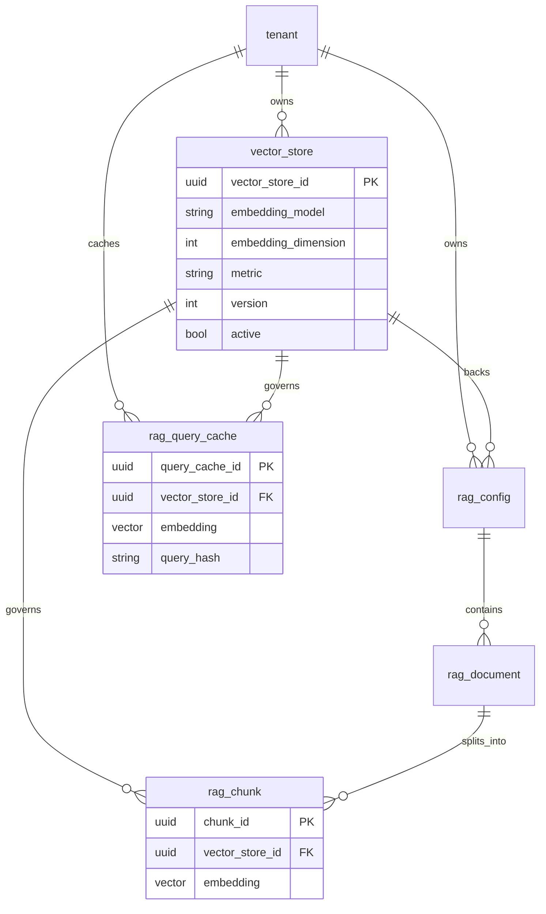

# RAG model — target DDL and decisions

Cross-references: [rag-analysis.md](./rag-analysis.md), [rag-orchestration-layer.md](./rag-orchestration-layer.md).

## Migration strategy

Non-production: schema lives in a single revision — `src/infra/database/migrations/versions/861cb744f4f0_initial_schema.py`. ORM sources of truth: `src/infra/database/models/rag/`, `src/infra/database/models/llm/semantic_answer_cache.py`, `src/infra/database/models/ai_policy/model.py`.

## Target ER (consolidated)



Decisions: `VectorStore.embedding_model` is a string (operational name), not an FK to `model.model_id`. `RagDocument` does not get `vector_store_id`; reach the store via `rag_config.vector_store_id`. `SemanticAnswerCache` keeps a single `embedding` plus `model_alias` and no `vector_store_id`.

### VectorStore (vira fonte da verdade)
```python
class VectorStore(ORMBaseModel):
    __tablename__ = "vector_store"

    vector_store_id = uuid_pk()

    tenant_id = Column(
        PG_UUID(as_uuid=True),
        ForeignKey("tenant.tenant_id", ondelete="RESTRICT"),
        nullable=False,
    )

    name = Column(String(length=255), nullable=False)

    embedding_model = Column(String(length=128), nullable=False)
    embedding_dimension = Column(Integer, nullable=False)
    metric = Column(String(length=32), nullable=False, server_default="cosine")

    version = Column(Integer, nullable=False, server_default="1")
    active = Column(Boolean, nullable=False, server_default="true")

    created_at = Column(
        DateTime(timezone=True), nullable=False, server_default=func.now()
    )
```

### RagChunk (simplificado e consistente)

```python
class RagChunk(ORMBaseModel):
    __tablename__ = "rag_chunk"

    chunk_id = uuid_pk()

    document_id = Column(
        PG_UUID(as_uuid=True),
        ForeignKey("rag_document.document_id", ondelete="CASCADE"),
        nullable=False,
    )

    vector_store_id = Column(
        PG_UUID(as_uuid=True),
        ForeignKey("vector_store.vector_store_id", ondelete="CASCADE"),
        nullable=False,
    )

    chunk_index = Column(Integer, nullable=False)
    content = Column(Text(), nullable=False)
    content_hash = Column(String(length=128), nullable=False)
    token_count = Column(Integer, nullable=False)

    embedding = Column(Vector, nullable=False)

    chunk_metadata = Column("metadata", JSONB, nullable=True)

    created_at = Column(
        DateTime(timezone=True), nullable=False, server_default=func.now()
    )

    __table_args__ = (
        UniqueConstraint(
            "document_id",
            "chunk_index",
            name="uq_rag_chunk_document_id_chunk_index",
        ),
        Index("ix_rag_chunk_document_id", "document_id"),
        Index("ix_rag_chunk_vector_store_id", "vector_store_id"),
        Index("ix_rag_chunk_embedding", "embedding", postgresql_using="ivfflat"),
    )
```

### RagQueryCache (alinhado ao índice)
```python
class RagQueryCache(ORMBaseModel):
    __tablename__ = "rag_query_cache"

    query_cache_id = uuid_pk()

    tenant_id = Column(
        PG_UUID(as_uuid=True),
        ForeignKey("tenant.tenant_id", ondelete="RESTRICT"),
        nullable=False,
    )

    vector_store_id = Column(
        PG_UUID(as_uuid=True),
        ForeignKey("vector_store.vector_store_id", ondelete="CASCADE"),
        nullable=False,
    )

    query_hash = Column(String(length=128), nullable=False)

    embedding = Column(Vector, nullable=False)

    use_count = Column(Integer, nullable=False, server_default="0")
    last_used_at = Column(DateTime(timezone=True), nullable=True)

    created_at = Column(
        DateTime(timezone=True), nullable=False, server_default=func.now()
    )
    updated_at = Column(
        DateTime(timezone=True), nullable=False, server_default=func.now()
    )

    __table_args__ = (
        UniqueConstraint(
            "tenant_id",
            "vector_store_id",
            "query_hash",
            name="uq_rag_query_cache_scope",
        ),
    )
```


### RagDocument (ajuste leve)

```python
class RagDocument(ORMBaseModel):
    __tablename__ = "rag_document"

    document_id = uuid_pk()

    tenant_id = Column(
        PG_UUID(as_uuid=True),
        ForeignKey("tenant.tenant_id", ondelete="RESTRICT"),
        nullable=False,
    )

    rag_config_id = Column(
        PG_UUID(as_uuid=True),
        ForeignKey("rag_config.rag_config_id", ondelete="SET NULL"),
        nullable=True,
        index=True,
    )

    source = Column(String(length=255), nullable=True)
    doc_type = Column(String(length=128), nullable=True)

    content_hash = Column(String(length=128), nullable=False)
    content = Column(Text(), nullable=True)

    version = Column(String(length=64), nullable=True)

    embedding_status = Column(
        String(length=32), nullable=False, server_default="PENDING"
    )
    embedding_attempts = Column(Integer, nullable=False, server_default="0")

    last_embedding_error_code = Column(String(length=128), nullable=True)
    embedding_started_at = Column(DateTime(timezone=True), nullable=True)
    embedding_completed_at = Column(DateTime(timezone=True), nullable=True)

    doc_metadata = Column("metadata", JSONB, nullable=True)
    created_at = Column(
        DateTime(timezone=True), nullable=False, server_default=func.now()
    )
    updated_at = Column(
        DateTime(timezone=True), nullable=False, server_default=func.now()
    )
```

Sugestão completa (ajuste mínimo, mantendo teu desenho).

---

## VectorStore (vira fonte da verdade)

```python
class VectorStore(ORMBaseModel):
    __tablename__ = "vector_store"

    vector_store_id = uuid_pk()

    tenant_id = Column(
        PG_UUID(as_uuid=True),
        ForeignKey("tenant.tenant_id", ondelete="RESTRICT"),
        nullable=False,
    )

    name = Column(String(length=255), nullable=False)

    embedding_model = Column(String(length=128), nullable=False)
    embedding_dimension = Column(Integer, nullable=False)
    metric = Column(String(length=32), nullable=False, server_default="cosine")

    version = Column(Integer, nullable=False, server_default="1")
    active = Column(Boolean, nullable=False, server_default="true")

    created_at = Column(
        DateTime(timezone=True), nullable=False, server_default=func.now()
    )
```

---

## RagChunk (simplificado e consistente)

```python
class RagChunk(ORMBaseModel):
    __tablename__ = "rag_chunk"

    chunk_id = uuid_pk()

    document_id = Column(
        PG_UUID(as_uuid=True),
        ForeignKey("rag_document.document_id", ondelete="CASCADE"),
        nullable=False,
    )

    vector_store_id = Column(
        PG_UUID(as_uuid=True),
        ForeignKey("vector_store.vector_store_id", ondelete="CASCADE"),
        nullable=False,
    )

    chunk_index = Column(Integer, nullable=False)
    content = Column(Text(), nullable=False)
    content_hash = Column(String(length=128), nullable=False)
    token_count = Column(Integer, nullable=False)

    embedding = Column(Vector, nullable=False)

    chunk_metadata = Column("metadata", JSONB, nullable=True)

    created_at = Column(
        DateTime(timezone=True), nullable=False, server_default=func.now()
    )
    updated_at = Column(
        DateTime(timezone=True), nullable=False, server_default=func.now()
    )

    __table_args__ = (
        UniqueConstraint(
            "document_id",
            "chunk_index",
            name="uq_rag_chunk_document_id_chunk_index",
        ),
        Index("ix_rag_chunk_document_id", "document_id"),
        Index("ix_rag_chunk_vector_store_id", "vector_store_id"),
        Index("ix_rag_chunk_embedding", "embedding", postgresql_using="ivfflat"),
    )
```

---

## RagQueryCache (alinhado ao índice)

```python
class RagQueryCache(ORMBaseModel):
    __tablename__ = "rag_query_cache"

    query_cache_id = uuid_pk()

    tenant_id = Column(
        PG_UUID(as_uuid=True),
        ForeignKey("tenant.tenant_id", ondelete="RESTRICT"),
        nullable=False,
    )

    vector_store_id = Column(
        PG_UUID(as_uuid=True),
        ForeignKey("vector_store.vector_store_id", ondelete="CASCADE"),
        nullable=False,
    )

    query_hash = Column(String(length=128), nullable=False)

    embedding = Column(Vector, nullable=False)

    use_count = Column(Integer, nullable=False, server_default="0")
    last_used_at = Column(DateTime(timezone=True), nullable=True)

    created_at = Column(
        DateTime(timezone=True), nullable=False, server_default=func.now()
    )
    updated_at = Column(
        DateTime(timezone=True), nullable=False, server_default=func.now()
    )

    __table_args__ = (
        UniqueConstraint(
            "tenant_id",
            "vector_store_id",
            "query_hash",
            name="uq_rag_query_cache_scope",
        ),
    )
```

---

## RagDocument (ajuste leve)

```python
class RagDocument(ORMBaseModel):
    __tablename__ = "rag_document"

    document_id = uuid_pk()

    tenant_id = Column(
        PG_UUID(as_uuid=True),
        ForeignKey("tenant.tenant_id", ondelete="RESTRICT"),
        nullable=False,
    )

    rag_config_id = Column(
        PG_UUID(as_uuid=True),
        ForeignKey("rag_config.rag_config_id", ondelete="SET NULL"),
        nullable=True,
        index=True,
    )

    content_hash = Column(String(length=128), nullable=False)
    content = Column(Text(), nullable=True)

    embedding_status = Column(
        String(length=32), nullable=False, server_default="PENDING"
    )

    created_at = Column(
        DateTime(timezone=True), nullable=False, server_default=func.now()
    )
```


## SemanticAnswerCache (Ajuste fino)
```python

class SemanticAnswerCache(ORMBaseModel):
    __tablename__ = "semantic_answer_cache"

    cache_id = uuid_pk()
    tenant_id = Column(
        PG_UUID(as_uuid=True),
        ForeignKey("tenant.tenant_id", ondelete="RESTRICT"),
        nullable=False,
    )
    task_type = Column(String(length=64), nullable=False)
    query_hash = Column(String(length=128), nullable=False)
    embedding = Column(Vector, nullable=True)
    response_json = Column(JSONB, nullable=False)
    model_alias = Column(String(length=128), nullable=True)
    inference_layer = Column(String(length=16), nullable=False)
    similarity_score = Column(Float, nullable=True)
    ttl_seconds = Column(Integer, nullable=False, server_default="3600")
    hit_count = Column(Integer, nullable=False, server_default="0")
    expires_at = Column(DateTime(timezone=True), nullable=False)
    last_hit_at = Column(DateTime(timezone=True), nullable=True)
    created_at = Column(
        DateTime(timezone=True), nullable=False, server_default=func.now()
    )
    updated_at = Column(
        DateTime(timezone=True), nullable=False, server_default=func.now()
    )

    __table_args__ = (
        UniqueConstraint(
            "tenant_id",
            "task_type",
            "query_hash",
            name="uq_semantic_answer_cache_tenant_task_query",
        ),
    )

```

## ai_policy.Model (Ótimo ponto para melhoria (Podemos deixar os LLM models + Embeeding models))

```python
class Model(ORMBaseModel):
    __tablename__ = "model"

    model_id = uuid_pk()

    name = Column(String(length=255), nullable=False, unique=True)
    provider = Column(String(length=64), nullable=False)  # openai, cohere

    type = Column(
        String(length=32), nullable=False
    )  # LLM | EMBEDDING

    is_active = Column(Boolean, nullable=False, server_default="true")

    created_at = Column(
        DateTime(timezone=True), nullable=False, server_default=func.now()
    )

```


---

## Impacto em `RagRuntimeService` e `RagRepository`

- `get_context`: carrega `VectorStore`, valida modelo/dimensão vs `options.embedding`, `get_query_cache(tenant_id, vector_store_id, query_hash)`, grava cache só com `tenant_id`, `vector_store_id`, `query_hash`, `embedding`; `search_similar_chunks` filtra por `vector_store_id` e usa uma coluna de embedding.
- Ingest / `embed_document_by_id`: chunks com `vector_store_id` e vetor único.
- Removidos: `list_chunks_pending_embedding_512`, `update_chunk_embedding_512`.

---

## Runtime validation (obrigatório)

```python
def validate_embedding(vector_store, embedding: list[float]):
    if len(embedding) != vector_store.embedding_dimension:
        raise Exception("embedding dimension mismatch")
```

---

# Defesa da mudança

1. **Centraliza governança**

Antes:

```text
embedding espalhado (chunk, cache, runtime)
```

Depois:

```text
VectorStore define tudo
```

Resultado: previsibilidade operacional.

---

2. **Elimina inconsistência silenciosa**

Você permitia:

```text
mesmo índice com múltiplas dimensões/modelos
```

Agora:

```text
1 índice = 1 modelo = 1 dimensão
```

Sem isso, teu recall degrada sem erro explícito.

---

3. **Alinha com teu próprio runtime**

Você já tem:

```text
Selector → decide modelo
```

Agora o storage:

```text
→ respeita essa decisão
→ valida antes de persistir
```

Antes havia conflito conceitual.

---

4. **Permite versionamento real**

Com:

```text
VectorStore.version
```

Você consegue:

```text
- criar novo índice com outro modelo
- reindexar em paralelo
- fazer cutover sem downtime
```

Sem isso: migração destrutiva.

---

5. **Simplifica consulta e tuning**

Index vetorial funciona melhor quando:

```text
- dimensão fixa
- distribuição homogênea
```

Você estava sabotando isso com múltiplos embeddings.

---

6. **Remove flexibilidade inútil**

Ter:

```text
embedding_512 + embedding_1536
```

parece otimização, mas vira:

```text
- duplicação de storage
- ambiguidade no retrieval
- complexidade no runtime
```

Se precisar multi-representação, isso é outro índice, não outra coluna.

---

7. **Isola responsabilidade corretamente**

```text
Selector → decide modelo
VectorStore → define contrato
Chunk → só armazena dado
```

Antes:

```text
Chunk decidia coisas que não são dele
```

---

Direto ao ponto:

Você já desenhou bem o runtime.
O problema estava no storage permitindo violar esse desenho.

Essa mudança fecha essa brecha sem reescrever o sistema.
