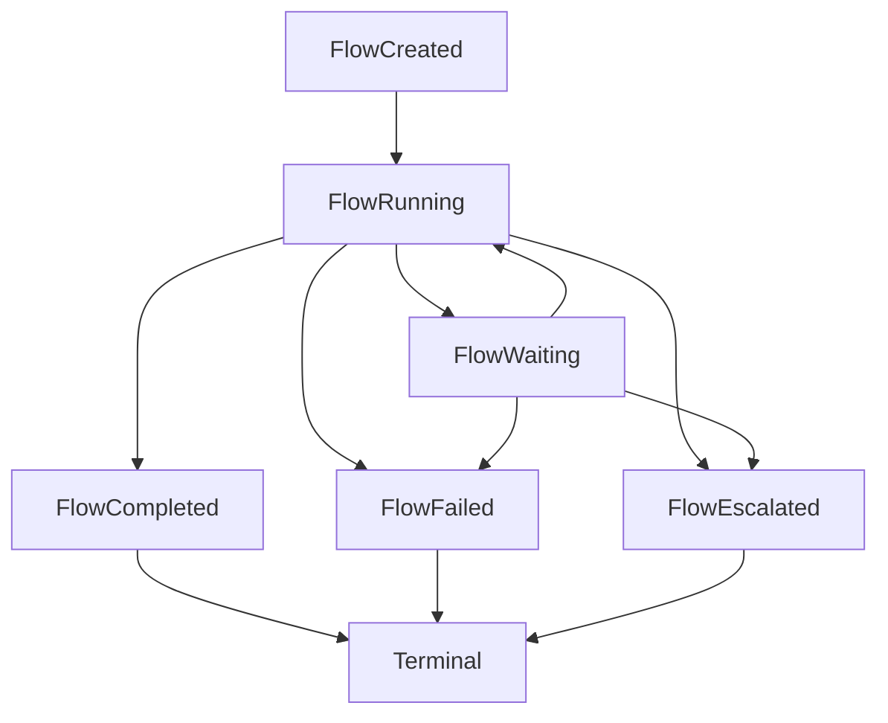

### Flow runtime diagram

```mermaid
flowchart TD
flowCreated[FlowCreated] --> flowRunning[FlowRunning]
flowRunning --> flowWaiting[FlowWaiting]
flowRunning --> flowCompleted[FlowCompleted]
flowRunning --> flowFailed[FlowFailed]
flowRunning --> flowEscalated[FlowEscalated]
flowWaiting --> flowRunning
flowWaiting --> flowFailed
flowWaiting --> flowEscalated
flowCompleted --> flowTerminal[Terminal]
flowFailed --> flowTerminal
flowEscalated --> flowTerminal
```

### Governance pointers

Active pointers reference immutable published versions; draft versions exist but stay inactive (publish != activate).